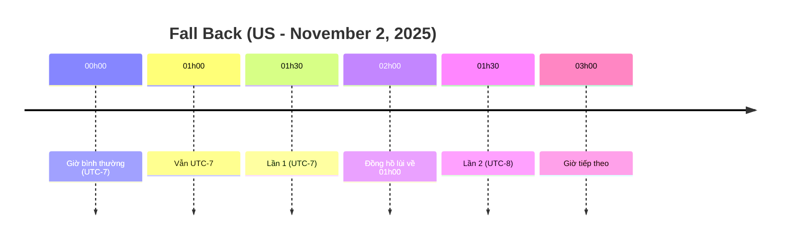
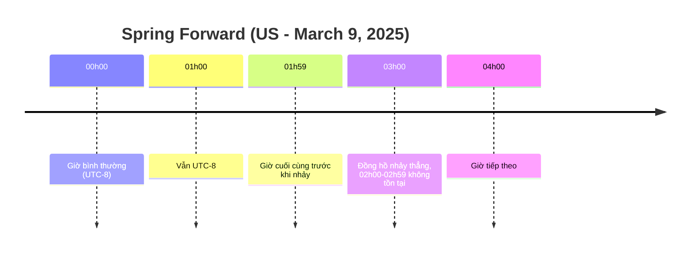

# Timezone kỳ thú

## Mở đầu: Cơn ác mộng của lập trình viên

Nếu bạn đã từng làm việc với hệ thống phân tán, xử lý log server, cronjob, hay chỉ đơn giản là viết một API trả về dữ liệu thời gian, thì chắc chắn ít nhất một lần bạn đã gặp phải rắc rối liên quan đến *timezone*. Tưởng như chuyện nhỏ, nhưng chỉ cần sai lệch vài giờ cũng có thể gây ra hậu quả nghiêm trọng: báo cáo sai số liệu, job chạy nhầm giờ, hoặc email chúc mừng sinh nhật gửi trước… một ngày. Vấn đề ở đây là thời gian trong hệ thống máy tính không chỉ đơn thuần là "ngày" và "giờ", mà còn gắn liền với khái niệm múi giờ, offset, và thậm chí cả những quy tắc lịch sử chính trị của từng quốc gia.

## UTC và GMT: Hai khái niệm dễ gây nhầm lẫn

**UTC (Coordinated Universal Time)** là chuẩn thời gian toàn cầu, được sử dụng trong mọi hệ thống hiện đại. **GMT (Greenwich Mean Time)** là khái niệm lịch sử, từng được dùng nhiều trong hàng hải và quân sự. Ngày nay, hầu hết các hệ thống coi GMT tương đương với UTC, nhưng về mặt kỹ thuật thì UTC chính xác hơn vì nó có tính đến giây nhuận. Khi bạn thấy chuỗi thời gian kết thúc bằng ký tự `Z`, ví dụ `2025-09-05T10:00:00Z`, điều đó có nghĩa là thời điểm đó được biểu diễn theo UTC (*Zulu time*).

➡️ Quy tắc bất di bất dịch: **lưu trữ và truyền dữ liệu dưới dạng UTC, hiển thị thì chuyển đổi sang timezone của người dùng**.

## Offset và Timezone: Giống mà khác

**Offset** chỉ là số giờ lệch so với UTC tại một thời điểm cụ thể, ví dụ `+07:00`. Trong khi đó, **timezone** là một tập hợp các quy tắc mô tả lịch sử và hiện tại của thời gian trong một vùng lãnh thổ, ví dụ `Asia/Ho_Chi_Minh`. Offset có thể thay đổi theo mùa do Daylight Saving Time (DST). Chính vì vậy, bạn không nên chỉ lưu "UTC+7" mà hãy lưu zone ID để có thể xử lý chính xác trong mọi ngữ cảnh.

## Việt Nam và Indochina Time (ICT)

Ở Việt Nam, tình hình dễ dàng hơn: chúng ta sử dụng **Indochina Time (ICT)** quanh năm, cố định ở mức **UTC+07:00** và không áp dụng DST. Zone chuẩn trong cơ sở dữ liệu IANA là `Asia/Ho_Chi_Minh`. Tuy nhiên, nếu bạn làm việc với dữ liệu quốc tế, bạn phải luôn lưu ý đến DST và sự thay đổi offset.

## DST: Khi thời gian "nhảy múa"

DST có thể tạo ra những tình huống trớ trêu:

* **Fall back (mùa thu):** Đồng hồ lùi một giờ. Kết quả là một khoảng thời gian được lặp lại hai lần (giờ trùng lặp).
* **Spring forward (mùa xuân):** Đồng hồ tiến một giờ. Có một khoảng thời gian hoàn toàn biến mất (giờ không tồn tại).

### Minh họa DST bằng sơ đồ timeline

#### Trường hợp **fall back**: giờ trùng lặp



#### Trường hợp **spring forward**: giờ biến mất



## Khi Windows khác Linux

Windows dùng tên timezone như `"SE Asia Standard Time"`, trong khi Linux/Unix và hầu hết các thư viện lập trình lại dùng `Asia/Ho_Chi_Minh`. Để tương thích, bạn cần ánh xạ giữa hai hệ thống này bằng bảng `windowsZones.xml` (CLDR) hoặc sử dụng thư viện như **TimeZoneConverter** trong .NET hay **Noda Time**.

## Cronjob và Container: Những chiếc bẫy ngầm

Cronjob truyền thống chạy theo timezone của server. Khi DST thay đổi, job có thể bị chạy hai lần hoặc không chạy. Kubernetes giải quyết vấn đề này từ phiên bản 1.27, cho phép bạn khai báo rõ `spec.timeZone`. Ngoài ra, khi deploy trong container (đặc biệt Alpine Linux), nhiều image không cài tzdata, dẫn đến việc log toàn UTC. Bạn cần chủ động cài tzdata hoặc mount `/etc/localtime`.

## Nguyên tắc vàng khi làm việc với thời gian

1. Luôn **lưu trữ dưới dạng UTC** và ghi kèm zone ID nếu cần.
2. **Truyền dữ liệu qua API** bằng chuẩn ISO-8601/RFC 3339.
3. **Hiển thị theo timezone của người dùng**, dùng API client để lấy timezone.
4. **Khai báo timezone rõ ràng trong Cronjob**, tránh phụ thuộc server.
5. **Kiểm thử kỹ DST** khi ứng dụng có người dùng quốc tế.

## Minh họa bằng code

### Java

```java
Instant now = Instant.now();
ZoneId vn = ZoneId.of("Asia/Ho_Chi_Minh");
ZonedDateTime local = now.atZone(vn);
```

### Python

```python
from datetime import datetime
from zoneinfo import ZoneInfo

utc_now = datetime.now(tz=ZoneInfo("UTC"))
vn_time = utc_now.astimezone(ZoneInfo("Asia/Ho_Chi_Minh"))
```

### JavaScript

```js
const tz = Intl.DateTimeFormat().resolvedOptions().timeZone;
console.log(tz); // "Asia/Ho_Chi_Minh"
```

## Kết luận: Biến nỗi sợ thành sự kỳ thú

Timezone vốn phức tạp bởi vì nó phản ánh cả lịch sử, chính trị và văn hóa của con người, chứ không chỉ là con số khô khan. Nhưng nếu nắm rõ nguyên tắc: **UTC để lưu trữ và truyền dữ liệu, timezone để hiển thị, và luôn test DST**, bạn sẽ thấy mọi thứ trở nên dễ kiểm soát hơn. Khi đó, timezone không còn là "ác mộng" nữa, mà trở thành một "thế giới kỳ thú" để bạn khám phá và chinh phục.
