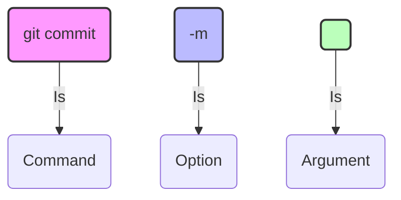

|                                                                                                                                                                                                                                                                                                                                                                                                                                                                                                                                                                                                                                                                                                                                                           |
| :-------------------------------------------------------------------------------------------------------------------------------------------------------------------------------------------------------------------------------------------------------------------------------------------------------------------------------------------------------------------------------------------------------------------------------------------------------------------------------------------------------------------------------------------------------------------------------------------------------------------------------------------------------------------------------------------------------------------------------------------------------- |
| In this chapter, I will introduce what Git is and why we use it, and ensure you have it installed on your computer. You will also set up some Git configuration variables (also known as _settings_). I'll introduce the graphical user interface and the command line, which are the two tools you'll use to interact with Git and the Rainbow practice project. To help you get familiar with working in the command line, we'll go through how to perform some basic operations like viewing the current directory location, navigating into and out of directories, and creating a directory. Finally, at the end of the chapter, you'll prepare the text editor that you will use to work on the Rainbow project in [Chapter 2](/en/blog/git-02-local-repositories). |
| If you already have experience working in the command line, you might already know some of the information in this chapter. However, I do not recommend skipping this chapter as it prepares the setup that you will use for the rest of the book.                                                                                                                                                                                                                                                                                                                                                                                                                                                                                                       |

> **[ Note ]**
>
> To understand how to use this document, you can refer to the "Introduction" section. If you haven't read that section, I strongly recommend you go back and do that now.

## What Is Git?

Git is a technology that can be used to track changes to a project and help multiple people collaborate on a project together. At its basic level, a project version controlled by Git consists of a folder with files in it, and Git tracks the changes made to the files in the project. This allows you to save different versions of the work you're doing, which is why we call Git a _version control system_.

Git was created by Linus Torvalds to version control the work done on a large software development project called the Linux kernel. However, because Git can track changes to all types of files, it can be used for a wide variety of different types of projects.

Git is a powerful technology, and the wealth of features it provides—as well as the fact that it was originally designed for use in the command line—means that using it is a bit more complicated than just selecting File → Save on your computer.

In short, Git is a version control system that you can download to your computer, allowing you to track the history of a project and collaborate with others. Next, let's look at [Example Book Project 1-1](#) for an example of how I might use Git for my Book project.

> **Illustrative Example 1-1**
>
> Suppose I am writing a book, and I want to use Git to version control all the files in my Book project. Each time I make changes to the book, I can save a version of it using Git. For example, suppose I make changes to the book on Monday, Wednesday, and Friday, and I save a version on each of those days. This means I have at least three versions of my project. A version of a project in Git is called a _commit_. In [Chapter 2](/en/blog/git-02-local-repositories), you will learn more about commits. For now, all you need to know is that in my example, I have at least three commits.
>
> These three commits allow me to review the different versions of the book I had at the end of the Monday session, the Wednesday session, and the Friday session. Git also allows me to compare any of those commits (or saved versions of the project) with each other to check what has changed between the different versions. This illustrates how Git helps me track the history of my project.
>
> Now, suppose I decide to work on my Book project with a co-author. Git allows me and my co-author to work on the same project at the same time and combine our work when we are ready. For example, I might work on chapter 1 and my co-author might work on chapter 2, and when we are ready, we can combine the work we've done.
>
> If we ask an editor to review the book, they can also make edits to all the chapters of the book we've written, and we can also integrate those changes into the main version of the book. This illustrates how Git is a useful tool for collaboration.

Next, let's learn about some other tools you'll use in this learning experience and how you'll interact with Git.

## The Graphical User Interface and the Command Line

The two main ways to interact with a computer are using a graphical user interface or the command line.

_Graphical user interface_ (GUI) is a set of graphical representations of objects (icons, buttons, etc.) that allow you to interact with your computer. You can think of it as a point-and-click interface. For example, the folders represented by folder icons on your desktop are part of your computer's GUI.

The command line—also known as a command line interface (CLI), terminal, or shell—is where you can enter text-based commands to interact with your computer.

The default way to work with Git is through the command line. However, there are also ways that you can work with Git using a GUI: for example, by using a Git GUI client or a text editor with integrated Git. This means you can perform Git actions by clicking buttons and selecting options instead of entering commands in the command line.

In this series, you will learn how to use Git in the command line, because this allows you to build a solid mental model of how it works and gives you access to all of its functions. You will only use your computer's GUI for other actions, such as viewing files in the filesystem or working in your text editor to manage files. We'll take a closer look at the command line in the next section.

> **[ Note ]**
>
> Throughout this series, I will provide some specific instructions for Linux (Ubuntu), macOS, and Microsoft Windows users. If you are a Linux user, some basic knowledge of the command line might already be familiar to you.

## Opening a Command Line Window

To use the command line, you must open a command line window using a command line application. At any time, in a command line window, you are in a specific directory, which we call the _current directory_. A directory, for our purposes, is just like a folder.

When you open a command line window, there will be a command prompt in the upper left corner. This is a short piece of text whose exact content will vary depending on your operating system and computer settings. However, by default, the command prompt indicates the directory location in the command line (in other words, your current directory). When you open a new command line window, the directory location starts at the current user directory (also known as the home folder), denoted by a tilde (`~`). This directory location will be the only important part of the command prompt that you will have to identify for the exercises in this series. After the command prompt, there is a cursor indicating where you are typing in the command line.

See [Figure 1-1](#) for an annotated example of a general command prompt. In the examples in this series, we use a dollar sign (`$`) at the end of the command prompt, but this is just an example of how a command prompt can end. Your command prompt might end with a different character or symbol.

```bash
annaskoulikari@ubuntu:~$
```

_Figure 1-1: An example of a command prompt (Ubuntu Linux style)_

The command line application you will use to complete the exercises in this series will depend on the operating system you are using:

- Linux (Ubuntu)—the command line application is called **Terminal** (you can open it quickly with `Ctrl+Alt+T`).
- macOS—the command line application is called **Terminal**.
- Microsoft Windows—the command line application is called **Git Bash**. It will only be available if you have installed Git on your computer.

> **[ Note ]**
>
> If you are a Microsoft Windows user and you haven't installed Git, then you will need to go to the Learning Git repository ([https://github.com/gitlearningjourney/learning-git](https://github.com/gitlearningjourney/learning-git)) and follow the steps to install Git for Microsoft Windows to gain access to Git Bash before continuing with the rest of this chapter.
>
> If you are a Linux (Ubuntu) or macOS user and you haven't installed Git, then you can continue with the rest of this section. You will install Git in the "Installing Git" section.

To open a command line window, you can use your computer's search function to find the command line application, select it, and open it. Go to [Follow Along 1-1](#) to open a command line window and see the command prompt.

### Follow Along 1-1

1. Use your command line application to open a command line window.
2. Look at the command prompt in your command line window.

Things to notice:

- The command prompt indicates the directory location.

Now that you've opened a command line window, let's find out how you'll execute your first command in the command line.

## Executing Commands in the Command Line

At the end of the command prompt in your command line window is the _cursor_ indicating where you will type commands. In the Terminal (Linux/macOS), by default, the cursor is on the same line as the command prompt, while in Git Bash (Microsoft Windows), it is on the line below. After you type a command, to execute it, you must press the Enter (Return) key.

If a step in a Follow Along section in this series includes a command printed in **bold** after a dollar sign (`$`), then you must execute it in the command line. If the command produces output, it will be displayed below the command (not in bold). If the command is supposed to be executed in a directory other than the current user directory, the directory location will be specified before the dollar sign.

[Figure 1-2](#) shows an example of what it will look like when you execute a command in a Follow Along. In this case, I am executing the `pwd` command while in the `desktop` directory. You will learn what the `pwd` command does later in this chapter; for now, look at [Figure 1-2](#) to identify where it shows the directory location, the command to execute, and the output.

```bash
annaskoulikari@ubuntu:~/desktop$ pwd
/home/annaskoulikari/desktop
```

_Figure 1-2: How to execute a command included in a Follow Along section_

### Command Output

Some commands produce output, and some do not. For those that do, I will provide sample output based on the Rainbow project I worked on when creating this series. This output was generated by the macOS operating system, but the output for Git-related commands does not differ between operating systems. In the few cases where the output of non-Git related commands differs significantly between operating systems, I will point that out in the text. Output on Linux (Ubuntu) is usually very similar to macOS.

If, while performing the exercises in the Follow Along sections, you see output that looks significantly different from the output in this series or if you get an unexpected error, then you might have done something different from what the instructions indicate, and you may need to review the steps in the Follow Along.

> **[ Note ]**
>
> It is possible that Git will undergo future updates that could affect output in small ways. If I become aware of any major changes, I will try to document these situations on the errata page in the Learning Git repository ([https://github.com/gitlearningjourney/learning-git](https://github.com/gitlearningjourney/learning-git)).

From now on, whenever you encounter a command in a Follow Along exercise, you should type the bold command into the command line and execute it.

### Executing the First Command in the Command Line

The first command you'll practice in the command line is the `git version` command. If you have Git installed on your computer, then it will provide the version number you have installed. If you don't have Git installed on your computer, then the output will provide you with a message indicating that it is not installed.

To have access to all the commands used in the exercises in this series, I recommend having a version of Git greater than 2.28. Go to [Follow Along 1-2](#) to check if you have Git installed and what its version is.

#### Follow Along 1-2

```bash
$ git version
git version 2.35.1
```

Things to notice:

- If you have Git installed, you will see its version installed on your computer.
- If you don't have Git installed, you'll see an error message instead.

If the output of the `git version` command indicates that you have a version of Git greater than 2.28 installed, then you can skip the "Installing Git" section and go to the "Command Options and Arguments" section.

If the output of the `git version` command indicates you do not have Git installed on your computer or a version of Git older than 2.28, then you should continue to the next section to install an up-to-date version of Git on your computer.

## Installing Git

If you don't have Git installed (version 2.28 or greater), go to [Follow Along 1-3](#). Otherwise, go to the next section.

### Follow Along 1-3

1. For Linux (Ubuntu): Open the terminal and run the command `sudo apt update && sudo apt install git`.
2. For macOS and Windows: Go to the Learning Git repository ([https://github.com/gitlearningjourney/learning-git](https://github.com/gitlearningjourney/learning-git)) and follow the steps to download Git for your operating system.

Now that you have an up-to-date version of Git installed on your computer, let's learn a bit more about the commands you'll be using in the Follow Along sections of this series.

## Command Options and Arguments

Sometimes you will use commands with options and/or arguments. _Options_ are settings that change the behavior of a command. An option follows a single dash (`-`) or a double dash (`--`).

_Arguments_ are values that provide information to the command. They will be denoted by angle brackets (`<>`), indicating that these items should be replaced by user-provided values. In exercises, you will have to pass a value for the argument, without including the angle brackets.

An example of a command with an option and an argument that you will use is `git commit -m "<message>"`. In this example, `-m` is the option and `<message>` is the argument, as shown in [Figure 1-3](#). We will cover what this command does in [Chapter 3](#).



_Figure 1-3: An example of a command with an option and an argument_

Besides typing commands in the command line, learning how to clear them is also very important.

## Clearing the Command Line

Each time you enter a command in your command line window, it will be listed directly below the previous command you entered (or its output). After you have entered many commands, the command line window becomes quite cluttered. To clear the contents of the command line window, you can use the `clear` command.

> **[ Command Reminder ]**
>
> **clear**
>
> Clears the command line window

Go to [Follow Along 1-4](#) to practice using the `clear` command.

### Follow Along 1-4

```bash
clear
```

Things to notice:

- The command line window has been cleared.
- Note: On Windows (Git Bash), the `clear` command might just scroll the screen down.

We've covered typing commands and clearing them from the command line window. Now it's time to prepare the next tool that will help you on your learning journey, the filesystem window.

## Opening the Filesystem Window

You will use a filesystem application to open a filesystem window, which is part of the GUI. Throughout your learning journey, you will interact with both the filesystem window and the command line window. Therefore, it is useful to open both windows side-by-side on your computer screen.

The filesystem application you use will depend on your operating system:

- Linux (Ubuntu)—the filesystem application is **Files** (Nautilus).
- macOS—the filesystem application is **Finder**.
- Microsoft Windows—the filesystem application is **File Explorer** (or Windows Explorer).

Go to [Follow Along 1-5](#) to open a filesystem window.

### Follow Along 1-5

1. Find your filesystem application and open a filesystem window next to your command line window.

Now that you have both windows open, let's get back to some command line basics.

## Working with Directories

As mentioned earlier, at any point in a command line window, you are in a specific directory (current directory). Assuming you haven't changed any default settings, when you first open the command line application, you will start at the current user directory (your home folder), denoted by a tilde (`~`) in the command prompt.

As you navigate to other directories in the command line, the command prompt will change to indicate the directory you are in. You can also use the `pwd` command, short for "print working directory," to see the path to the current directory.

> **[ Command Reminder ]**
>
> **pwd**
>
> Displays the path to the current directory

Go to [Follow Along 1-6](#) to practice using the `pwd` command.

### Follow Along 1-6

```bash
$ pwd
/home/annaskoulikari
```

Things to notice:

- You are in your current user directory.

> **[ Note ]**
>
> In Follow Along 1-6, the output of the `pwd` command for Microsoft Windows users will be similar to `/c/Users/annaskoulikari`. For Linux users, it will be `/home/annaskoulikari`. The output in the example is from macOS (`/Users/annaskoulikari`).

The output of the `pwd` command prints out the path to the current directory. In [Follow Along 1-6](#), `/Users/annaskoulikari` (or `/home/annaskoulikari` on Linux) is an example of a path. My name is Anna Skoulikari and `annaskoulikari` is my username on my computer. `Users` (or `home`) and `annaskoulikari` are two directories. The directories in a path are separated by a forward slash (`/`). The `annaskoulikari` directory is inside the `Users` (or `home` on Linux) directory.

Knowing the directory location in a command line window is useful because many commands show you information about or affect the current directory when you execute them. It also helps you navigate through your filesystem, which we will cover later in this chapter.

Now that we've covered how to identify the current directory, let's explore how to view its actual contents.

### Viewing the Contents of Directories

You can view the contents of a directory in the GUI and in a command line window. But before we get there, I want to mention that there are two types of files and directories that exist in the filesystem: visible files and directories and hidden files and directories. _Visible_ files and directories are always displayed in the filesystem. _Hidden_ files and directories are only displayed in the filesystem if you change your settings to see them. They are usually files or directories that store information that we, as users, do not need to access, such as application configurations and various system settings.

I do not recommend modifying or deleting hidden files or directories unless you really know what you are doing. When you change your settings to view hidden files and directories, they appear partially grayed out. Their names usually start with a dot (`.`).

There are some important hidden files and directories that you will want to know on your Git learning journey, so you need to know how to see them, both in the GUI and in the command line.

In the GUI, to see hidden files and directories in a filesystem window, you must make them visible explicitly:

- Linux (Ubuntu)—to toggle between viewing and hiding hidden files and directories, press `Ctrl+H`.
- macOS—to toggle between viewing and hiding hidden files and directories, press `Cmd-Shift-dot` (`.`).
- Microsoft Windows—you must change the filesystem settings to view hidden files and directories. Refer to online resources if necessary for step-by-step instructions for your computer.

Go to [Follow Along 1-7](#) to view hidden files and directories in your filesystem.

#### Follow Along 1-7

1. Make hidden files and directories visible in your filesystem.

In the command line, to view a list of _visible_ files and directories in the current directory, you use the `ls` command (short for "list").

To view both visible and _hidden_ files and directories in the current directory, you use the `ls` command with the `-a` option: `ls -a`.

> **[ Command Reminder ]**
>
> **ls**
>
> Lists visible files and directories
>
> **ls -a**
>
> Lists hidden and visible files and directories

Go to [Follow Along 1-8](#) to practice using these commands to list different types of files.

#### Follow Along 1-8

```bash
$ ls
(Output is a list of visible folders/files, e.g., Desktop, Documents, Downloads...)

$ ls -a
(Output is a list including hidden files starting with a dot, e.g., .bash_profile, .config...)
```

Things to notice:

- The names of many hidden files and directories start with a dot (`.`).
- The visible and hidden files and directories shown in the output in this series will differ from the files on your computer because everyone's computer content is different.

Now that we've covered how to identify the current directory and view its contents in the command line, let's explore how to move between directories.

### Navigating into and out of a Directory

In the GUI, to enter a directory, you can double-click it. In the command line, to enter a directory, you use the `cd` command, short for "change directory," and pass in the name of the directory or the path to the directory.

> **[ Command Reminder ]**
>
> **cd <path_to_directory>**
>
> Change directory

Go to [Follow Along 1-9](#) to practice by navigating into the `desktop` directory.

#### Follow Along 1-9

```bash
$ cd desktop
desktop $ pwd
/home/annaskoulikari/desktop
```

Things to notice:

- In step 1, the `cd` command produced no output.
- In step 2, the command prompt and the output of the `pwd` command indicate that you are in the `desktop` directory.

Earlier in this chapter, I mentioned that the command prompt indicates the directory location. In [Follow Along 1-9](#), notice that the command prompt updates to show that your current directory is the `desktop` directory. By default, how the directory location is presented depends on the operating system you use:

- Linux (Ubuntu) & macOS—in the Terminal, the name of the current directory is displayed (or the full path depending on configuration).
- Microsoft Windows—in Git Bash, the path to the current directory is displayed.

> **[ Note ]**
>
> Navigating into and out of directories in the command line does not affect what you are viewing in the filesystem. For example, navigating into the `desktop` directory in the command line will not automatically cause your filesystem to display the contents of the `desktop` directory.

In the GUI, to return to the parent directory, you can select the back button. In the command line, to return to the parent directory, you can pass two dots (`..`) to the `cd` command. The two dots represent the parent directory of the current directory. Go to [Follow Along 1-10](#) to try this.

#### Follow Along 1-10

```bash
desktop $ cd ..
$ pwd
/home/annaskoulikari
```

Things to notice:

- In step 2, the command prompt and the output of the `pwd` command indicate that you have returned to the current user directory.

Now that we've covered how to navigate into and out of directories, let's go over how to create a new directory.

### Creating a Directory

In the GUI, you can create a directory by right-clicking or selecting the relevant menu option or icon. In the command line, to create a directory, you'll use a command called `mkdir`, short for "make directory." The directory will be created inside the current directory when you execute the command.

> **[ Command Reminder ]**
>
> **mkdir <directory_name>**
>
> Create a directory

To keep things simple, avoid including spaces in your directory names. If a directory name contains spaces, then you must make modifications to how you use certain commands in the command line, which makes your tasks more complicated.

> **[ Note ]**
>
> Generally, when working in the command line, you should avoid using spaces in the names of any files, directories, or other things you create because it can cause complications when you use commands.

As mentioned in the Introduction, throughout this series, you will work on a project where you will create and edit files to list the colors of the rainbow, as well as some colors that are not part of the rainbow. This is not a realistic example of a project that is typically version controlled with Git; it is a simplified example that will allow you to focus on learning how Git works.

Since the main goal of the sample project is to list the colors of the rainbow, you will name your project directory `rainbow`. You'll create this project directory in the `desktop` directory so you can easily see it from the desktop of your computer screen. Go to [Follow Along 1-11](#) to create your directory.

#### Follow Along 1-11

```bash
$ cd desktop
desktop $ mkdir rainbow
desktop $ ls
rainbow
```

Things to notice:

- In step 3, the output of the `ls` command will show the `rainbow` project directory you just created along with any other directories or files you have in your `desktop` directory. These are not shown in the sample output, as the content on your computer will be different from mine.

If you look at your computer's desktop, you will see the `rainbow` project directory you just created, as shown in [Figure 1-4](#).


_Figure 1-4: An example of your desktop before and after you create the rainbow project directory (Appearance may differ depending on your Desktop Environment)_

Next, you will notice that just because you have created the `rainbow` project directory, this doesn't mean you have navigated into it in the command line. Go to [Follow Along 1-12](#) to explicitly navigate into the `rainbow` project directory in the command line.

#### Follow Along 1-12

```bash
desktop $ cd rainbow
rainbow $ pwd
/home/annaskoulikari/desktop/rainbow
```

Things to notice:

- In step 2, the command prompt and the output from the `pwd` command indicate you are in the `rainbow` directory.

You've created and navigated into the `rainbow` directory. Now, what happens if you close the command line window and open it again?

## Closing the Command Line

By default, if you close a command line window and then open it again, the directory location resets to the current user directory. Therefore, you will have to navigate to the directory you want to work in again. Go to [Follow Along 1-13](#) to test this.

### Follow Along 1-13

```bash
rainbow $ pwd
/home/annaskoulikari/desktop/rainbow
```

Close your command line window and then open a new command line window.

```bash
$ pwd
/home/annaskoulikari
$ cd desktop
desktop $ cd rainbow
rainbow $ pwd
/home/annaskoulikari/desktop/rainbow
```

At this point, we have covered some command line basics. Next, you will set up some basic Git configurations.

## Setting Git Configurations

Git configurations are settings that allow you to customize how Git works. They consist of variables and their values, and they are stored in a few different files. To work with Git, you must set some configuration variables related to user settings.

Before setting any variables, you will check if a global Git configuration file exists in your filesystem and, if so, what variables have already been set. To do so, you will use the `git config` command, passing the `--global` and `--list` options.

Note that the `git config` command with the `--global` option is an example of a command where it doesn't matter what your current directory is when you execute it; it will just show information about or change information in the global Git configuration file. This is a hidden file named `.gitconfig` that is typically created in the current user directory.

> **[ Command Reminder ]**
>
> **git config --global --list**
>
> Lists variables in the global Git configuration file and their values

Go to [Follow Along 1-14](#) to try this.

### Follow Along 1-14

```bash
rainbow $ git config --global --list
fatal: unable to read config file '/home/annaskoulikari/.gitconfig': No such file or directory
```

Things to notice:

- The output shown here indicates what you would see if you have never set any variables in your global Git configuration file. In this case, you will get an error indicating that the file does not exist. If you have already set variables in your global Git configuration file, then your output will show the variables you have set and their values.

The two variables we are interested in for this series are `user.name` and `user.email`. Every time someone saves a version of a project (or in other words, creates a commit), Git records the name and email address of that individual and associates it with that saved version. The `user.name` and `user.email` variables are used to set the name and email address that will be saved for the commits you make. This means you can see who worked on what in a Git project. Configuring these variables is mandatory for working with Git. Keep in mind that anyone who can view the list of your commits in any Git project will be able to see your email address, so make sure to use one that you don't mind others seeing.

To set these variables in your global Git configuration file, you pass them as arguments to the `git config` command, entering your desired values inside double quotes (remember, you should not include the angle brackets around the values).

> **[ Command Reminder ]**
>
> **git config --global user.name "<name>"**
>
> Sets your name in the global Git configuration file
>
> **git config --global user.email "<email>"**
>
> Sets your email address in the global Git configuration file

If in the output of [Follow Along 1-14](#) these variables are set to the values you want, then you can skip [Follow Along 1-15](#). If these variables do not appear or are not set to the values you want, decide on the name and email address you want to associate with your work on the Rainbow project, and go to [Follow Along 1-15](#). Be sure to swap the values you want to use in place of my username and email address.

### Follow Along 1-15

```bash
rainbow $ git config --global user.name "annaskoulikari"
rainbow $ git config --global user.email "gitlearningjourney@gmail.com"
rainbow $ git config --global --list
user.name=annaskoulikari
user.email=gitlearningjourney@gmail.com
```

Things to notice:

- In step 3, in the output of `git config --global --list`, the `user.name` and `user.email` variables are set to the values you entered.

Now that you have installed Git and prepared your user settings, the final tool you need to work on a Git project is a text editor.

## Preparing a Text Editor

A Git project consists of files and directories that are version controlled. Git can version control all types of files. In the Rainbow project, you will use a text editor to work with simple text files (with the `.txt` extension).

A _text editor_ is a program that allows users to edit plain text. You will need a text editor to perform many of the Follow Along exercises in this series. A text editor is different from a word processor, which is primarily used to edit rich text. Examples of word processors are Microsoft Word and Google Docs; they cannot be used to manage the files of a Git project. _Rich text_ is text that has styles attached to or embedded within it. If you can see text that is bold or italicized, then it is rich text.

Some text editors make working on Git projects much easier than others. This book is written in a way that allows you to use any text editor you like. If you already have a text editor installed that you have used to work on Git projects, then feel free to use it for the exercises in this series. If you're not sure which text editor to use, I strongly recommend Visual Studio Code ([https://code.visualstudio.com](https://code.visualstudio.com/)): it's a popular text editor, and it's what I used when working on the Rainbow project in this series. Go to [Follow Along 1-16](#) to prepare a text editor.

### Follow Along 1-16

1. Choose your preferred text editor. If you don't have one installed, download a text editor.
2. Open the `rainbow` project directory in a text editor window.

## Integrated Terminals

Some advanced text editors (also called _integrated development environments_, or IDEs), such as Visual Studio Code, include a version of the command line inside them, often referred to as an _integrated terminal_, in which you can execute commands that you would normally use in your command line window.

When you use an integrated terminal, it can be easier to manage your screen space, as the terminal is already part of the text editor window. However, this is a matter of personal preference. If your text editor has an integrated terminal, you can choose to use it instead of a separate command line window to perform Git commands for the rest of the exercises in this series. Both will work fine, so it's up to you to decide what you prefer.

In the rest of this series, whenever I want to refer to where you need to perform commands, I will mention the command line window; however, remember that this also includes integrated terminals.

Now, with Git installed and your text editor ready, you are ready to start working on the Rainbow project!

## Summary

In this chapter, you've learned a bit about Git and seen that it's a useful tool for tracking the history of a project and collaborating with others. You've prepared to work on a project using Git by installing an up-to-date version on your computer and setting some basic Git configuration variables.

You also learned some command line basics, such as how to view the contents of directories, how to navigate into and out of them, and how to create them from scratch. In the process, you created the project directory that you will use throughout this learning journey, called `rainbow`.

Finally, you prepared a text editor so you can create and edit files for any Git project you want to work on.

Now you are ready to move on to [Chapter 2](/en/blog/git-02-local-repositories), where you will actually turn your `rainbow` project directory into a Git repository and start learning about the most important areas when working with Git.
