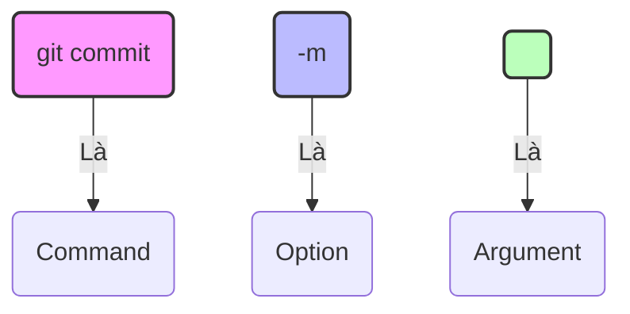

|                                                                                                                                                                                                                                                                                                                                                                                                                                                                                                                                                                                                                                                                                                                                                           |
| :-------------------------------------------------------------------------------------------------------------------------------------------------------------------------------------------------------------------------------------------------------------------------------------------------------------------------------------------------------------------------------------------------------------------------------------------------------------------------------------------------------------------------------------------------------------------------------------------------------------------------------------------------------------------------------------------------------------------------------------------------------- |
| Trong chương này, tôi sẽ giới thiệu Git là gì và tại sao chúng ta sử dụng nó, đồng thời đảm bảo bạn đã cài đặt nó trên máy tính của mình. Bạn cũng sẽ thiết lập một số Git configuration variables (còn gọi là _settings_). Tôi sẽ giới thiệu về graphical user interface và command line, đây là hai công cụ bạn sẽ sử dụng để tương tác với Git và dự án thực hành Rainbow. Để giúp bạn làm quen với việc làm việc trong command line, chúng ta sẽ đi qua cách thực hiện một số thao tác cơ bản như xem vị trí directory hiện tại, điều hướng vào và ra khỏi các directory, và tạo directory. Cuối cùng, ở cuối chương, bạn sẽ chuẩn bị text editor mà bạn sẽ sử dụng để làm việc trên dự án Rainbow trong [Chương 2](/blog/git-02-local-repositories). |
| Nếu bạn đã có kinh nghiệm làm việc trong command line, thì bạn có thể đã biết một số thông tin trong chương này. Tuy nhiên, tôi không khuyến khích bạn bỏ qua chương này vì nó chuẩn bị các setup mà bạn sẽ sử dụng cho phần còn lại của cuốn sách.                                                                                                                                                                                                                                                                                                                                                                                                                                                                                                       |

> **[ Lưu ý ]**
>
> Để hiểu cách sử dụng tài liệu này, bạn có thể tham khảo phần "Giới thiệu". Nếu bạn chưa đọc phần đó, tôi thực sự khuyên bạn nên quay lại và làm điều đó ngay bây giờ.

## What Is Git?

Git là một công nghệ có thể được sử dụng để theo dõi các thay đổi của một dự án và giúp nhiều người cùng collaborate trên một dự án. Ở mức cơ bản, một dự án được version controlled bởi Git bao gồm một folder với các file trong đó, và Git theo dõi các thay đổi được thực hiện đối với các file trong dự án. Điều này cho phép bạn lưu các phiên bản khác nhau của công việc bạn đang làm, đó là lý do tại sao chúng ta gọi Git là một _version control system_.

Git được tạo ra bởi Linus Torvalds để version control công việc được thực hiện trên một dự án phát triển phần mềm lớn gọi là Linux kernel. Tuy nhiên, vì Git có thể theo dõi các thay đổi đối với mọi loại file, nó có thể được sử dụng cho rất nhiều loại dự án khác nhau.

Git là một công nghệ mạnh mẽ, và sự phong phú của các tính năng mà nó cung cấp—cũng như thực tế là nó ban đầu được thiết kế để sử dụng trong command line—có nghĩa là việc sử dụng nó phức tạp hơn một chút so với việc chỉ chọn File → Save trên máy tính của bạn.

Tóm lại, Git là một version control system mà bạn có thể tải xuống máy tính của mình, cho phép bạn theo dõi lịch sử của một dự án và collaborate với những người khác. Tiếp theo, hãy xem [Example Book Project 1-1](#) để xem một ví dụ về cách tôi có thể sử dụng Git cho dự án Book của mình.

> **Ví Dụ Minh Họa 1-1**
>
> Giả sử tôi đang viết một cuốn sách, và tôi muốn sử dụng Git để version control tất cả các file trong dự án Book của mình. Mỗi lần tôi thực hiện các thay đổi đối với cuốn sách, tôi có thể lưu một phiên bản của nó bằng cách sử dụng Git. Ví dụ, giả sử tôi thực hiện các thay đổi đối với cuốn sách vào thứ Hai, thứ Tư và thứ Sáu, và tôi lưu một phiên bản vào mỗi ngày đó. Điều này có nghĩa là tôi có ít nhất ba phiên bản của dự án của mình. Một phiên bản của một dự án trong Git được gọi là một _commit_. Trong [Chương 2](/blog/git-02-local-repositories), bạn sẽ tìm hiểu thêm về các commit. Hiện tại, tất cả những gì bạn cần biết là trong ví dụ của tôi, tôi có ít nhất ba commit.
>
> Ba commit này cho phép tôi xem xét các phiên bản khác nhau của cuốn sách mà tôi đã có vào cuối phiên làm việc thứ Hai, phiên làm việc thứ Tư và phiên làm việc thứ Sáu. Git cũng cho phép tôi so sánh bất kỳ commit nào trong số đó (hoặc các phiên bản đã lưu của dự án) với nhau để kiểm tra xem những gì đã thay đổi giữa các phiên bản khác nhau. Điều này minh họa cách Git giúp tôi theo dõi lịch sử của dự án của mình.
>
> Bây giờ, giả sử tôi quyết định làm việc trên dự án Book của mình cùng với một đồng tác giả. Git cho phép tôi và đồng tác giả của tôi làm việc trên cùng một dự án cùng một lúc và kết hợp công việc của chúng tôi khi chúng tôi sẵn sàng. Ví dụ, tôi có thể làm việc trên chương 1 và đồng tác giả của tôi có thể làm việc trên chương 2, và khi chúng tôi sẵn sàng, chúng tôi có thể kết hợp công việc mà chúng tôi đã làm.
>
> Nếu chúng tôi nhờ một biên tập viên xem xét cuốn sách, họ cũng có thể thực hiện các chỉnh sửa đối với tất cả các chương của cuốn sách mà chúng tôi đã viết, và chúng tôi cũng có thể tích hợp những thay đổi đó vào phiên bản chính của cuốn sách. Điều này minh họa cách Git là một công cụ hữu ích cho việc collaboration.

Tiếp theo, hãy tìm hiểu về một số công cụ khác mà bạn sẽ sử dụng trong trải nghiệm học tập này và cách bạn sẽ tương tác với Git.

## The Graphical User Interface and the Command Line

Hai cách chính để tương tác với máy tính là sử dụng graphical user interface hoặc command line.

_Graphical user interface_ (GUI) là tập hợp các biểu diễn đồ họa của các đối tượng (biểu tượng, nút bấm, v.v.) cho phép bạn tương tác với máy tính của mình. Bạn có thể nghĩ về nó như giao diện trỏ và nhấp (point-and-click). Ví dụ, các folder được biểu diễn bởi các icon folder trên desktop của bạn là một phần của GUI của máy tính.

Command line—còn được gọi là command line interface (CLI), terminal, hoặc shell—là nơi bạn có thể nhập các lệnh dựa trên văn bản (text-based commands) để tương tác với máy tính của mình.

Cách mặc định để làm việc với Git là thông qua command line. Tuy nhiên, cũng có những cách mà bạn có thể làm việc với Git bằng cách sử dụng GUI: ví dụ, bằng cách sử dụng một Git GUI client hoặc một text editor có tích hợp Git. Điều này có nghĩa là bạn có thể thực hiện các hành động Git bằng cách nhấp vào các nút và chọn các tùy chọn thay vì nhập các lệnh trong command line.

Trong loạt bài này, bạn sẽ học cách sử dụng Git trong command line, bởi vì điều này cho phép bạn xây dựng một mô hình tư duy (mental model) vững chắc về cách nó hoạt động và cung cấp cho bạn quyền truy cập vào tất cả các chức năng của nó. Bạn sẽ chỉ sử dụng GUI của máy tính cho các hành động khác, ví dụ như để xem các file trong filesystem hoặc để làm việc trong text editor của bạn để quản lý các file. Chúng ta sẽ xem xét kỹ hơn về command line trong phần tiếp theo.

> **[ Lưu ý ]**
>
> Trong suốt loạt bài này, tôi sẽ cung cấp một số hướng dẫn cụ thể cho người dùng Linux (Ubuntu), macOS và Microsoft Windows. Nếu bạn là người dùng Linux, một số kiến thức cơ bản về command line có thể đã quen thuộc với bạn.

## Opening a Command Line Window

Để sử dụng command line, bạn phải mở một command line window bằng cách sử dụng một command line application. Tại bất kỳ thời điểm nào, trong một command line window, bạn đang ở trong một directory cụ thể, cái mà chúng ta gọi là _current directory_. Một directory, cho mục đích của chúng ta, cũng giống như một folder.

Khi bạn mở một command line window, sẽ có một command prompt ở góc trên bên trái. Đây là một đoạn văn bản ngắn có nội dung chính xác sẽ khác nhau tùy thuộc vào hệ điều hành và cài đặt máy tính của bạn. Tuy nhiên, theo mặc định, command prompt chỉ ra vị trí directory trong command line (nói cách khác, current directory của bạn). Khi bạn mở một command line window mới, vị trí directory bắt đầu tại current user directory (còn được gọi là home folder), được biểu thị bằng dấu ngã (`~`). Vị trí directory này sẽ là phần quan trọng duy nhất của command prompt mà bạn sẽ phải xác định cho các bài tập trong loạt bài này. Sau command prompt, có một con trỏ (cursor) chỉ ra nơi bạn đang nhập trong command line.

Xem [Figure 1-1](#) để biết một ví dụ có chú thích về một command prompt chung. Trong các ví dụ trong loạt bài này, chúng tôi sử dụng dấu đô la (`$`) ở cuối command prompt, nhưng đây chỉ là một ví dụ về cách một command prompt có thể kết thúc. Command prompt của bạn có thể kết thúc bằng một ký tự hoặc biểu tượng khác.

```bash
annaskoulikari@ubuntu:~$
```

_Hình 1-1: An example of a command prompt (Ubuntu Linux style)_

Command line application mà bạn sẽ sử dụng để hoàn thành các bài tập trong loạt bài này sẽ phụ thuộc vào hệ điều hành bạn đang sử dụng:

- Linux (Ubuntu)—command line application được gọi là **Terminal** (bạn có thể mở nhanh bằng `Ctrl+Alt+T`).
- macOS—command line application được gọi là **Terminal**.
- Microsoft Windows—command line application được gọi là **Git Bash**. Nó sẽ chỉ có sẵn nếu bạn đã cài đặt Git trên máy tính của mình.

> **[ Lưu ý ]**
>
> Nếu bạn là người dùng Microsoft Windows và bạn chưa cài đặt Git, thì bạn sẽ cần truy cập Learning Git repository ([https://github.com/gitlearningjourney/learning-git](https://github.com/gitlearningjourney/learning-git)) và làm theo các bước để cài đặt Git cho Microsoft Windows để có quyền truy cập vào Git Bash trước khi tiếp tục với phần còn lại của chương này.
>
> Nếu bạn là người dùng Linux (Ubuntu) hoặc macOS và bạn chưa cài đặt Git, thì bạn có thể tiếp tục với phần còn lại của phần này. Bạn sẽ cài đặt Git trong phần "Installing Git".

Để mở một command line window, bạn có thể sử dụng chức năng tìm kiếm trên máy tính của mình để tìm command line application, chọn nó và mở nó. Đi đến [Follow Along 1-1](#) để mở một command line window và xem command prompt.

### Thực Hành 1-1

1. Sử dụng command line application của bạn để mở một command line window.
2. Nhìn vào command prompt trong command line window của bạn.

Những điều cần chú ý:

- Command prompt chỉ ra vị trí directory.

Bây giờ bạn đã mở một command line window, hãy tìm hiểu cách bạn sẽ thực thi lệnh đầu tiên của mình trong command line.

## Executing Commands in the Command Line

Ở cuối command prompt trong command line window của bạn là _cursor_ (con trỏ) chỉ ra nơi bạn sẽ nhập các lệnh. Trong Terminal (Linux/macOS), theo mặc định, con trỏ nằm trên cùng dòng với command prompt, trong khi trong Git Bash (Microsoft Windows), nó nằm trên dòng bên dưới. Sau khi bạn nhập một lệnh, để thực hiện nó, bạn phải nhấn phím Enter (Return).

Nếu một bước trong phần Follow Along trong loạt bài này bao gồm một lệnh được in **đậm** sau dấu đô la (`$`), thì bạn phải thực hiện nó trong command line. Nếu lệnh tạo ra output, nó sẽ được hiển thị bên dưới lệnh (không in đậm). Nếu lệnh được cho là được thực hiện trong một directory khác với current user directory, vị trí directory sẽ được chỉ định trước dấu đô la.

[Figure 1-2](#) cho thấy một ví dụ về những gì nó sẽ trông như thế nào khi bạn thực hiện một lệnh trong một Follow Along. Trong trường hợp này, tôi đang thực hiện lệnh `pwd` trong khi ở trong `desktop` directory. Bạn sẽ tìm hiểu lệnh `pwd` làm gì sau trong chương này; bây giờ, hãy xem [Figure 1-2](#) để xác định nơi nó hiển thị vị trí directory, lệnh để thực hiện, và output.

```bash
annaskoulikari@ubuntu:~/desktop$ pwd
/home/annaskoulikari/desktop
```

_Hình 1-2: How to execute a command included in a Follow Along section_

### Command Output

Một số lệnh tạo ra output, và một số thì không. Đối với các lệnh tạo ra output, tôi sẽ cung cấp output mẫu dựa trên dự án Rainbow mà tôi đã làm khi tạo loạt bài này. Output này được tạo bởi hệ điều hành macOS, nhưng output cho các lệnh liên quan đến Git không khác nhau giữa các hệ điều hành. Trong một số ít trường hợp output của lệnh không liên quan đến Git khác nhau đáng kể giữa các hệ điều hành, tôi sẽ chỉ ra điều đó trong văn bản. Output trên Linux (Ubuntu) thường rất giống với macOS.

Nếu, trong khi thực hiện các bài tập trong phần Follow Along, bạn thấy output trông khác biệt đáng kể so với output trong loạt bài này hoặc bạn nhận được một lỗi không mong muốn, thì bạn có thể đã làm điều gì đó khác với những gì hướng dẫn chỉ ra, và bạn có thể cần xem lại các bước trong Follow Along.

> **[ Lưu ý ]**
>
> Có thể Git sẽ trải qua các bản cập nhật trong tương lai có thể ảnh hưởng đến output theo những cách nhỏ. Nếu tôi biết về bất kỳ thay đổi quan trọng nào, tôi sẽ cố gắng ghi lại các tình huống này trên trang đính chính (errata page) trong Learning Git repository ([https://github.com/gitlearningjourney/learning-git](https://github.com/gitlearningjourney/learning-git)).

Từ bây giờ, bất cứ khi nào bạn gặp một lệnh trong một bài tập Follow Along, bạn nên nhập lệnh được in đậm vào command line và thực thi nó.

### Executing the First Command in the Command Line

Lệnh đầu tiên bạn sẽ thực hành trong command line là lệnh `git version`. Nếu bạn đã cài đặt Git trên máy tính của mình, thì nó sẽ cung cấp số phiên bản mà bạn đã cài đặt. Nếu bạn chưa cài đặt Git trên máy tính của mình, thì output sẽ cung cấp cho bạn một thông báo chỉ ra rằng nó chưa được cài đặt.

Để có quyền truy cập vào tất cả các lệnh được sử dụng trong các bài tập trong loạt bài này, tôi khuyên bạn nên có một phiên bản Git lớn hơn 2.28. Đi đến [Follow Along 1-2](#) để kiểm tra xem bạn đã cài đặt Git chưa và phiên bản của nó là gì.

#### Thực Hành 1-2

```bash
$ git version
git version 2.35.1
```

Những điều cần chú ý:

- Nếu bạn đã cài đặt Git, bạn sẽ thấy phiên bản của nó được cài đặt trên máy tính của bạn.
- Nếu bạn chưa cài đặt Git, thay vào đó bạn sẽ thấy một thông báo lỗi.

Nếu output của lệnh `git version` chỉ ra rằng bạn đã cài đặt một phiên bản Git lớn hơn 2.28, thì bạn có thể bỏ qua phần "Installing Git" và đi đến phần "Command Options and Arguments".

Nếu output của lệnh `git version` chỉ ra bạn chưa cài đặt Git trên máy tính của mình hoặc phiên bản Git cũ hơn 2.28, thì bạn nên tiếp tục sang phần tiếp theo để cài đặt một phiên bản Git cập nhật (up-to-date) trên máy tính của mình.

## Installing Git

Nếu bạn chưa cài đặt Git (phiên bản 2.28 hoặc lớn hơn), hãy đi đến [Follow Along 1-3](#). Nếu không, hãy đi đến phần tiếp theo.

### Thực Hành 1-3

1. Đối với Linux (Ubuntu): Mở terminal và chạy lệnh `sudo apt update && sudo apt install git`.
2. Đối với macOS và Windows: Đi đến Learning Git repository ([https://github.com/gitlearningjourney/learning-git](https://github.com/gitlearningjourney/learning-git)) và làm theo các bước để tải xuống Git cho hệ điều hành của bạn.

Bây giờ bạn đã cài đặt một phiên bản Git cập nhật trên máy tính của mình, hãy tiếp tục tìm hiểu thêm một chút về các lệnh bạn sẽ sử dụng trong các phần Follow Along trong loạt bài này.

## Command Options and Arguments

Đôi khi bạn sẽ sử dụng các lệnh với các option (tùy chọn) và/hoặc argument (đối số). _Options_ là các cài đặt thay đổi hành vi của một lệnh. Một option theo sau một dấu gạch ngang đơn (`-`) hoặc một dấu gạch ngang kép (`--`).

_Arguments_ là các giá trị cung cấp thông tin cho lệnh. Chúng sẽ được ký hiệu bằng dấu ngoặc nhọn (`<>`), chỉ ra rằng các mục này nên được thay thế bằng các giá trị do người dùng cung cấp. Trong các bài tập, bạn sẽ phải truyền vào một giá trị cho argument, mà không bao gồm các dấu ngoặc nhọn.

Một ví dụ về một lệnh với một option và một argument mà bạn sẽ sử dụng là `git commit -m "<message>"`. Trong ví dụ này, `-m` là option và `<message>` là argument, như được hiển thị trong [Figure 1-3](#). Chúng ta sẽ đề cập đến những gì lệnh này làm trong [Chương 3](#).



_Hình 1-3: An example of a command with an option and an argument_

Ngoài việc nhập các lệnh trong command line, việc học cách xóa chúng cũng rất quan trọng.

## Clearing the Command Line

Mỗi lần bạn nhập một lệnh trong command line window, nó sẽ được liệt kê ngay bên dưới lệnh trước đó bạn đã nhập (hoặc output của nó). Sau khi bạn đã nhập rất nhiều lệnh, command line window trở nên khá lộn xộn. Để xóa nội dung của command line window, bạn có thể sử dụng lệnh `clear`.

> **[ Ghi nhớ lệnh ]**
>
> **clear**
>
> Xóa command line window

Đi đến [Follow Along 1-4](#) để thực hành sử dụng lệnh `clear`.

### Thực Hành 1-4

```bash
clear
```

Những điều cần chú ý:

- Command line window đã được xóa sạch.
- Lưu ý: Trên Windows (Git Bash), lệnh `clear` có thể chỉ cuộn màn hình xuống.

Chúng ta đã đề cập đến việc nhập các lệnh và xóa chúng khỏi command line window. Bây giờ là lúc chuẩn bị công cụ tiếp theo sẽ giúp bạn trong hành trình học tập của mình, filesystem window.

## Opening the Filesystem Window

Bạn sẽ sử dụng một filesystem application để mở một filesystem window, là một phần của GUI. Trong suốt hành trình học tập của mình, bạn sẽ tương tác với cả filesystem window và command line window. Do đó, rất hữu ích khi mở cả hai cửa sổ cạnh nhau trên màn hình máy tính của bạn.

Filesystem application mà bạn sử dụng sẽ phụ thuộc vào hệ điều hành của bạn:

- Linux (Ubuntu)—filesystem application là **Files** (Nautilus).
- macOS—filesystem application là **Finder**.
- Microsoft Windows—filesystem application là **File Explorer** (hoặc Windows Explorer).

Đi đến [Follow Along 1-5](#) để mở một filesystem window.

### Thực Hành 1-5

1. Tìm filesystem application của bạn và mở một filesystem window bên cạnh command line window của bạn.

Bây giờ bạn đã mở cả hai cửa sổ, hãy quay lại một số kiến thức cơ bản về command line.

## Working with Directories

Như đã đề cập trước đó, tại bất kỳ thời điểm nào trong một command line window, bạn đang ở trong một directory cụ thể (current directory). Giả sử bạn chưa thay đổi bất kỳ cài đặt mặc định nào, khi bạn mở command line application lần đầu tiên, bạn sẽ bắt đầu tại current user directory (home folder của bạn), được biểu thị bằng dấu ngã (`~`) trong command prompt.

Khi bạn điều hướng đến các directory khác trong command line, command prompt sẽ thay đổi để chỉ ra directory bạn đang ở. Bạn cũng có thể sử dụng lệnh `pwd`, viết tắt của "print working directory", để xem đường dẫn (path) đến directory hiện tại.

> **[ Ghi nhớ lệnh ]**
>
> **pwd**
>
> Hiển thị đường dẫn đến current directory

Đi đến [Follow Along 1-6](#) để thực hành sử dụng lệnh `pwd`.

### Thực Hành 1-6

```bash
$ pwd
/home/annaskoulikari
```

Những điều cần chú ý:

- Bạn đang ở trong current user directory của mình.

> **[ Lưu ý ]**
>
> Trong Thực Hành 1-6, output của lệnh `pwd` cho người dùng Microsoft Windows sẽ tương tự như `/c/Users/annaskoulikari`. Với người dùng Linux, nó sẽ là `/home/annaskoulikari`. Output trong ví dụ là từ macOS (`/Users/annaskoulikari`).

Output của lệnh `pwd` in ra đường dẫn đến directory hiện tại. Trong [Thực Hành 1-6](#), `/Users/annaskoulikari` (hoặc `/home/annaskoulikari` trên Linux) là một ví dụ về một đường dẫn. Tên tôi là Anna Skoulikari và `annaskoulikari` là username của tôi trên máy tính của tôi. `Users` (hoặc `home`) và `annaskoulikari` là hai directory. Các directory trong một đường dẫn được phân tách bằng một dấu gạch chéo (`/`). Directory `annaskoulikari` nằm bên trong directory `Users` (hoặc `home` trên Linux).

Biết vị trí directory trong một command line window rất hữu ích vì nhiều lệnh hiển thị cho bạn thông tin về hoặc ảnh hưởng đến directory hiện tại khi bạn thực hiện chúng. Nó cũng giúp bạn điều hướng qua filesystem của mình, điều mà chúng ta sẽ đề cập sau trong chương này.

Bây giờ chúng ta đã đề cập đến cách xác định directory hiện tại, hãy khám phá cách xem nội dung thực tế của một directory.

### Viewing the Contents of Directories

Bạn có thể xem nội dung của một directory trong GUI và command line window. Nhưng trước khi chúng ta đi đến đó, tôi muốn đề cập rằng có hai loại file và directory tồn tại trong filesystem: các file và directory hiển thị (visible) và các file và directory ẩn (hidden). _Visible_ files và directories luôn hiển thị trong filesystem. _Hidden_ files và directories chỉ hiển thị trong filesystem nếu bạn thay đổi cài đặt của mình để xem chúng. Chúng thường là các file hoặc directory lưu trữ thông tin mà chúng ta, với tư cách là người dùng, không cần truy cập, chẳng hạn như cấu hình ứng dụng và các cài đặt hệ thống khác nhau.

Tôi không khuyên bạn nên sửa đổi hoặc xóa các file hoặc directory ẩn, trừ khi bạn thực sự biết mình đang làm gì. Khi bạn thay đổi cài đặt của mình để xem các file và directory ẩn, chúng xuất hiện mờ một phần (grayed out). Tên của chúng thường bắt đầu bằng một dấu chấm (`.`).

Có một số file và directory ẩn quan trọng mà bạn sẽ muốn biết trong hành trình học Git của mình, vì vậy bạn cần biết cách xem chúng, cả trong GUI và command line.

Trong GUI, để xem các file và directory ẩn trong một filesystem window, bạn phải làm cho chúng hiển thị một cách rõ ràng:

- Linux (Ubuntu)—để chuyển đổi giữa việc xem và ẩn các file và directory ẩn, nhấn `Ctrl+H`.
- macOS—để chuyển đổi giữa việc xem và ẩn các file và directory ẩn, nhấn `Cmd-Shift-dot` (`.` ).
- Microsoft Windows—bạn phải thay đổi cài đặt filesystem để xem các file và directory ẩn. Tham khảo các tài nguyên trực tuyến nếu cần thiết để có hướng dẫn từng bước cho máy tính của bạn.

Đi đến [Follow Along 1-7](#) để xem các file và directory ẩn trong filesystem của bạn.

#### Thực Hành 1-7

1. Làm cho các file và directory ẩn hiển thị trong filesystem của bạn.

Trong command line, để xem danh sách các file và directory _hiển thị_ (visible) trong directory hiện tại, bạn sử dụng lệnh `ls` (viết tắt của "list").

Để xem cả file và directory hiển thị và _ẩn_ trong directory hiện tại, bạn sử dụng lệnh `ls` với option `-a`: `ls -a`.

> **[ Ghi nhớ lệnh ]**
>
> **ls**
>
> Liệt kê các file và directory hiển thị
>
> **ls -a**
>
> Liệt kê các file và directory ẩn và hiển thị

Đi đến [Follow Along 1-8](#) để thực hành sử dụng các lệnh này để liệt kê các loại file khác nhau.

#### Thực Hành 1-8

```bash
$ ls
(Output là danh sách các folder/file hiển thị, ví dụ: Desktop, Documents, Downloads...)

$ ls -a
(Output là danh sách bao gồm cả file ẩn bắt đầu bằng dấu chấm, ví dụ: .bash_profile, .config...)
```

Những điều cần chú ý:

- Tên của nhiều file và directory ẩn bắt đầu bằng một dấu chấm (`.`).
- Các file và directory hiển thị và ẩn được hiển thị trong output trong loạt bài này sẽ khác với các file trên máy tính của bạn vì nội dung máy tính của mọi người là khác nhau.

Bây giờ chúng ta đã đề cập đến cách xác định directory hiện tại và xem nội dung của nó trong command line, hãy khám phá cách di chuyển giữa các directory.

### Navigating into and out of a Directory

Trong GUI, để đi vào một directory, bạn có thể nhấp đúp vào nó. Trong command line, để đi vào một directory, bạn sử dụng lệnh `cd`, viết tắt của "change directory", và truyền vào tên của directory hoặc đường dẫn đến directory.

> **[ Ghi nhớ lệnh ]**
>
> **cd <path_to_directory>**
>
> Thay đổi directory (Change directory)

Đi đến [Follow Along 1-9](#) để thực hành bằng cách điều hướng vào `desktop` directory.

#### Thực Hành 1-9

```bash
$ cd desktop
desktop $ pwd
/home/annaskoulikari/desktop
```

Những điều cần chú ý:

- Ở bước 1, lệnh `cd` không tạo ra bất kỳ output nào.
- Ở bước 2, command prompt và output của lệnh `pwd` chỉ ra rằng bạn đang ở trong `desktop` directory.

Trước đó trong chương này, tôi đã đề cập rằng command prompt hiển thị vị trí directory. Trong [Follow Along 1-9](#), hãy chú ý rằng command prompt cập nhật để hiển thị rằng directory hiện tại của bạn là `desktop` directory. Theo mặc định, cách vị trí directory được trình bày khác nhau tùy thuộc vào hệ điều hành bạn sử dụng:

- Linux (Ubuntu) & macOS—trong Terminal, tên của directory hiện tại được hiển thị (hoặc đường dẫn đầy đủ tùy cấu hình).
- Microsoft Windows—trong Git Bash, đường dẫn đến directory hiện tại được hiển thị.

> **[ Lưu ý ]**
>
> Điều hướng vào và ra khỏi các directory trong command line không ảnh hưởng đến những gì bạn đang xem trong filesystem. Ví dụ, điều hướng vào `desktop` directory trong command line sẽ không tự động khiến filesystem của bạn hiển thị nội dung của `desktop` directory.

Trong GUI, để quay lại parent directory (thư mục cha), bạn có thể chọn nút quay lại (back button). Trong command line, để quay lại parent directory, bạn có thể truyền hai dấu chấm (`..`) cho lệnh `cd`. Hai dấu chấm đại diện cho parent directory của directory hiện tại. Đi đến [Follow Along 1-10](#) để thử điều này.

#### Thực Hành 1-10

```bash
desktop $ cd ..
$ pwd
/home/annaskoulikari
```

Những điều cần chú ý:

- Ở bước 2, command prompt và output của lệnh `pwd` chỉ ra rằng bạn đã quay lại current user directory.

Bây giờ chúng ta đã đề cập đến cách điều hướng (navigate) vào và ra khỏi các directory, hãy đi qua cách tạo một directory mới.

### Creating a Directory

Trong GUI, bạn có thể tạo một directory bằng cách nhấp chuột phải hoặc chọn tùy chọn menu hoặc biểu tượng có liên quan. Trong command line, để tạo một directory, bạn sẽ sử dụng một lệnh gọi là `mkdir`, viết tắt của "make directory". Directory sẽ được tạo bên trong directory hiện tại khi bạn thực hiện lệnh.

> **[ Ghi nhớ lệnh ]**
>
> **mkdir <directory_name>**
>
> Tạo một directory

Để giữ cho mọi thứ đơn giản, tránh bao gồm khoảng trắng trong tên directory của bạn. Nếu tên directory chứa khoảng trắng, thì bạn phải thực hiện sửa đổi đối với cách bạn sử dụng các lệnh nhất định trong command line, điều này làm cho các tác vụ của bạn phức tạp hơn.

> **[ Lưu ý ]**
>
> Nói chung, khi làm việc trong command line, bạn nên tránh sử dụng khoảng trắng trong tên của bất kỳ file, directory hoặc những thứ khác mà bạn tạo vì nó có thể gây ra sự phức tạp khi bạn sử dụng các lệnh.

Như đã đề cập trong Giới thiệu, trong suốt loạt bài này, bạn sẽ làm việc trên một dự án, trong đó bạn sẽ tạo và chỉnh sửa các file để liệt kê các màu của cầu vồng, cũng như một số màu không phải là một phần của cầu vồng. Đây không phải là một ví dụ thực tế về một dự án thường được version controlled bằng Git; đó là một ví dụ đơn giản hóa sẽ cho phép bạn tập trung vào việc học cách Git hoạt động.

Vì mục tiêu chính của dự án mẫu là liệt kê các màu của cầu vồng, bạn sẽ đặt tên cho directory dự án của mình là `rainbow`. Bạn sẽ tạo project directory này trong `desktop` directory để bạn có thể dễ dàng nhìn thấy nó từ desktop trên màn hình máy tính của mình. Đi đến [Follow Along 1-11](#) để tạo directory của bạn.

#### Thực Hành 1-11

```bash
$ cd desktop
desktop $ mkdir rainbow
desktop $ ls
rainbow
```

Những điều cần chú ý:

- Ở bước 3, output của lệnh `ls` sẽ hiển thị `rainbow` project directory bạn vừa tạo cùng với bất kỳ directory hoặc file nào khác bạn có trong `desktop` directory của mình. Những thứ này không được hiển thị trong output mẫu, vì nội dung trên máy tính của bạn sẽ khác với của tôi.

Nếu bạn nhìn vào desktop của máy tính, bạn sẽ thấy `rainbow` project directory bạn vừa tạo, như được hiển thị trong [Figure 1-4](#).


_Hình 1-4: An example of your desktop before and after you create the rainbow project directory (Giao diện có thể khác tùy thuộc vào Desktop Environment của bạn)_

Tiếp theo, bạn sẽ nhận thấy rằng chỉ vì bạn đã tạo `rainbow` project directory, điều này không có nghĩa là bạn đã điều hướng vào nó trong command line. Đi đến [Follow Along 1-12](#) để điều hướng rõ ràng (explicitly navigate) vào `rainbow` project directory trong command line.

#### Thực Hành 1-12

```bash
desktop $ cd rainbow
rainbow $ pwd
/home/annaskoulikari/desktop/rainbow
```

Những điều cần chú ý:

- Ở bước 2, command prompt và output từ lệnh `pwd` chỉ ra bạn đang ở trong `rainbow` directory.

Bạn đã tạo và điều hướng vào `rainbow` directory. Bây giờ, điều gì sẽ xảy ra nếu bạn đóng command line window và mở lại nó?

## Closing the Command Line

Theo mặc định, nếu bạn đóng command line window và sau đó mở lại, vị trí directory sẽ reset về current user directory. Do đó, bạn sẽ phải điều hướng đến directory bạn muốn làm việc lại một lần nữa. Đi đến [Follow Along 1-13](#) để kiểm tra điều này.

### Thực Hành 1-13

```bash
rainbow $ pwd
/home/annaskoulikari/desktop/rainbow
```

Đóng command line window của bạn và sau đó mở một command line window mới.

```bash
$ pwd
/home/annaskoulikari
$ cd desktop
desktop $ cd rainbow
rainbow $ pwd
/home/annaskoulikari/desktop/rainbow
```

Tại thời điểm này, chúng ta đã đề cập đến một số điều cơ bản về command line. Tiếp theo, bạn sẽ thiết lập một số Git configuration cơ bản.

## Setting Git Configurations

Git configurations là các cài đặt cho phép bạn tùy chỉnh cách Git hoạt động. Chúng bao gồm các biến (variables) và giá trị của chúng, và chúng được lưu trữ trong một vài file khác nhau. Để làm việc với Git, bạn phải thiết lập một vài configuration variables liên quan đến cài đặt người dùng (user settings).

Trước khi thiết lập bất kỳ biến nào, bạn sẽ kiểm tra xem một global Git configuration file có tồn tại trong filesystem của bạn hay không và, nếu có, những biến nào đã được thiết lập. Để làm như vậy, bạn sẽ sử dụng lệnh `git config`, truyền vào các option `--global` và `--list`.

Lưu ý rằng lệnh `git config` với option `--global` là một ví dụ về một lệnh mà không quan trọng current directory của bạn là gì khi bạn thực hiện nó; nó sẽ chỉ hiển thị thông tin về hoặc thay đổi thông tin trong global Git configuration file. Đây là một hidden file có tên `.gitconfig` thường được tạo trong current user directory.

> **[ Ghi nhớ lệnh ]**
>
> **git config --global --list**
>
> Liệt kê các biến trong global Git configuration file và giá trị của chúng

Đi đến [Follow Along 1-14](#) để thử điều này.

### Thực Hành 1-14

```bash
rainbow $ git config --global --list
fatal: unable to read config file '/home/annaskoulikari/.gitconfig': No such file or directory
```

Những điều cần chú ý:

- Output hiển thị ở đây chỉ ra những gì bạn sẽ thấy nếu bạn chưa bao giờ thiết lập bất kỳ biến nào trong global Git configuration file của mình. Trong trường hợp này, bạn sẽ nhận được một lỗi chỉ ra rằng file không tồn tại. Nếu bạn đã thiết lập các biến trong global Git configuration file, thì output của bạn sẽ hiển thị các biến bạn đã thiết lập và giá trị của chúng.

Hai biến chúng ta quan tâm cho loạt bài này là `user.name` và `user.email`. Mỗi khi ai đó lưu một phiên bản của dự án (hay nói cách khác, tạo một commit), Git sẽ ghi lại tên và địa chỉ email của cá nhân đó và liên kết nó với phiên bản đã lưu đó. Các biến `user.name` và `user.email` được sử dụng để thiết lập tên và địa chỉ email sẽ được lưu cho các commit bạn thực hiện. Điều này có nghĩa là bạn có thể thấy ai đã làm việc trên cái gì trong một dự án Git. Việc cấu hình các biến này là bắt buộc để làm việc với Git. Hãy nhớ rằng bất kỳ ai có thể xem danh sách các commit của bạn trong bất kỳ dự án nào cũng sẽ có thể xem địa chỉ email của bạn, vì vậy hãy đảm bảo sử dụng một địa chỉ mà bạn không ngại người khác xem.

Để thiết lập các biến này trong global Git configuration file của bạn, bạn truyền chúng dưới dạng argument cho lệnh `git config`, nhập các giá trị mong muốn của bạn bên trong dấu ngoặc kép (hãy nhớ, bạn không nên bao gồm các dấu ngoặc nhọn xung quanh các giá trị).

> **[ Ghi nhớ lệnh ]**
>
> **git config --global user.name "<name>"**
>
> Thiết lập tên của bạn trong global Git configuration file
>
> **git config --global user.email "<email>"**
>
> Thiết lập địa chỉ email của bạn trong global Git configuration file

Nếu trong output của [Follow Along 1-14](#) các biến này được đặt thành các giá trị bạn muốn, thì bạn có thể bỏ qua [Follow Along 1-15](#). Nếu các biến này không xuất hiện hoặc không được đặt thành các giá trị bạn muốn, hãy quyết định tên và địa chỉ email bạn muốn liên kết với công việc bạn làm trên dự án Rainbow, và đi đến [Follow Along 1-15](#). Hãy chắc chắn đổi các giá trị bạn muốn sử dụng thay cho username và địa chỉ email của tôi.

### Thực Hành 1-15

```bash
rainbow $ git config --global user.name "annaskoulikari"
rainbow $ git config --global user.email "gitlearningjourney@gmail.com"
rainbow $ git config --global --list
user.name=annaskoulikari
user.email=gitlearningjourney@gmail.com
```

Những điều cần chú ý:

- Ở bước 3, trong output của `git config --global --list`, các biến `user.name` và `user.email` được đặt thành các giá trị bạn đã nhập.

Bây giờ bạn đã cài đặt Git và chuẩn bị cài đặt người dùng của mình, công cụ cuối cùng bạn cần để làm việc trên một dự án Git là một text editor.

## Preparing a Text Editor

Một dự án Git bao gồm các file và directory được version controlled. Git có thể version control tất cả các loại file. Trong dự án Rainbow, bạn sẽ sử dụng một text editor để làm việc với các text file đơn giản (có phần mở rộng là `.txt`).

Một _text editor_ là một chương trình cho phép người dùng chỉnh sửa plain text (văn bản thuần túy). Bạn sẽ cần một text editor để thực hiện nhiều bài tập Follow Along trong loạt bài này. Một text editor khác với một word processor (trình xử lý văn bản), loại chủ yếu được sử dụng để chỉnh sửa rich text (văn bản giàu định dạng). Ví dụ về word processor là Microsoft Word và Google Docs; chúng không thể được sử dụng để quản lý các file của một dự án Git. _Rich text_ là văn bản có các kiểu (styles) gắn liền hoặc nhúng bên trong nó. Nếu bạn có thể thấy văn bản được in đậm hoặc nghiêng, thì đó là rich text.

Một số text editor giúp làm việc trên các dự án Git dễ dàng hơn nhiều so với những cái khác. Cuốn sách này được viết theo cách cho phép bạn sử dụng bất kỳ text editor nào bạn thích. Nếu bạn đã cài đặt một text editor mà bạn đã sử dụng để làm việc trên các dự án Git, thì hãy thoải mái sử dụng nó cho các bài tập trong loạt bài này. Nếu bạn không chắc nên sử dụng text editor nào, tôi thực sự khuyên dùng Visual Studio Code ([https://code.visualstudio.com](https://code.visualstudio.com/)): đó là một text editor phổ biến, và đó là cái tôi đã sử dụng khi làm việc trên dự án Rainbow trong loạt bài này. Đi đến [Follow Along 1-16](#) để chuẩn bị một text editor.

### Thực Hành 1-16

1. Chọn text editor ưa thích của bạn. Nếu bạn chưa cài đặt, hãy tải xuống một text editor.
2. Mở `rainbow` project directory trong một cửa sổ text editor.

## Integrated Terminals

Một số text editor nâng cao (cũng được gọi là _integrated development environments_, hoặc IDE), chẳng hạn như Visual Studio Code, bao gồm một phiên bản của command line bên trong chúng, thường được gọi là một _integrated terminal_, trong đó bạn có thể thực hiện các lệnh mà bạn thường sử dụng trong command line window của mình.

Khi bạn sử dụng một integrated terminal, có thể dễ dàng hơn để quản lý không gian màn hình của bạn, vì terminal đã là một phần của cửa sổ text editor. Tuy nhiên, điều này phụ thuộc vào sở thích cá nhân. Nếu text editor của bạn có một integrated terminal, bạn có thể chọn sử dụng nó thay vì một command line window riêng biệt để thực hiện các lệnh Git trong phần còn lại của các bài tập trong loạt bài này. Cả hai đều sẽ hoạt động tốt, vì vậy tùy bạn quyết định những gì bạn thích.

Trong phần còn lại của loạt bài này, bất cứ khi nào tôi muốn đề cập đến nơi bạn cần thực hiện các lệnh, tôi sẽ đề cập đến command line window; tuy nhiên, hãy nhớ rằng điều này cũng bao gồm integrated terminal.

Bây giờ, với Git được cài đặt và text editor của bạn đã sẵn sàng, bạn đã sẵn sàng bắt đầu làm việc trên dự án Rainbow!

## Summary

Trong chương này, bạn đã học một chút về Git và thấy rằng nó là một công cụ hữu ích để theo dõi lịch sử của một dự án và collaborate với những người khác. Bạn đã chuẩn bị để làm việc trên một dự án bằng cách sử dụng Git bằng cách cài đặt một phiên bản cập nhật trên máy tính của mình và thiết lập một số Git configuration variables cơ bản.

Bạn cũng đã học một số kiến thức cơ bản về command line, chẳng hạn như cách xem nội dung của các directory, cách điều hướng vào và ra khỏi chúng, và cách tạo chúng ngay từ đầu. Trong quá trình đó, bạn đã tạo project directory mà bạn sẽ sử dụng trong suốt hành trình học tập này, được gọi là `rainbow`.

Cuối cùng, bạn đã chuẩn bị một text editor để bạn có thể tạo và chỉnh sửa các file cho bất kỳ dự án Git nào bạn muốn làm việc.

Bây giờ bạn đã sẵn sàng chuyển sang [Chương 2](/blog/git-02-local-repositories), nơi bạn sẽ thực sự biến `rainbow` project directory của mình thành một Git repository và bắt đầu tìm hiểu về các lĩnh vực quan trọng nhất khi làm việc với Git.
