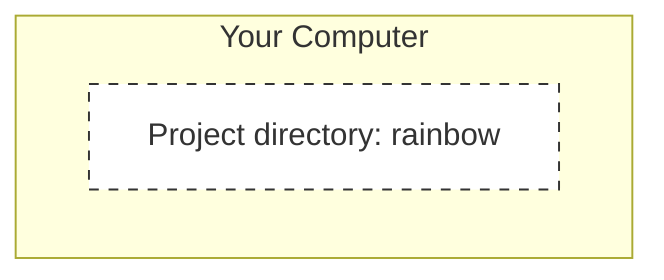
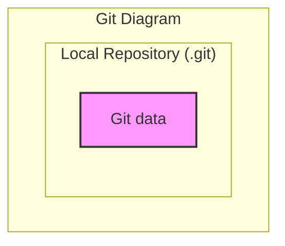
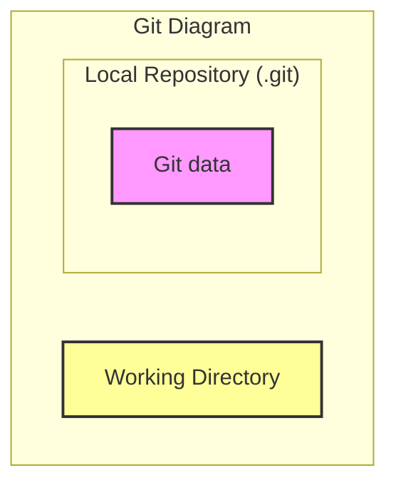
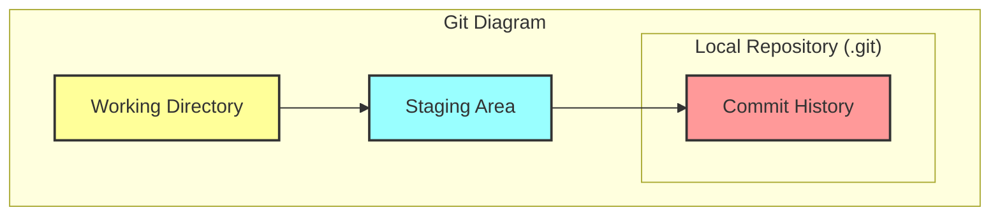
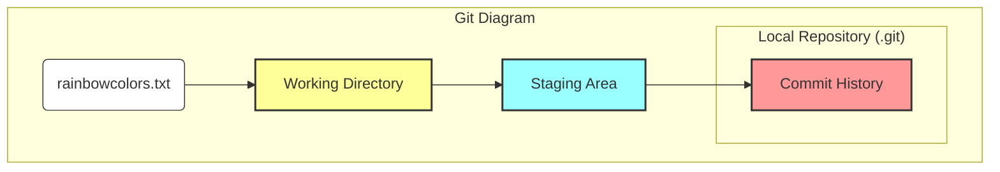

|                                                                                                                                                                                                                                                                                                                                                                                                                                                                                                                                                                                                                                                                                                                                                                                                            |
| :--------------------------------------------------------------------------------------------------------------------------------------------------------------------------------------------------------------------------------------------------------------------------------------------------------------------------------------------------------------------------------------------------------------------------------------------------------------------------------------------------------------------------------------------------------------------------------------------------------------------------------------------------------------------------------------------------------------------------------------------------------------------------------------------------------- |
| In the previous chapter, you learned some command line basics and prepared the environment for working with Git by installing and configuring the necessary settings.                                                                                                                                                                                                                                                                                                                                                                                                                                                                                                                                                                                                                                      |
| In this chapter, you will turn the `rainbow` project directory you created in [Chapter 1](/en/blog/git-01-command-line) into a **Git repository**. You will also learn about 4 important areas when working with Git: the **Working Directory**, the **Staging Area**, the **Commit History**, and the **Local Repository**. To help you visualize how these areas work together, we'll build a **Git Diagram** illustrating each component. Finally, you will add the first file to the `rainbow` project and, through that, learn about the concepts of **untracked** and **tracked files**. Let's get started!                                                                                                                                                                                        |

## Current Setup

At the beginning of this chapter, ensure you have:

- Installed or updated Git on your computer (version >= 2.28).
- Created an empty project directory named `rainbow` on your Desktop.
- Opened a command line window (Terminal) and navigated inside the `rainbow` directory.
- Chosen a text editor and opened the `rainbow` project directory in it.
- Set `user.name` and `user.email` in the Git global configuration.

## Introduction to Repositories

A **repository** (also known as a **repo**) is how we refer to a project version-controlled by Git. In practice, there are two types of repositories:

- **Local repository**: A repository stored on your personal computer.
- **Remote repository**: A repository stored on a hosting service (like [GitHub](https://github.com), [GitLab](https://about.gitlab.com), or [Bitbucket](https://bitbucket.org/product)).

In the first part of this series (until the end of Chapter 5), we will focus exclusively on **local repositories**. From Chapter 6 onwards, you will learn how to work with **remote repositories**.

Now, let's start initializing a local repository.

## Initializing a Local Repository

A local repository is represented by a hidden directory named `.git` located inside your project directory. It contains all the data about the historical changes of the project.

To turn a regular project directory into a local repository, you need to **initialize** it. When you do this, the `.git` directory will be automatically created inside. Since `.git` is a hidden directory, you won't see it unless you enable the option to show hidden files.

> **[ Note ]**
>
> You **ABSOLUTELY SHOULD NOT** manually edit any files or directories inside `.git`. Doing so can break your repository. You should also not delete this directory unless you really want to delete the entire Git history of the project.

In [Follow Along 2-1](#), you will check if there are any hidden files or directories in `rainbow` yet.

### Follow Along 2-1

1. Ensure you have enabled hidden file visibility in your file manager (Files/Nautilus on Ubuntu press `Ctrl+H`).
2. Open the `rainbow` directory and observe. It should currently be empty.
3. In the Terminal:

```bash
rainbow $ ls -a
.   ..
```

Things to notice:

- In steps 2 and 3, you see the `rainbow` directory is completely empty (except for `.` and `..` representing the current directory and parent directory).

To prepare for building the **Git Diagram**, we will illustrate the empty state of the `rainbow` project directory as follows:



_Figure 2-1: Model of an empty rainbow project directory_

To initialize a Git repository, you use the `git init` command. You must be inside the project directory when running this command.

Typically, Git users only need to run `git init`. However, in this Rainbow project, we will use `git init` with the `-b` option (short for `--initial-branch`) to set the default branch name to `main`.

We will explore **branches** in depth in Chapter 4. For now, you just need to know that by old default, Git created a branch named `master`. From Git 2.28 onwards, you can configure this name. I choose `main` instead of `master` because `master` is considered non-inclusive terminology.

> **[ Note ]**
>
> If you want all new repositories to have `main` (or any other name) as the default branch, you can configure the `init.defaultBranch` variable in the global config:
> `git config --global init.defaultBranch main`

> **[ Command Reminder ]**
>
> **git init**
>
> Initializes a Git repository.
>
> **git init -b <branch_name>**
>
> Initializes a Git repository and sets the name for the first branch to `<branch_name>`.

### Follow Along 2-2

1. To see the `.git` directory being created, open the `rainbow` folder window (with hidden files visible) next to the Terminal.
2. Run the initialization command:

```bash
rainbow $ git init -b main
Initialized empty Git repository in /home/annaskoulikari/desktop/rainbow/.git/
```

1. Go back to the folder window, and you will see the `.git` directory appear.

Things to notice:

- Git has created the `.git` directory inside the `rainbow` directory.

The first component in our **Git Diagram** is the **Local Repository**, represented by the `.git` directory.



_Figure 2-2: Git Diagram with the Local Repository component_

Inside `.git` there are many files and sub-directories (like `HEAD`, `config`, `objects/`, `refs/`, ...). This is where Git stores its entire "brain."

## The Areas of Git

There are 4 important areas you need to master when working with Git:

1. **Working Directory**
2. **Staging Area**
3. **Commit History**
4. **Local Repository**

We already know about the Local Repository. Now let's look at the other areas.

### Introduction to the Working Directory

The **Working Directory** is the location where the current project files and folders that you see and edit are stored. It's like your "workbench." Here, you add, edit, and delete files.

> **Illustrative Example 2-1**
>
> Suppose I am writing a book with 10 chapters, corresponding to 10 text files: `chapter_one.txt`, `chapter_two.txt`, etc.
>
> - To add these files to the project, I create them in the Working Directory.
> - If I want to edit the content, I edit the files in the Working Directory.
> - If I want to delete a chapter, I delete the corresponding file in the Working Directory.
>
> In short, the Working Directory is where you perform all changes to the project content.

In the case of the `rainbow` project, the Working Directory is the `rainbow` directory (excluding the `.git` folder). Currently, it is empty.

Let's update the **Git Diagram**:



_Figure 2-3: Git Diagram with the Working Directory and Local Repository_

### Introduction to the Staging Area

The **Staging Area** (also known as the Index) is like a draft space. This is where you select and prepare which changes will be included in the next version (next commit) of the project. The Staging Area is represented by a file inside `.git` named `index`.

> **[ Note ]**
>
> The `index` file is only created when you add at least one file to the Staging Area. Currently in the `rainbow` project, you haven't added anything, so this file does not exist yet.

Let's add the Staging Area to the **Git Diagram**:

```mermaid
graph TD
    subgraph "Git Diagram"
        WorkingDir[Working Directory]
        StagingArea[Staging Area (Index)]
        subgraph "Local Repository (.git)"
            RepoContent[Git data]
        end
        WorkingDir --> StagingArea
        StagingArea --> RepoContent
    end
    style WorkingDir fill:#ff9,stroke:#333,stroke-width:2px
    style StagingArea fill:#9ff,stroke:#333,stroke-width:2px
    style RepoContent fill:#f9f,stroke:#333,stroke-width:2px
```

_Figure 2-4: Git Diagram with the Working Directory, Staging Area, and Local Repository_

### What Is a Commit?

A **commit** in Git is essentially a **version** of the project. You can think of it as a snapshot of the entire project at a specific point in time.

Each commit has a unique **Commit Hash** (or Commit ID). This is a 40-character string (consisting of numbers and letters) used to identify that commit. For example: `51dc6ecb327578cca503abba4a56e8c18f3835e1`.

In practice, you usually only need to use the first 7 characters (e.g., `51dc6ec`) to reference that commit.

### Introduction to the Commit History

The **Commit History** is where your commits are stored. It is represented by the `objects` directory inside `.git`. Every time you create a commit, it is saved here.

### Follow Along 2-3

1. In the file window, open the `.git` directory inside `rainbow`.
2. Look for the `objects` directory. That is where the Commit History is stored.

Let's complete the **Git Diagram**:



_Figure 2-5: The complete Git Diagram_

## Adding a File to a Git Project

The first step of the `rainbow` project is to create a file named `rainbowcolors.txt`.

### Follow Along 2-4

1. Using your text editor, create a new file named `rainbowcolors.txt` inside the `rainbow` directory.
2. Enter the following content on line 1:
   `Red is the first color of the rainbow.`
3. Save the file.

At this point, `rainbowcolors.txt` is in the **Working Directory**, but it is not yet part of the repository. It hasn't been added to the Staging Area or the Commit History.



_Figure 2-6: The rainbow project after adding the rainbowcolors.txt file to the Working Directory_

Therefore, `rainbowcolors.txt` is currently an **untracked file**.

- **Untracked file**: A file in the working directory that is not yet tracked by Git (version controlled).
- **Tracked file**: A file that is already being tracked by Git (has been committed or added to the staging area).

In the next chapter, we will learn how to bring it into the Staging Area and Commit History.

## Summary

In this chapter, you have:

1. Turned the `rainbow` directory into a **Local Repository** using `git init`.
2. Understood the 4 areas: **Working Directory**, **Staging Area**, **Commit History**, and **Local Repository**.
3. Created the first file and understood the concept of an **untracked file**.

See you in [Chapter 3](/en/blog/git-03-making-commit), where we will make our first commit!
