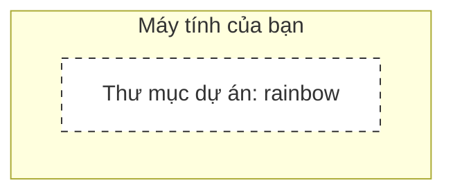
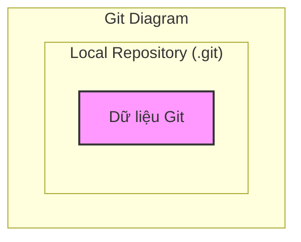
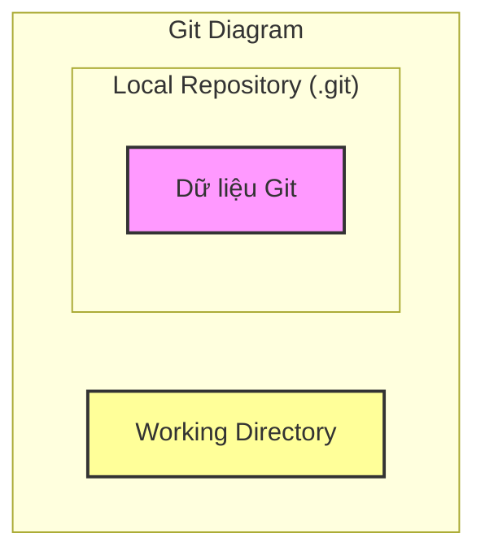
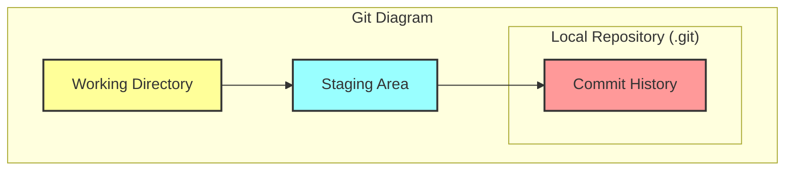
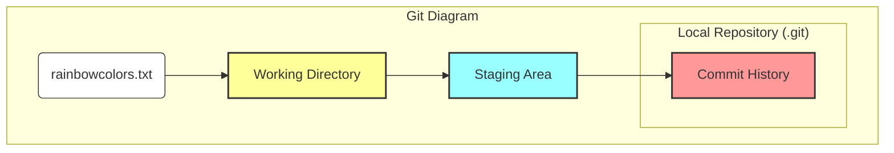

|                                                                                                                                                                                                                                                                                                                                                                                                                                    |
| :--------------------------------------------------------------------------------------------------------------------------------------------------------------------------------------------------------------------------------------------------------------------------------------------------------------------------------------------------------------------------------------------------------------------------------- |
| Trong chương trước, bạn đã học được một số kiến thức cơ bản về command line và chuẩn bị môi trường làm việc với Git bằng cách cài đặt và cấu hình các settings cần thiết.                                                                                                                                                                                                                                                          |
| Trong chương này, bạn sẽ biến thư mục dự án `rainbow` mà bạn đã tạo ở [Chương 1](/vi/blog/git-01-command-line) thành một **Git repository**. Bạn cũng sẽ tìm hiểu về 4 khu vực quan trọng khi làm việc với Git: **Working Directory**, **Staging Area**, **Commit History**, và **Local Repository**. Để giúp bạn hình dung cách các khu vực này phối hợp với nhau, chúng ta sẽ xây dựng một **Git Diagram** mô diễn từng thành phần. |
| Cuối cùng, bạn sẽ thêm file đầu tiên vào dự án `rainbow`, và qua đó tìm hiểu về khái niệm **untracked** và **tracked files**. Hãy cùng bắt đầu!                                                                                                                                                                                                                                                                                    |

## Cài Đặt Hiện Tại (Current Setup)

Ở đầu chương này, bạn cần đảm bảo:

- Đã cài đặt hoặc cập nhật Git trên máy tính (phiên bản >= 2.28).
- Đã tạo một thư mục dự án trống tên là `rainbow` trên Desktop.
- Đã mở một cửa sổ command line (Terminal) và điều hướng vào bên trong thư mục `rainbow`.
- Đã chọn một Text Editor và mở thư mục dự án `rainbow` trong đó.
- Đã thiết lập `user.name` và `user.email` trong Git global configuration.

## Giới Thiệu Về Repository

Một **repository** (hay còn gọi tắt là **repo**) là cách chúng ta gọi một dự án được quản lý phiên bản (version controlled) bởi Git. Thực tế, có hai loại repository:

- **Local repository**: Là repository được lưu trữ trên máy tính cá nhân của bạn.
- **Remote repository**: Là repository được lưu trữ trên một dịch vụ hosting (như [GitHub](https://github.com), [GitLab](https://about.gitlab.com), hoặc [Bitbucket](https://bitbucket.org/product)).

Trong phần đầu của series này (đến hết Chương 5), chúng ta sẽ chỉ tập trung vào **local repositories**. Từ Chương 6 trở đi, bạn sẽ học cách làm việc với **remote repositories**.

Giờ thì, hãy bắt đầu khởi tạo một local repository.

## Khởi Tạo Một Local Repository

Một local repository thực chất được đại diện bởi một thư mục ẩn có tên là `.git` nằm bên trong thư mục dự án của bạn. Nó chứa toàn bộ dữ liệu về các thay đổi lịch sử của dự án.

Để biến một thư mục dự án thường thành một local repository, bạn cần **khởi tạo** (initialize) nó. Khi bạn làm điều này, thư mục `.git` sẽ được tự động tạo ra bên trong. Vì `.git` là thư mục ẩn, bạn sẽ không thấy nó trừ khi bạn bật chế độ hiển thị file ẩn.

> **[ Lưu ý ]**
>
> Bạn **TUYỆT ĐỐI KHÔNG** nên chỉnh sửa thủ công bất kỳ file hay thư mục nào bên trong `.git`. Làm vậy có thể làm hỏng repository của bạn. Bạn cũng không nên xóa thư mục này trừ khi bạn thực sự muốn xóa bỏ toàn bộ lịch sử Git của dự án.

Trong **Thực Hành 2-1**, bạn sẽ kiểm tra xem có file hay thư mục ẩn nào trong `rainbow` chưa.

### Thực Hành 2-1

1. Hãy đảm bảo bạn đã bật chế độ hiển thị file ẩn (Show Hidden Files) trong trình quản lý file (Files/Nautilus trên Ubuntu nhấn `Ctrl+H`).
2. Mở thư mục `rainbow` và quan sát. Hiện tại nó sẽ trống rỗng.
3. Trên Terminal:

```bash
rainbow $ ls -a
.   ..
```

**Những điều cần chú ý:**

- Ở bước 2 và 3, bạn thấy thư mục `rainbow` hoàn toàn trống (ngoại trừ `.` và `..` đại diện cho thư mục hiện tại và thư mục cha).

Để chuẩn bị xây dựng **Git Diagram**, chúng ta sẽ minh họa trạng thái thư mục `rainbow` trống rỗng như sau:



_Hình 2-1: Mô hình thư mục dự án rainbow trống_

Để khởi tạo Git repository, bạn sử dụng lệnh `git init`. Bạn phải đang đứng ở bên trong thư mục dự án khi chạy lệnh này.

Thông thường, người dùng Git chỉ cần chạy `git init`. Tuy nhiên, trong dự án Rainbow này, chúng ta sẽ sử dụng `git init` kèm theo option `-b` (viết tắt của `--initial-branch`) để đặt tên nhánh mặc định là `main`.

Chúng ta sẽ tìm hiểu sâu hơn về **branch** (nhánh) ở Chương 4. Hiện tại, bạn chỉ cần biết rằng theo mặc định cũ, Git tạo nhánh tên là `master`. Từ Git 2.28 trở đi, bạn có thể cấu hình tên này. Tôi chọn `main` thay vì `master` vì `master` là thuật ngữ không còn được khuyến khích (non-inclusive terminology).

> **[ Lưu ý ]**
>
> Nếu bạn muốn tất cả các repository mới đều có nhánh mặc định là `main` (hoặc tên khác tùy thích), bạn có thể cấu hình biến `init.defaultBranch` trong global config:
> `git config --global init.defaultBranch main`

> **[ Ghi nhớ lệnh ]**
>
> **git init**
>
> Khởi tạo một Git repository.
>
> **git init -b <branch_name>**
>
> Khởi tạo Git repository và đặt tên cho nhánh đầu tiên là `<branch_name>`.

### Thực Hành 2-2

1. Để thấy thư mục `.git` được tạo ra, hãy mở sẵn cửa sổ thư mục `rainbow` (đã bật hiện file ẩn) song song với Terminal.
2. Chạy lệnh khởi tạo:

```bash
rainbow $ git init -b main
Initialized empty Git repository in /home/annaskoulikari/desktop/rainbow/.git/
```

1. Quay lại cửa sổ thư mục, bạn sẽ thấy thư mục `.git` xuất hiện.

**Những điều cần chú ý:**

- Git đã tạo ra thư mục `.git` bên trong thư mục `rainbow`.

Thành phần đầu tiên trong **Git Diagram** của chúng ta chính là **Local Repository**, được đại diện bởi thư mục `.git`.



_Hình 2-2: Git Diagram với thành phần Local Repository_

Bên trong `.git` có chứa nhiều file và thư mục con (như `HEAD`, `config`, `objects/`, `refs/`, ...). Đây là nơi Git lưu trữ toàn bộ "bộ não" của nó.

## Các Khu Vực Làm Việc Của Git (The Areas of Git)

Có 4 khu vực quan trọng bạn cần nắm vững khi làm việc với Git:

1. **Working Directory**
2. **Staging Area**
3. **Commit History**
4. **Local Repository**

Chúng ta đã biết về Local Repository. Giờ hãy xem xét các khu vực còn lại.

### Giới Thiệu Về Working Directory

**Working Directory** (thư mục làm việc) chính là nơi chứa các file và thư mục hiện tại của dự án mà bạn đang nhìn thấy và chỉnh sửa. Nó giống như "bàn làm việc" (workbench) của bạn. Tại đây, bạn thêm, sửa, xóa các file.

> **Ví Dụ Minh Họa 2-1**
>
> Giả sử tôi đang viết một cuốn sách có 10 chương, tương ứng với 10 file text: `chapter_one.txt`, `chapter_two.txt`, v.v.
>
> - Để thêm các file này vào dự án, tôi sẽ tạo chúng trong Working Directory.
> - Nếu muốn sửa nội dung, tôi sẽ sửa file trong Working Directory.
> - Nếu muốn xóa một chương, tôi sẽ xóa file tương ứng trong Working Directory.
>
> Tóm lại, Working Directory là nơi bạn thực hiện mọi thay đổi đối với nội dung dự án.

> **Ví Dụ Minh Họa 2-1**
>
> Giả sử tôi đang viết một cuốn sách có 10 chương, tương ứng với 10 file text: `chapter_one.txt`, `chapter_two.txt`, v.v.
>
> - Để thêm các file này vào dự án, tôi sẽ tạo chúng trong Working Directory.
> - Nếu muốn sửa nội dung, tôi sẽ sửa file trong Working Directory.
> - Nếu muốn xóa một chương, tôi sẽ xóa file tương ứng trong Working Directory.
>
> Tóm lại, Working Directory là nơi bạn thực hiện mọi thay đổi đối với nội dung dự án.

Trong trường hợp của dự án `rainbow`, Working Directory chính là thư mục `rainbow` (trừ thư mục `.git`). Hiện tại nó đang trống.

Hãy cập nhật **Git Diagram**:



_Hình 2-3: Git Diagram với Working Directory và Local Repository_

### Giới Thiệu Về Staging Area

**Staging Area** (khu vực tổ chức/tạm tính) giống như một không gian nháp. Đây là nơi bạn chọn lọc và chuẩn bị những thay đổi nào sẽ được đưa vào phiên bản tiếp theo (commit tiếp theo) của dự án. Staging Area được đại diện bởi một file nằm trong `.git` có tên là `index`.

> **[ Lưu ý ]**
>
> File `index` chỉ được tạo ra khi bạn thêm ít nhất một file vào Staging Area. Hiện tại trong dự án `rainbow`, bạn chưa thêm gì nên file này chưa tồn tại.

Hãy thêm Staging Area vào **Git Diagram**:

```mermaid
graph TD
    subgraph "Git Diagram"
        WorkingDir[Working Directory]
        StagingArea[Staging Area (Index)]
        subgraph "Local Repository (.git)"
            RepoContent[Dữ liệu Git]
        end
        WorkingDir --> StagingArea
        StagingArea --> RepoContent
    end
    style WorkingDir fill:#ff9,stroke:#333,stroke-width:2px
    style StagingArea fill:#9ff,stroke:#333,stroke-width:2px
    style RepoContent fill:#f9f,stroke:#333,stroke-width:2px
```

_Hình 2-4: Git Diagram với Working Directory, Staging Area và Local Repository_

### Commit Là Gì?

Một **commit** trong Git về cơ bản là một **phiên bản** của dự án. Bạn có thể coi nó như một bản chụp (snapshot) của toàn bộ dự án tại một thời điểm cụ thể.

Mỗi commit đều có một **Commit Hash** (hoặc Commit ID) duy nhất. Đây là chuỗi 40 ký tự (gồm số và chữ) dùng để định danh commit đó. Ví dụ: `51dc6ecb327578cca503abba4a56e8c18f3835e1`.

Thực tế, bạn thường chỉ cần dùng 7 ký tự đầu tiên (ví dụ `51dc6ec`) để tham chiếu đến commit đó.

### Giới Thiệu Về Commit History

**Commit History** (Lịch sử Commit) là nơi lưu trữ các commit của bạn. Nó được đại diện bởi thư mục `objects` bên trong `.git`. Mỗi khi bạn tạo một commit, nó sẽ được lưu vào đây.

### Thực Hành 2-3

1. Trong cửa sổ file, mở thư mục `.git` bên trong `rainbow`.
2. Tìm thư mục `objects`. Đó chính là nơi chứa Commit History.

Hãy hoàn thiện **Git Diagram**:



_Hình 2-5: Git Diagram hoàn chỉnh_

## Thêm Một File Vào Dự Án Git (Adding a File)

Bước đầu tiên của dự án `rainbow`, bạn sẽ tạo một file tên là `rainbowcolors.txt`.

### Thực Hành 2-4

1. Sử dụng Text Editor của bạn, tạo một file mới tên là `rainbowcolors.txt` bên trong thư mục `rainbow`.
2. Nhập nội dung sau vào dòng 1:
   `Red is the first color of the rainbow.`
3. Lưu file lại.

Lúc này, `rainbowcolors.txt` đang nằm trong **Working Directory**, nhưng nó chưa phải là một phần của repository. Nó chưa được đưa vào Staging Area và chưa có trong Commit History.



_Hình 2-6: Dự án rainbow sau khi thêm file rainbowcolors.txt vào Working Directory_

Vì vậy, `rainbowcolors.txt` hiện đang là một **untracked file**.

- **Untracked file**: Là file nằm trong working directory nhưng chưa được Git theo dõi (version control).
- **Tracked file**: Là file đã được Git theo dõi (đã từng được commit hoặc add vào staging area).

Trong chương tiếp theo, chúng ta sẽ học cách đưa nó vào Staging Area và Commit History.

## Tổng Kết

Trong chương này, bạn đã:

1. Biến thư mục `rainbow` thành một **Local Repository** với `git init`.
2. Hiểu về 4 khu vực: **Working Directory**, **Staging Area**, **Commit History**, **Local Repository**.
3. Tạo file đầu tiên và hiểu khái niệm **untracked file**.

Hẹn gặp lại bạn ở [Chương 3](/vi/blog/git-03-making-commit), nơi chúng ta sẽ thực hiện commit đầu tiên!
