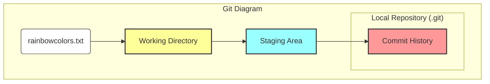
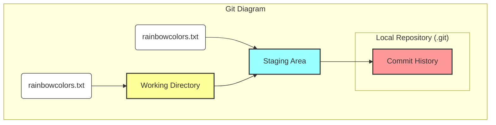
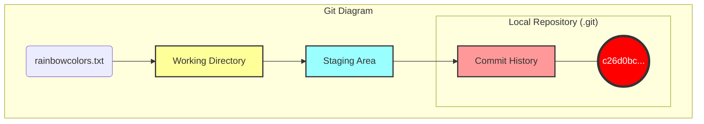

|                                                                                                                                                                                                                                                                                                                                                                                                                |
| :------------------------------------------------------------------------------------------------------------------------------------------------------------------------------------------------------------------------------------------------------------------------------------------------------------------------------------------------------------------------------------------------------------- |
| In the previous chapter, you learned about the different areas when working with Git: the **Working Directory**, the **Staging Area**, the **Commit History**, and the **Local Repository**. We built the Git Diagram for these areas, and you finished the chapter by adding the first file to the `rainbow` project.                                                                                         |
| In this chapter, you will go through the process of creating a **commit** in the Rainbow project and observe how each area in the Git Diagram participates in that process. I'll also introduce two important commands to support your daily work with Git. The first command helps you check the status of the working directory and staging area, and the second command helps you view the list of commits. |

## Current Setup

Currently, you have a project directory named `rainbow` containing a `.git` directory inside, and a `rainbowcolors.txt` file located in the working directory. The Staging Area and Commit History are still empty because you haven't created any commits yet.

This is illustrated in the figure below:



_Figure 3-1: The rainbow project at the beginning of Chapter 3 with an untracked file in the Working Directory_

## Why Do We Need Commits?

In Chapter 2, you learned that a commit represents a **version** of the project. Every time you want to save a version, you create a commit.

Committing is very important because it allows you to back up your work and prevent data loss. Once committed, the work is saved safely, and you can go back to that point in time whenever you want to see what the project looked like.

So when should you commit? There are no hard and fast rules. It depends on whether you're working alone or in a team, and what kind of project it is. A common piece of advice in the Git community is **"commit early, commit often."** When you're just starting, it's better to commit too much than too little.

## The 2-Step Process to Create a Commit

Creating a commit is a 2-step process:

1. Add all the files you want to include in the next commit to the **Staging Area**.
2. Create the commit with a **commit message**.

Throughout this process, you will interact with the 4 areas of Git: the Local Repository, the Working Directory, the Staging Area, and the Commit History.

A very useful command is `git status`. It tells you the status of the Working Directory and the Staging Area.

> **[ Command Reminder ]**
>
> **git status**
>
> Displays the status of the Working Directory and the Staging Area.

### Illustrative Example 3-1

Suppose I am writing a book with 10 chapter files. After a long period of editing, I might forget which chapters I've modified. The `git status` command will come to the rescue by listing exactly which files have been modified, which have been added to the Staging Area, and which haven't.

The `git status` command only provides information; it doesn't change anything. Use it freely at any time.

### Follow Along 3-1

Let's check the status of the `rainbow` project. Ensure you are inside the project directory in the Terminal.

```bash
rainbow $ git status
On branch main

No commits yet

Untracked files:
  (use "git add <file>..." to include in what will be committed)
    rainbowcolors.txt

nothing added to commit but untracked files present (use "git add" to track)
```

Things to notice:

- `No commits yet`: There are no commits in the history yet.
- `Untracked files`: `rainbowcolors.txt` is in an untracked state.
- Git guides you to use `git add <file>...` to include the file in what will be committed.

As mentioned in Chapter 2, for `rainbowcolors.txt` to become a **tracked file**, it must be added to the Staging Area and then committed. Let's start with Step 1: Add the file to the Staging Area.

## Adding a File to the Staging Area (git add)

To add a file to the Staging Area, you use the `git add` command.

- To add a specific file: `git add <filename>`
- To add all changes in the current directory: `git add -A` (or `git add .`)

> **[ Command Reminder ]**
>
> **git add <filename>**
>
> Adds a file to the Staging Area.
>
> **git add -A**
>
> Adds all changed/newly created files in the Working Directory to the Staging Area.

The Staging Area allows you to choose which changes will go into the next commit. This helps you organize your commits cleanly and logically.

### Illustrative Example 3-2

If I edit chapters 1, 2, and 3, but only want to commit chapter 2 (because chapters 1 and 3 are not finished), I only need to run `git add chapter_two.txt`. Then, the next commit will only contain the changes for chapter 2.

In the Rainbow project, `rainbowcolors.txt` is the first file you add. When you add this file, the `index` file (representing the Staging Area in `.git`) will be created.

### Follow Along 3-2

1. Open the `.git` directory window to observe it.
2. Run the command:

```bash
rainbow $ git add rainbowcolors.txt
```

1. Check the status again:

```bash
rainbow $ git status
On branch main

No commits yet

Changes to be committed:
  (use "git rm --cached <file>..." to unstage)
    new file: rainbowcolors.txt
```

1. Observe inside the `.git` directory; the `index` file has appeared.

Things to notice:

- `rainbowcolors.txt` is now in the `Changes to be committed` section. This means it is in the Staging Area.

Illustration of the current state:



_Figure 3-2: The rainbow project after adding rainbowcolors.txt to the Staging Area_

Note that `git add` **copies** the file from the Working Directory to the Staging Area; it doesn't move it. The file still exists in both places.

## Creating a Commit (git commit)

Step 2 is creating the commit with a message.

`Commit` is both a verb (to save) and a noun (a version).
To create a commit, use the `git commit -m "message content"` command.

> **[ Command Reminder ]**
>
> **git commit -m "<message>"**
>
> Creates a new commit with a descriptive message.

### Illustrative Example 3-3

If I only commit chapter 2, I might set the message to "Updated chapter 2".

For the Rainbow project, we will use the color name as the message for easy tracking. Since the first color is "red," let's commit with the message "red."

### Follow Along 3-3

```bash
rainbow $ git commit -m "red"
[main (root-commit) c26d0bc] red
 1 file changed, 1 insertion(+)
 create mode 100644 rainbowcolors.txt
```

Things to notice:

- The output displays the first 7 characters of the **Commit Hash** (in this example `c26d0bc`, yours will be different).
- `rainbowcolors.txt` is now a **tracked file**.

Updating the Git Diagram:



_Figure 3-3: The rainbow project after creating the "red" commit_

In our diagram, commits will be represented by circles.

## Viewing Commit List (Viewing History)

To view the commit history, use the `git log` command. It lists commits in reverse chronological order (newest at the top).

4 main pieces of information for each commit:

1. Commit Hash (long)
2. Author
3. Date
4. Commit Message

> **[ Command Reminder ]**
>
> **git log**
>
> Displays the list of commits (history).

> **[ Note ]**
>
> If the list is too long, press `Enter` or the `Down Arrow` to see more. Press `q` to quit.

### Follow Along 3-4

```bash
rainbow $ git log
commit c26d0bc371c3634ab49543686b3c8f10e9da63c5 (HEAD -> main)
Author: annaskoulikari <gitlearningjourney@gmail.com>
Date:   Sat Feb 19 09:23:18 2022 +0100

    red
```

Things to notice:

- You see the single "red" commit.
- The author information matches the configuration you set up.
- Next to the commit hash, you see `(HEAD -> main)`. `main` is the **branch**, and `HEAD` is a pointer to the current location. We'll explore this more in the next chapter.

## Summary

This chapter introduced the 2-step process for creating a commit: `git add` (add to the Staging Area) and `git commit` (save to the Commit History). You also became familiar with `git status` to check the status and `git log` to view the history.

In the next chapter, we'll dive into the concept of **Branches** and find out what `HEAD` really is. See you in [Chapter 4](/en/blog/git-04-branches)!
