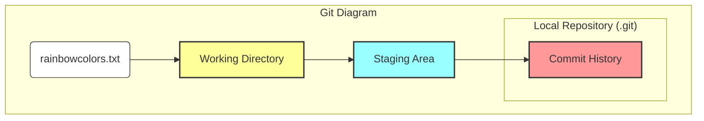
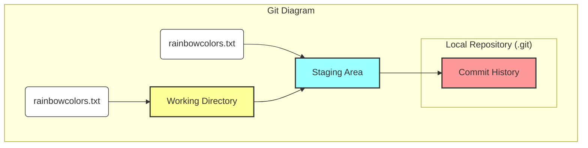
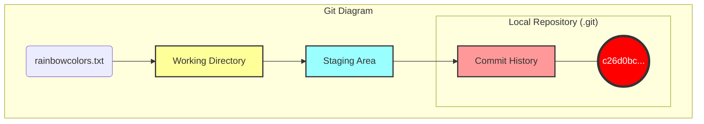

|                                                                                                                                                                                                                                                                                                                                                                                     |
| :---------------------------------------------------------------------------------------------------------------------------------------------------------------------------------------------------------------------------------------------------------------------------------------------------------------------------------------------------------------------------------- |
| Trong chương trước, bạn đã tìm hiểu về các khu vực khác nhau khi làm việc với Git: **Working Directory**, **Staging Area**, **Commit History**, và **Local Repository**. Chúng ta đã xây dựng Git Diagram cho các khu vực này, và bạn đã kết thúc chương bằng hành động thêm file đầu tiên vào dự án `rainbow`.                                                                     |
| Trong chương này, bạn sẽ đi qua quy trình tạo một **commit** trong dự án Rainbow và quan sát cách mỗi khu vực trong Git Diagram tham gia vào quá trình đó. Tôi cũng sẽ giới thiệu hai lệnh quan trọng hỗ trợ công việc hàng ngày của bạn với Git. Lệnh đầu tiên giúp bạn kiểm tra trạng thái của working directory và staging area, lệnh thứ hai giúp bạn xem danh sách các commit. |

## Cài Đặt Hiện Tại (Current Setup)

Hiện tại, bạn có một thư mục dự án tên là `rainbow` chứa thư mục `.git` bên trong, và một file `rainbowcolors.txt` nằm trong working directory. Staging Area và Commit History vẫn đang trống vì bạn chưa tạo bất kỳ commit nào.

Điều này được minh họa trong hình dưới đây:



_Hình 3-1: Dự án rainbow ở đầu Chương 3 với một untracked file trong Working Directory_

## Tại Sao Chúng Ta Cần Commit?

Ở Chương 2, bạn đã biết rằng một commit đại diện cho một **phiên bản** của dự án. Mỗi khi bạn muốn lưu lại một phiên bản, bạn tạo một commit.

Việc commit rất quan trọng vì nó cho phép bạn sao lưu công việc của mình và tránh mất mát dữ liệu. Khi đã commit, công việc đó đã được lưu trữ an toàn, và bạn có thể quay lại thời điểm đó bất cứ lúc nào để xem dự án trông như thế nào.

Vậy khi nào nên commit? Không có quy tắc cứng nhắc nào cả. Nó phụ thuộc vào việc bạn làm việc một mình hay trong team, và loại dự án là gì. Một lời khuyên phổ biến trong giới Git là **"commit early, commit often"** (commit sớm, commit thường xuyên). Khi mới bắt đầu, thà commit thừa còn hơn thiếu.

## Quy Trình 2 Bước Để Tạo Commit

Tạo một commit là quy trình gồm 2 bước:

1. Thêm tất cả các file bạn muốn đưa vào commit tiếp theo vào **Staging Area**.
2. Tạo commit với một **commit message**.

Trong suốt quá trình này, bạn sẽ tương tác với 4 khu vực của Git: Local Repository, Working Directory, Staging Area, và Commit History.

Một lệnh cực kỳ hữu ích là `git status`. Nó cho bạn biết trạng thái của Working Directory và Staging Area.

> **[ Ghi nhớ lệnh ]**
>
> **git status**
>
> Hiển thị trạng thái của Working Directory và Staging Area.

### Ví Dụ Minh Họa 3-1

Giả sử tôi đang viết sách với 10 file chương. Sau một hồi chỉnh sửa, tôi có thể quên mất mình đã sửa chương nào. Lệnh `git status` sẽ cứu cánh bằng cách liệt kê chính xác file nào đã sửa, file nào đã được thêm vào Staging Area, và file nào chưa.

Lệnh `git status` chỉ cung cấp thông tin, nó không thay đổi gì cả. Hãy dùng nó thoải mái bất cứ lúc nào.

### Thực Hành 3-1

Hãy kiểm tra trạng thái của dự án `rainbow`. Đảm bảo bạn đang đứng trong thư mục dự án trên Terminal.

```bash
rainbow $ git status
On branch main

No commits yet

Untracked files:
  (use "git add <file>..." to include in what will be committed)
    rainbowcolors.txt

nothing added to commit but untracked files present (use "git add" to track)
```

**Những điều cần chú ý:**

- `No commits yet`: Chưa có commit nào trong lịch sử.
- `Untracked files`: `rainbowcolors.txt` đang ở trạng thái untracked.
- Git hướng dẫn bạn dùng `git add <file>...` để thêm file vào commit.

Như đã đề cập ở Chương 2, để `rainbowcolors.txt` trở thành **tracked file**, nó phải được thêm vào Staging Area và sau đó được commit. Hãy bắt đầu bước 1: Thêm file vào Staging Area.

## Thêm File Vào Staging Area (git add)

Để thêm file vào Staging Area, bạn dùng lệnh `git add`.

- Để thêm từng file: `git add <tên_file>`
- Để thêm tất cả thay đổi trong thư mục hiện tại: `git add -A` (hoặc `git add .`)

> **[ Ghi nhớ lệnh ]**
>
> **git add <filename>**
>
> Thêm một file vào Staging Area.
>
> **git add -A**
>
> Thêm tất cả file đã thay đổi/tạo mới trong Working Directory vào Staging Area.

Staging Area cho phép bạn chọn lọc những thay đổi nào sẽ vào commit tiếp theo. Điều này giúp bạn tổ chức các commit gọn gàng và logic.

### Ví Dụ Minh Họa 3-2

Nếu tôi sửa chương 1, 2 và 3, nhưng chỉ muốn commit chương 2 (vì chương 1 và 3 chưa xong), tôi chỉ cần `git add chapter_two.txt`. Khi đó, commit tiếp theo chỉ chứa thay đổi của chương 2.

Trong dự án Rainbow, `rainbowcolors.txt` là file đầu tiên bạn thêm vào. Khi bạn thêm file này, file `index` (đại diện cho Staging Area trong `.git`) sẽ được tạo ra.

### Thực Hành 3-2

1. Mở sẵn cửa sổ thư mục `.git` để quan sát.
2. Chạy lệnh:

```bash
rainbow $ git add rainbowcolors.txt
```

1. Kiểm tra lại trạng thái:

```bash
rainbow $ git status
On branch main

No commits yet

Changes to be committed:
  (use "git rm --cached <file>..." to unstage)
    new file: rainbowcolors.txt
```

1. Quan sát trong thư mục `.git`, file `index` đã xuất hiện.

**Những điều cần chú ý:**

- `rainbowcolors.txt` hiện đã nằm trong phần `Changes to be committed`. Điều này nghĩa là nó đã ở trong Staging Area.

Minh họa trạng thái hiện tại:



_Hình 3-2: Dự án rainbow sau khi thêm rainbowcolors.txt vào Staging Area_

Lưu ý rằng `git add` **sao chép** file từ Working Directory vào Staging Area, chứ không phải di chuyển nó. File vẫn nằm ở cả hai nơi.

## Tạo Commit (git commit)

Bước 2 là tạo commit với một thông điệp (message).

`Commit` vừa là động từ (lưu lại) vừa là danh từ (một phiên bản).
Để tạo commit, dùng lệnh `git commit -m "nội dung message"`.

> **[ Ghi nhớ lệnh ]**
>
> **git commit -m "<message>"**
>
> Tạo một commit mới với message mô tả.

### Ví Dụ Minh Họa 3-3

Nếu tôi chỉ commit chương 2, tôi có thể đặt message là "Updated chapter 2".

Đối với dự án Rainbow, chúng ta sẽ dùng tên màu sắc làm message để dễ theo dõi. Vì màu đầu tiên là "red", hãy commit với message là "red".

### Thực Hành 3-3

```bash
rainbow $ git commit -m "red"
[main (root-commit) c26d0bc] red
 1 file changed, 1 insertion(+)
 create mode 100644 rainbowcolors.txt
```

**Những điều cần chú ý:**

- Output hiển thị 7 ký tự đầu của **Commit Hash** (trong ví dụ là `c26d0bc`, của bạn sẽ khác).
- `rainbowcolors.txt` giờ đã là **tracked file**.

Cập nhật Git Diagram:



_Hình 3-3: Dự án rainbow sau khi tạo commit "red"_

Trong sơ đồ của chúng ta, các commit sẽ được biểu diễn bằng hình tròn.

## Xem Danh Sách Commit (Viewing History)

Để xem lịch sử commit, dùng lệnh `git log`. Nó liệt kê các commit theo thứ tự thời gian ngược (mới nhất ở trên).

4 thông tin chính của mỗi commit:

1. Commit Hash (dài)
2. Tác giả (Author)
3. Ngày giờ (Date)
4. Commit Message

> **[ Ghi nhớ lệnh ]**
>
> **git log**
>
> Hiển thị danh sách commit (lịch sử).

> **[ Lưu ý ]**
>
> Nếu danh sách quá dài, nhấn `Enter` hoặc `Mũi tên xuống` để xem tiếp. Nhấn `q` để thoát.

### Thực Hành 3-4

```bash
rainbow $ git log
commit c26d0bc371c3634ab49543686b3c8f10e9da63c5 (HEAD -> main)
Author: annaskoulikari <gitlearningjourney@gmail.com>
Date:   Sat Feb 19 09:23:18 2022 +0100

    red
```

**Những điều cần chú ý:**

- Bạn thấy commit "red" duy nhất.
- Thông tin tác giả trùng với cấu hình bạn đã cài đặt.
- Bên cạnh commit hash có `(HEAD -> main)`. `main` là **branch** (nhánh) và `HEAD` là con trỏ chỉ vị trí hiện tại. Chúng ta sẽ tìm hiểu kỹ hơn ở chương sau.

## Tổng Kết

Chương này đã giới thiệu quy trình 2 bước để tạo commit: `git add` (thêm vào Staging Area) và `git commit` (lưu vào Commit History). Bạn cũng đã làm quen với `git status` để kiểm tra trạng thái và `git log` để xem lịch sử.

Trong chương tiếp theo, chúng ta sẽ đi sâu vào khái niệm **Branch** (nhánh) và tìm hiểu `HEAD` thực sự là gì. Hẹn gặp lại bạn ở [Chương 4](/vi/blog/git-04-branches)!
