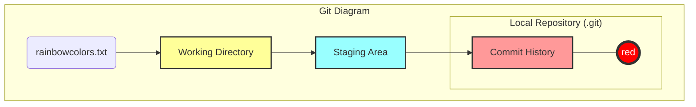
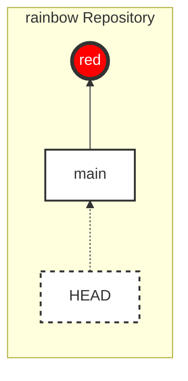
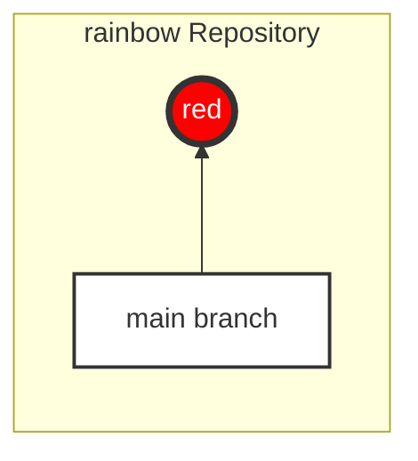
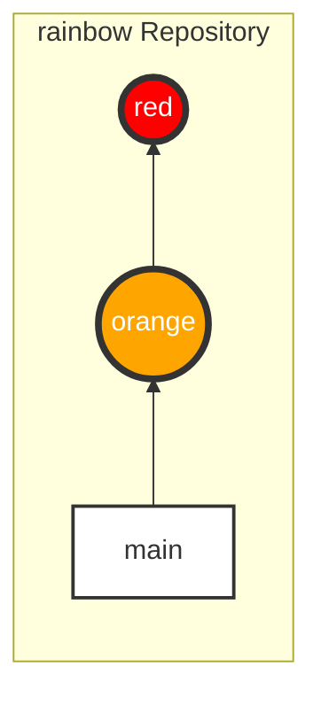
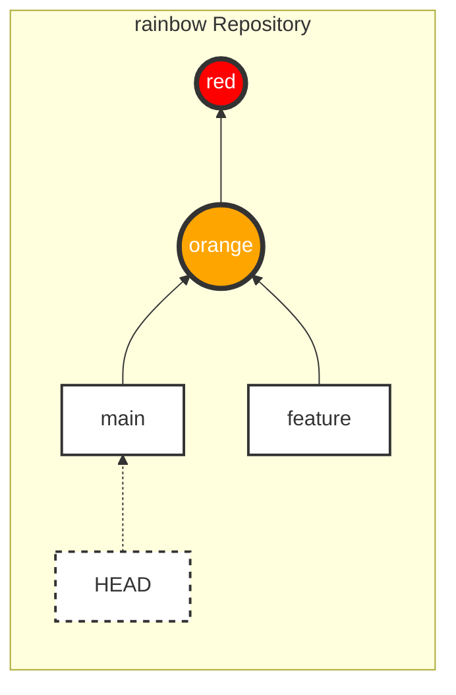
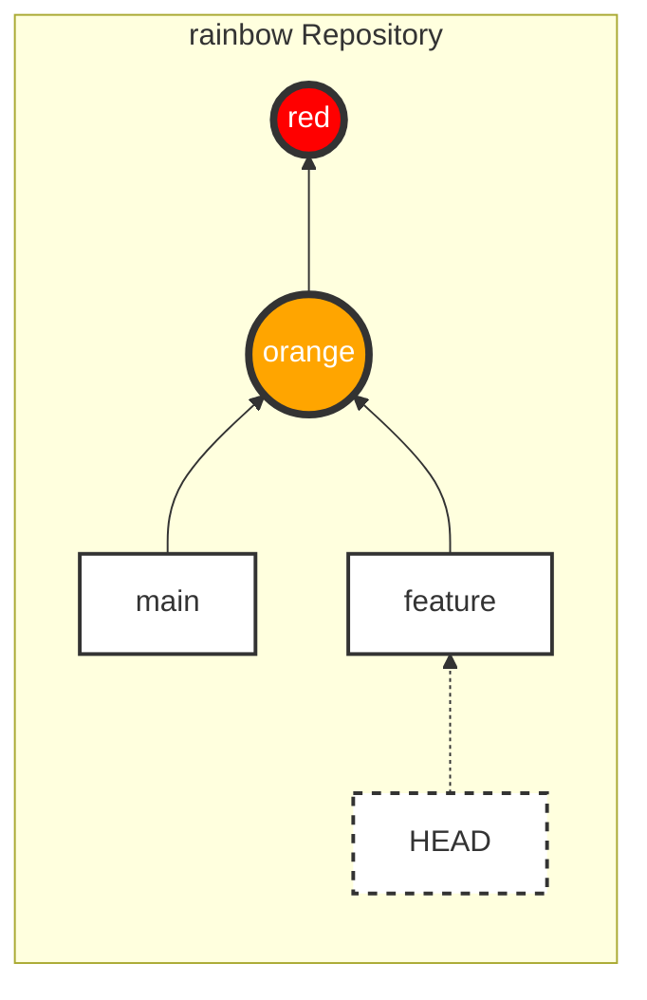
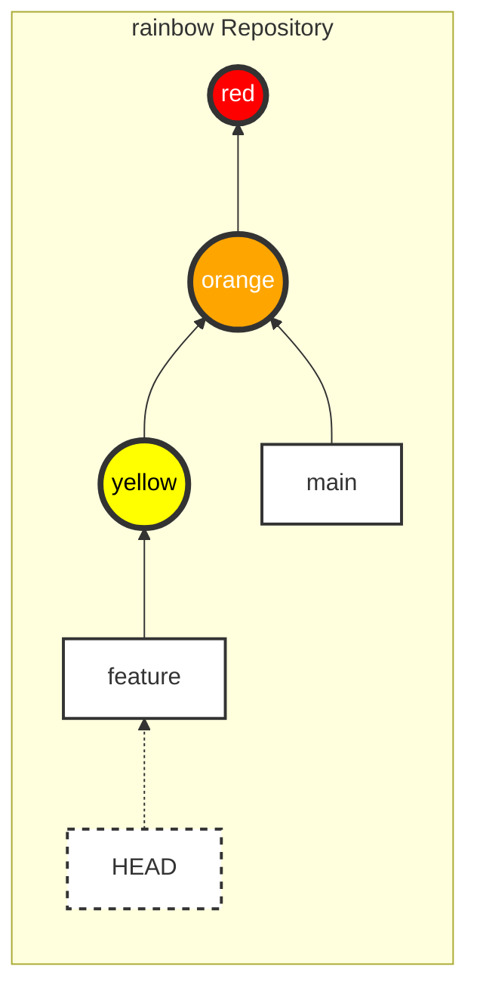

|                                                                                                                                                                                                                                                                                                                                                                                                                                                                                                                                         |
| :-------------------------------------------------------------------------------------------------------------------------------------------------------------------------------------------------------------------------------------------------------------------------------------------------------------------------------------------------------------------------------------------------------------------------------------------------------------------------------------------------------------------------------------- |
| In the previous chapter, your `rainbow` project had its first commit.                                                                                                                                                                                                                                                                                                                                                                                                                                                                   |
| In this chapter, you will learn about **Branches** and why we use them. You will continue to create more commits in the `rainbow` project and see how it affects the branches. Finally, you will create a new branch and learn how to **switch** to it. Additionally, you will also explore the concepts of **unmodified** and **modified files**, as well as how commits are linked together. |

## Status of the Local Repository

Let's review the status of the `rainbow` project at the beginning of this chapter using the Git Diagram and a Repository Diagram.

### Git Diagram



_Figure 4-1: Git Diagram showing the status of the `rainbow` repository with 1 commit (red)_

> **[ Note ]**
>
> From now on, Visualize It diagrams will only display the color name of the commit or a shorthand, instead of the first 7 characters of the commit hash.

### Repository Diagram

To focus on the Commit History, I'll introduce the **Repository Diagram**. This diagram focuses solely on the commit history and associated branches/references.



_Figure 4-2: Repository Diagram showing the current status with the "red" commit_

## Why Do We Use Branches?

There are two main reasons to use branches:

1. To work on the same project in different directions.
2. To allow multiple people to work on the same project at once.

You can think of a branch as a line of development. A project can have a main branch (usually `main`) and multiple side branches (called _topic branches_ or _feature branches_) to develop specific features. These side branches are usually short-lived; after completion, they are merged back into the main branch and deleted.

### Illustrative Example 4-1

Suppose the official branch of a book project is `main`. I don't want to include content that hasn't been approved by the editor. Therefore, every time I write a new chapter, I create a side branch, write on it, and send it to the editor. When they approve it, I merge it into `main`.

## What Is a Branch in Git, Really?

In Git, **a Branch is a moveable pointer that points to a commit.**

When you use `git log`, you will see information about which branch points to which commit.

### Follow Along 4-1

Check `git log`:

```bash
rainbow $ git log
commit c26d0bc371c3634ab49543686b3c8f10e9da63c5 (HEAD -> main)
Author: annaskoulikari <gitlearningjourney@gmail.com>
Date:   Sat Feb 19 09:23:18 2022 +0100

    red
```

Things to notice:

- Next to the commit hash, you see `(HEAD -> main)`. This means the `main` branch is pointing to this commit.

> **[ Note ]**
>
> `HEAD` (all caps) is not a branch. We'll discuss it in a later section.

In the `rainbow` project, the `main` branch is currently pointing to the "red" commit.



_Figure 4-3: The `main` branch points to the "red" commit_

### Follow Along 4-2: Checking the branch file

To better understand that a branch is a "pointer," let's look at the file containing the branch information.

1. Open your file manager and go to `rainbow > .git > refs > heads`.
2. You will see a file named `main`.
3. Open the `main` file with your text editor.

**Content inside:** It contains exactly the hash of the "red" commit.
This proves: A branch is just a file containing the hash of the commit it points to.

## Git History: `master` and `main`

Previously, when initializing Git, the default branch name was `master`. However, because this term is considered non-inclusive, the Git community switched to using `main` (or other names) as the default.

That is why in Chapter 2, we used the `git init -b main` command. The word `main` itself isn't special; it's just the default name for the first branch.

## Unmodified and Modified Files

In Chapter 2, we learned about **Tracked** and **Untracked** files.

Files that are already Tracked (Git is aware of them) can be in one of two states:

- **Unmodified**: The file has not been changed since the last commit.
- **Modified**: The file has been changed (and saved).

The `git status` command displays the list of **modified** files. It does not display **unmodified** files.

### Follow Along 4-3

1. Check the status:

```bash
rainbow $ git status
On branch main
nothing to commit, working tree clean
```

(The `rainbowcolors.txt` file is currently unmodified, so it doesn't appear).

1. Edit the `rainbowcolors.txt` file, add the line: "Orange is the second color of the rainbow." and save it.
2. Check the status again:

```bash
rainbow $ git status
On branch main
Changes not staged for commit:
  (use "git add <file>..." to update what will be committed)
  (use "git restore <file>..." to discard changes in working directory)
	modified:   rainbowcolors.txt

no changes added to commit (use "git add" and/or "git commit -a")
```

Things to notice:

- Now `rainbowcolors.txt` appears with a `modified` status.

### Follow Along 4-4: Staging the file

```bash
rainbow $ git add rainbowcolors.txt
rainbow $ git status
On branch main
Changes to be committed:
  (use "git restore --staged <file>..." to unstage)
	modified:   rainbowcolors.txt
```

Now the file is in the Staging Area, ready to be committed.

## Creating a Commit on a Branch

Let's create the second commit with the color orange ("orange").

### Follow Along 4-5

```bash
rainbow $ git commit -m "orange"
[main 7acb333] orange
 1 file changed, 2 insertions(+), 1 deletion(-)

rainbow $ git log
commit 7acb333... (HEAD -> main)
Author: ...
Date: ...
    orange

commit c26d0bc...
Author: ...
Date: ...
    red
```

Things to notice:

- You now have a second commit ("orange").
- The "orange" commit points back to the "red" commit (the parent).
- The `main` branch has moved to point to the latest commit ("orange").



_Figure 4-4: The `main` branch updates to point to the "orange" commit_

The gray arrows in the diagram represent the parent link. Every commit (except the first one) points back to its parent commit.

### Follow Along 4-6: Checking a commit's parent

Use the `git cat-file -p <commit_hash>` command to see commit details and find the `parent` line.

```bash
rainbow $ git cat-file -p 7acb333
tree ...
parent c26d0bc...
author ...
committer ...

orange
```

## Creating a New Branch (git branch)

To create a new branch: `git branch <new_branch_name>`.
Note: Branch names cannot contain spaces.

We will create a branch named `feature`.

### Follow Along 4-7

1. Check the current list of branches:

```bash
rainbow $ git branch
* main
```

(The `*` sign indicates you are currently on the `main` branch).

1. Create the `feature` branch:

```bash
rainbow $ git branch feature
```

1. Check the list again:

```bash
rainbow $ git branch
  feature
* main
```

1. View the log:

```bash
rainbow $ git log
commit 7acb333... (HEAD -> main, feature)
...
    orange
```

Things to notice:

- Both `main` and `feature` are currently pointing to the same commit ("orange").
- When you create a new branch, it points to the commit you are currently on.



_Figure 4-5: Both `main` and `feature` point to the "orange" commit_

## What Is HEAD?

**HEAD** is a special pointer that indicates **which branch you are currently on**.

In `git log`, you see `(HEAD -> main, feature)`.
This means:

1. `HEAD` is pointing to `main` (You are on the `main` branch).
2. Both `main` and `feature` are pointing to the current commit.

### Follow Along 4-8: Checking the HEAD file

1. Open your file manager and go to `rainbow > .git`.
2. Open the `HEAD` file with your text editor.
3. Content: `ref: refs/heads/main`.

This confirms `HEAD` is referencing `main`.

## Switching Branches

To switch to a different branch, use the `git switch` command. (Or `git checkout` with older Git versions).

> **[ Command Reminder ]**
>
> **git switch <branch_name>**
>
> Switches to the specified branch (Recommended).
>
> **git checkout <branch_name>**
>
> Switches to the specified branch (Older, more multi-purpose command).

When you switch branches, 3 things happen:

1. `HEAD` moves to point to the new branch.
2. The Staging Area is updated to match the commit of the new branch.
3. The Working Directory is updated to match the content of the new branch.

### Follow Along 4-9

Let's switch to the `feature` branch.

```bash
rainbow $ git switch feature
Switched to branch 'feature'

rainbow $ git branch
* feature
  main
```

(The `*` mark has moved to `feature`).

Check the log:

```bash
rainbow $ git log
commit 7acb333... (HEAD -> feature, main)
...
```

(Now `HEAD -> feature`).

Check logic again in `.git/HEAD`, you'll see it changed to `ref: refs/heads/feature`.



_Figure 4-6: HEAD moved to point to the `feature` branch_

## Working on a Separate Branch

Now you are on the `feature` branch. Any commit you create will make the `feature` branch move, while the `main` branch will stay where it is.

### Follow Along 4-10

1. Edit the `rainbowcolors.txt` file, add "Yellow is the third color of the rainbow." to line 3.
2. Add and Commit.

```bash
rainbow $ git add rainbowcolors.txt
rainbow $ git commit -m "yellow"
[feature fc8139c] yellow
 1 file changed, 2 insertions(+), 1 deletion(-)
```

1. Check the log:

```bash
rainbow $ git log
commit fc8139c... (HEAD -> feature)
...
    yellow

commit 7acb333... (main)
...
    orange
```

Things to notice:

- The `feature` branch has moved forward to the "yellow" commit.
- The `main` branch still stays at the "orange" commit.



_Figure 4-7: The `feature` branch moves forward; `main` stays stationary_

## Summary

This chapter introduced Branches—independent lines of development. You learned how to create a branch (`git branch`), switch branches (`git switch`), and understood the role of `HEAD`.

Most importantly, you saw that when working on a separate branch (`feature`), your changes do not affect the main branch (`main`).

In [Chapter 5](/en/blog/git-05-merging), we will learn how to merge the changes from the `feature` branch back into the `main` branch.
