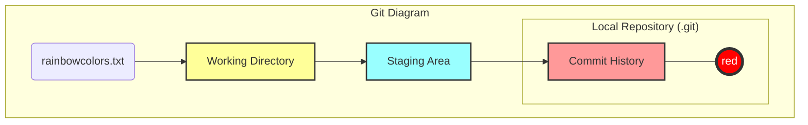
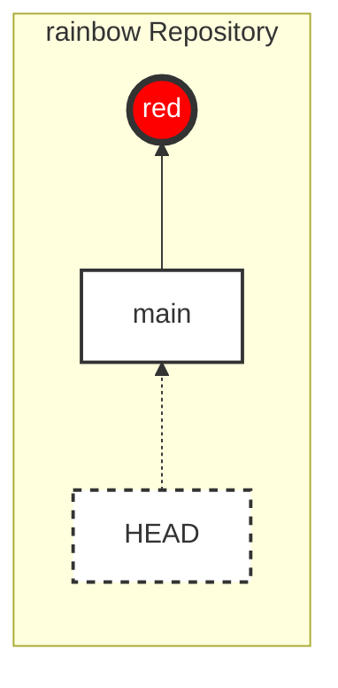
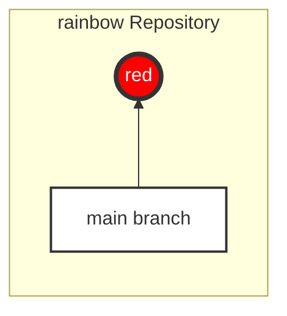
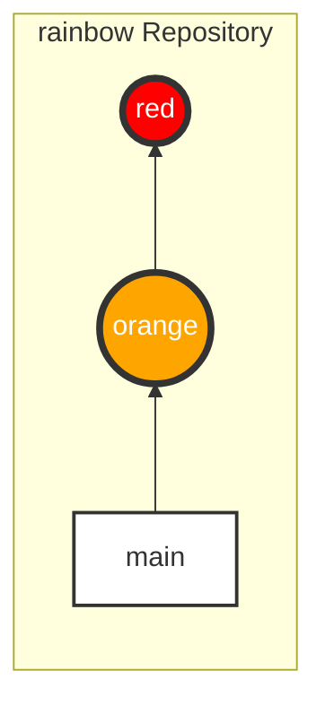
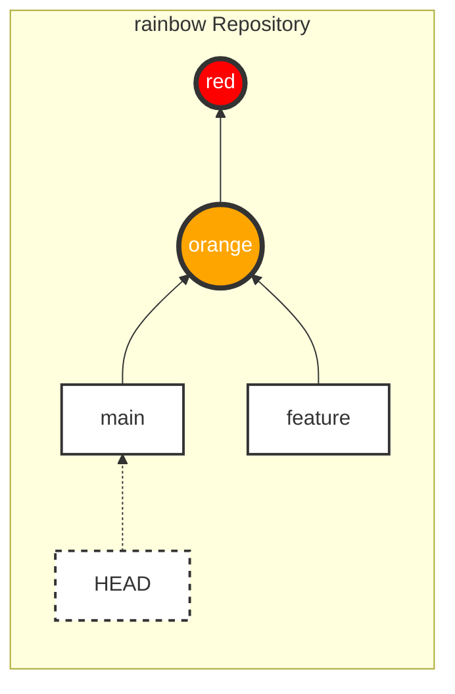
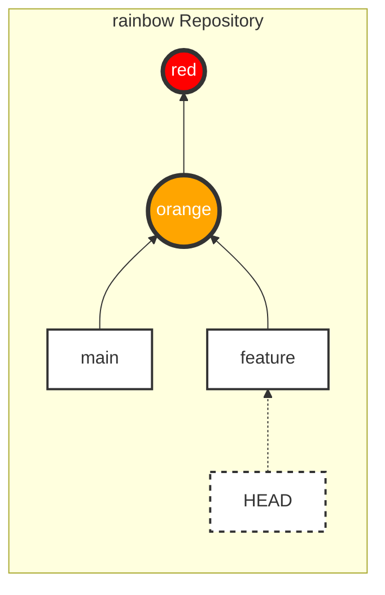
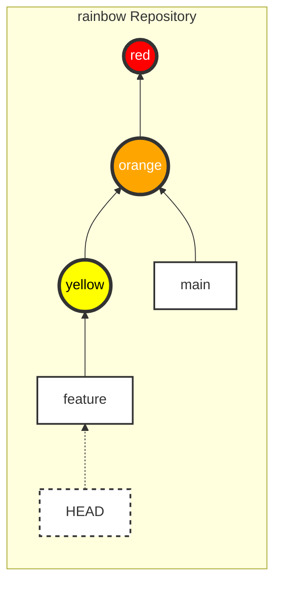

|                                                                                                                                                                                                                                                                                                                                                                                                                     |
| :------------------------------------------------------------------------------------------------------------------------------------------------------------------------------------------------------------------------------------------------------------------------------------------------------------------------------------------------------------------------------------------------------------------ |
| Trong chương trước, dự án `rainbow` của bạn đã có commit đầu tiên.                                                                                                                                                                                                                                                                                                                                                  |
| Trong chương này, bạn sẽ tìm hiểu về **Branch** (nhánh) và lý do tại sao chúng ta sử dụng chúng. Bạn sẽ tiếp tục tạo thêm commit vào dự án `rainbow` và xem nó ảnh hưởng như thế nào đến các nhánh. Cuối cùng, bạn sẽ tạo một nhánh mới và học cách chuyển đổi (switch) sang nhánh đó. Ngoài ra, bạn cũng sẽ tìm hiểu về khái niệm **unmodified** và **modified files** cũng như cách các commit liên kết với nhau. |

## Trạng Thái Của Local Repository

Hãy xem lại trạng thái của dự án `rainbow` ở đầu chương này thông qua Git Diagram và Repository Diagram.

### Git Diagram



_Hình 4-1: Git Diagram hiển thị trạng thái của repository `rainbow` với 1 commit (red)_

> **[ Lưu ý ]**
>
> Từ giờ trở đi, các biểu đồ Visualize It sẽ chỉ hiển thị tên màu của commit hoặc tên viết tắt, thay vì hiển thị 7 ký tự đầu của commit hash.

### Repository Diagram

Để tập trung vào Commit History, tôi sẽ giới thiệu **Repository Diagram**. Biểu đồ này chỉ tập trung vào lịch sử commit và các nhánh/tham chiếu liên quan.



_Hình 4-2: Repository Diagram hiển thị trạng thái hiện tại với commit "red"_

## Tại Sao Chúng Ta Sử Dụng Branch?

Có hai lý do chính để sử dụng branch:

1. Để làm việc trên cùng một dự án theo nhiều hướng khác nhau.
2. Để giúp nhiều người cùng làm việc trên một dự án cùng lúc.

Bạn có thể coi một branch giống như một dòng phát triển (line of development). Một dự án có thể có một nhánh chính (thường là `main`) và nhiều nhánh phụ (gọi là _topic branches_ hoặc _feature branches_) để phát triển tính năng cụ thể. Các nhánh phụ này thường tồn tại ngắn hạn, sau khi hoàn thành sẽ được gộp (merge) lại vào nhánh chính và xóa đi.

### Ví Dụ Minh Họa 4-1

Giả sử nhánh chính thức của dự án sách là `main`. Tôi không muốn đưa những nội dung chưa được biên tập viên duyệt vào đây. Vì vậy, mỗi khi viết một chương mới, tôi tạo một nhánh phụ, viết trên đó, và gửi cho biên tập viên xem. Khi họ duyệt, tôi mới gộp nó vào `main`.

## Branch Trong Git Thực Sự Là Gì?

Trong Git, **Branch là các con trỏ (pointers) có thể di chuyển, trỏ đến các commit.**

Khi bạn dùng `git log`, bạn sẽ thấy thông tin về việc nhánh nào đang trỏ vào commit nào.

### Thực Hành 4-1

Kiểm tra `git log`:

```bash
rainbow $ git log
commit c26d0bc371c3634ab49543686b3c8f10e9da63c5 (HEAD -> main)
Author: annaskoulikari <gitlearningjourney@gmail.com>
Date:   Sat Feb 19 09:23:18 2022 +0100

    red
```

**Những điều cần chú ý:**

- Bên cạnh commit hash, bạn thấy `(HEAD -> main)`. Điều này có nghĩa là nhánh `main` đang trỏ vào commit này.

> **[ Lưu ý ]**
>
> `HEAD` (viết hoa) không phải là một nhánh. Chúng ta sẽ bàn về nó ở phần sau.

Trong dự án `rainbow`, nhánh `main` đang trỏ vào commit "red".



_Hình 4-3: Nhánh `main` trỏ vào commit "red"_

### Thực Hành 4-2: Kiểm tra file branch

Để hiểu rõ hơn branch là "con trỏ", hãy xem file chứa thông tin branch.

1. Mở trình quản lý file, đi tới `rainbow > .git > refs > heads`.
2. Bạn sẽ thấy một file tên là `main`.
3. Mở file `main` bằng Text Editor.

**Nội dung bên trong:** Nó chứa chính xác mã hash của commit "red".
Điều này chứng tỏ: Nhánh chỉ là một file chứa mã hash của commit mà nó trỏ tới.

## Lịch Sử Git: `master` và `main`

Trước đây, khi khởi tạo Git, nhánh mặc định tên là `master`. Tuy nhiên, do thuật ngữ này không mang tính bao hàm (inclusive), cộng đồng Git đã chuyển sang dùng `main` (hoặc các tên khác) làm mặc định.

Đó là lý do ở Chương 2, chúng ta dùng lệnh `git init -b main`. Bản thân từ `main` không có gì đặc biệt, nó chỉ là cái tên mặc định cho nhánh đầu tiên.

## Unmodified và Modified Files

Trong Chương 2, chúng ta đã biết về **Tracked** và **Untracked** files.

Các file đã được Track (Git đã biết đến) có thể ở 1 trong 2 trạng thái:

- **Unmodified**: File chưa bị chỉnh sửa gì kể từ commit cuối cùng.
- **Modified**: File đã bị chỉnh sửa (và đã lưu).

Lệnh `git status` hiển thị danh sách các file **modified**. Nó không hiển thị file **unmodified**.

### Thực Hành 4-3

1. Kiểm tra trạng thái:

```bash
rainbow $ git status
On branch main
nothing to commit, working tree clean
```

(File `rainbowcolors.txt` đang là unmodified, nên không hiện ra).

1. Sửa file `rainbowcolors.txt`, thêm dòng: "Orange is the second color of the rainbow." và lưu lại.
2. Kiểm tra lại:

```bash
rainbow $ git status
On branch main
Changes not staged for commit:
  (use "git add <file>..." to update what will be committed)
  (use "git restore <file>..." to discard changes in working directory)
 modified:   rainbowcolors.txt

no changes added to commit (use "git add" and/or "git commit -a")
```

**Những điều cần chú ý:**

- Giờ đây `rainbowcolors.txt` đã xuất hiện với trạng thái `modified`.

### Thực Hành 4-4: Stage file

```bash
rainbow $ git add rainbowcolors.txt
rainbow $ git status
On branch main
Changes to be committed:
  (use "git restore --staged <file>..." to unstage)
 modified:   rainbowcolors.txt
```

Giờ file đã ở trong Staging Area, sẵn sàng để commit.

## Tạo Commit Trên Một Branch

Hãy tạo commit thứ hai với màu cam ("orange").

### Thực Hành 4-5

```bash
rainbow $ git commit -m "orange"
[main 7acb333] orange
 1 file changed, 2 insertions(+), 1 deletion(-)

rainbow $ git log
commit 7acb333... (HEAD -> main)
Author: ...
Date: ...
    orange

commit c26d0bc...
Author: ...
Date: ...
    red
```

**Những điều cần chú ý:**

- Bạn đã có commit thứ hai ("orange").
- Commit "orange" trỏ ngược về commit "red" (parent).
- Nhánh `main` đã di chuyển để trỏ vào commit mới nhất ("orange").



_Hình 4-4: Nhánh `main` cập nhật trỏ vào commit "orange"_

Mũi tên màu xám trong diagram thể hiện liên kết cha-con (parent link). Mỗi commit (trừ commit đầu tiên) đều trỏ về commit cha của nó.

### Thực Hành 4-6: Kiểm tra commit cha

Dùng lệnh `git cat-file -p <commit_hash>` để xem chi tiết commit và thấy dòng `parent`.

```bash
rainbow $ git cat-file -p 7acb333
tree ...
parent c26d0bc...
author ...
committer ...

orange
```

## Tạo Một Branch Mới (git branch)

Để tạo branch mới: `git branch <tên_branch_mới>`.
Lưu ý: Tên branch không được chứa khoảng trắng.

Chúng ta sẽ tạo một nhánh tên là `feature`.

### Thực Hành 4-7

1. Kiểm tra danh sách branch hiện tại:

```bash
rainbow $ git branch
* main
```

(Dấu `*` báo hiệu bạn đang ở nhánh `main`).

1. Tạo nhánh `feature`:

```bash
rainbow $ git branch feature
```

1. Kiểm tra lại:

```bash
rainbow $ git branch
  feature
* main
```

1. Xem log:

```bash
rainbow $ git log
commit 7acb333... (HEAD -> main, feature)
...
    orange
```

**Những điều cần chú ý:**

- Cả `main` và `feature` đều đang trỏ vào cùng một commit ("orange").
- Khi bạn tạo nhánh mới, nó sẽ trỏ vào commit mà bạn đang đứng.



_Hình 4-5: Cả `main` và `feature` đều trỏ vào commit "orange"_

## HEAD Là Gì?

**HEAD** là một con trỏ đặc biệt cho biết **bạn đang ở trên nhánh nào**.

Trong `git log`, bạn thấy `(HEAD -> main, feature)`.
Điều này có nghĩa là:

1. `HEAD` đang trỏ vào `main` (Bạn đang ở trên nhánh `main`).
2. Cả `main` và `feature` đều đang trỏ vào commit hiện tại.

### Thực Hành 4-8: Kiểm tra file HEAD

1. Mở trình quản lý file, đi tới `rainbow > .git`.
2. Mở file `HEAD` bằng Text Editor.
3. Nội dung: `ref: refs/heads/main`.

Điều này xác nhận `HEAD` đang tham chiếu tới `main`.

## Chuyển Đổi Branch (Switching Branches)

Để chuyển sang nhánh khác, bạn dùng lệnh `git switch`. (Hoặc `git checkout` với các phiên bản Git cũ hơn).

> **[ Ghi nhớ lệnh ]**
>
> **git switch <tên_nhánh>**
>
> Chuyển sang nhánh chỉ định (Khuyên dùng).
>
> **git checkout <tên_nhánh>**
>
> Chuyển sang nhánh chỉ định (Lệnh cũ, đa năng hơn).

Khi bạn chuyển nhánh, 3 điều xảy ra:

1. `HEAD` chuyển sang trỏ vào nhánh mới.
2. Staging Area được cập nhật theo commit của nhánh mới.
3. Working Directory được cập nhật theo nội dung của nhánh mới.

### Thực Hành 4-9

Hãy chuyển sang nhánh `feature`.

```bash
rainbow $ git switch feature
Switched to branch 'feature'

rainbow $ git branch
* feature
  main
```

(Dấu `*` đã chuyển sang `feature`).

Kiểm tra log:

```bash
rainbow $ git log
commit 7acb333... (HEAD -> feature, main)
...
```

(Giờ `HEAD -> feature`).

Hãy kiểm tra file `.git/HEAD` một lần nữa, bạn sẽ thấy nó đổi thành `ref: refs/heads/feature`.



_Hình 4-6: HEAD chuyển sang trỏ vào nhánh `feature`_

## Làm Việc Trên Một Branch Riêng Biệt

Bây giờ bạn đang ở trên nhánh `feature`. Mọi commit bạn tạo ra sẽ làm nhánh `feature` di chuyển, trong khi nhánh `main` sẽ đứng yên.

### Thực Hành 4-10

1. Sửa file `rainbowcolors.txt`, thêm "Yellow is the third color of the rainbow." vào dòng 3.
2. Add và Commit.

```bash
rainbow $ git add rainbowcolors.txt
rainbow $ git commit -m "yellow"
[feature fc8139c] yellow
 1 file changed, 2 insertions(+), 1 deletion(-)
```

1. Kiểm tra log:

```bash
rainbow $ git log
commit fc8139c... (HEAD -> feature)
...
    yellow

commit 7acb333... (main)
...
    orange
```

**Những điều cần chú ý:**

- Nhánh `feature` đã tiến lên commit "yellow".
- Nhánh `main` vẫn nằm lại ở commit "orange".



_Hình 4-7: Nhánh `feature` tiến lên, `main` đứng yên_

## Tổng Kết

Chương này đã giới thiệu về Branch (Nhánh) - các dòng phát triển độc lập. Bạn đã học cách tạo nhánh (`git branch`), chuyển nhánh (`git switch`), và hiểu vai trò của `HEAD`.

Quan trọng nhất, bạn đã thấy rằng khi làm việc trên một nhánh riêng (`feature`), các thay đổi của bạn không ảnh hưởng đến nhánh chính (`main`).

Trong [Chương 5](/vi/blog/git-05-merging), chúng ta sẽ học cách gộp (merge) những thay đổi từ nhánh `feature` trở lại nhánh `main`.
