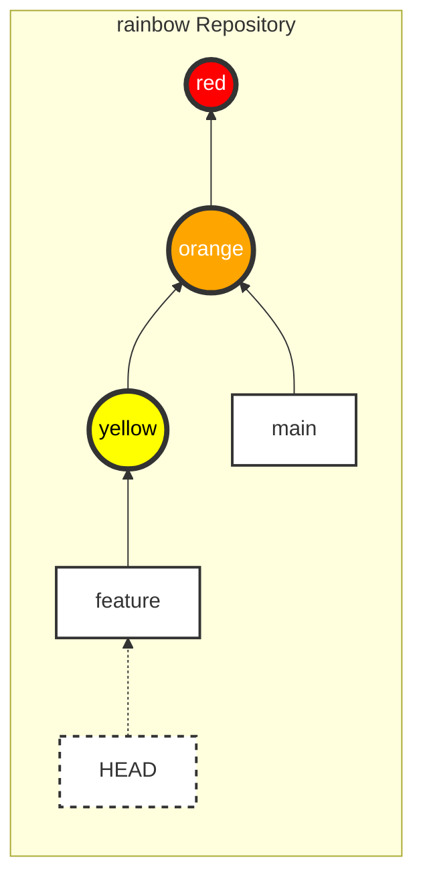
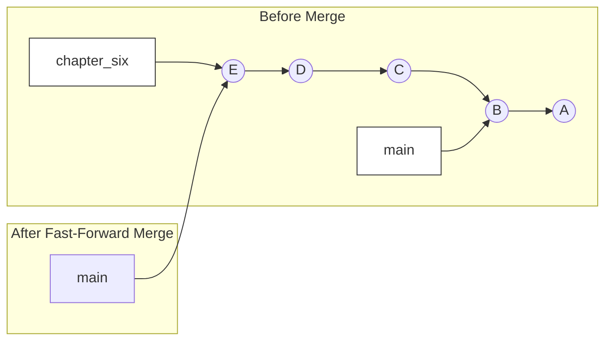
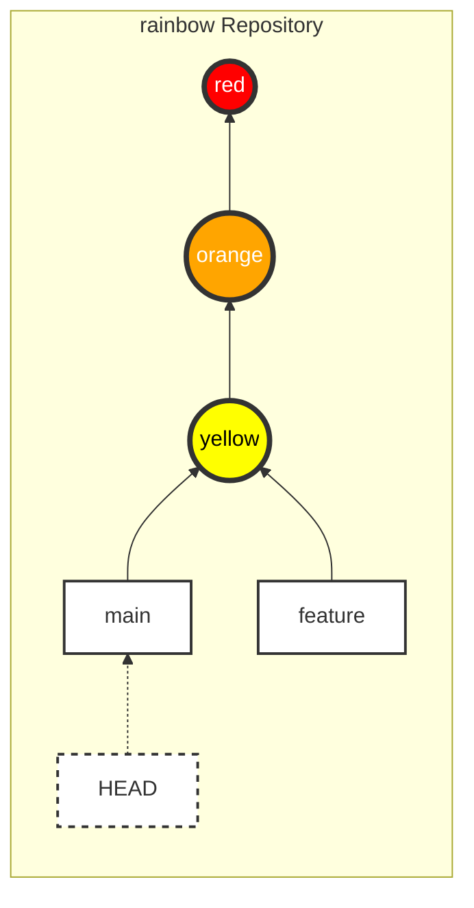
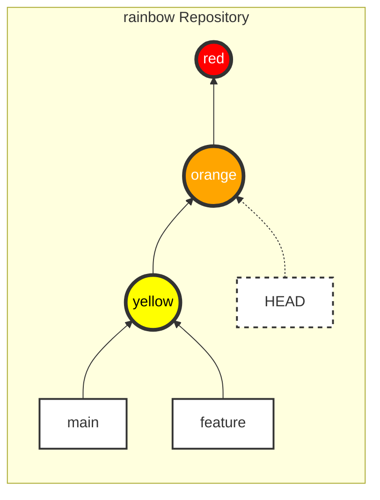

|                                                                                                                                                                                                                                                                                                                                                                                                                                                                                                                                                                                                       |
| :---------------------------------------------------------------------------------------------------------------------------------------------------------------------------------------------------------------------------------------------------------------------------------------------------------------------------------------------------------------------------------------------------------------------------------------------------------------------------------------------------------------------------------------------------------------------------------------------------- |
| In the previous chapter, you learned about branches and how they allow working on the same project in multiple directions and support collaboration.                                                                                                                                                                                                                                                                                                                                                                                                                                                  |
| In this chapter, you will learn how to integrate changes from one branch into another. In Git, there are two ways to do this: **merging** and **rebasing**. We will explore rebasing in [Chapter 11](/en/blog/git-11-rebasing); for now, we will focus on merging. This chapter will introduce two types of merges (fast-forward and three-way), and you will practice the first type: the fast-forward merge. You will also learn how Git protects you from losing uncommitted changes, how switching branches affects the contents of the working directory, and how to check out commits directly. |

## Status of the Local Repository

At the beginning of this chapter, your `rainbow` repository should have 3 commits and 2 branches (`main` and `feature`). You are currently on the `feature` branch.

### Current State



_Figure 5-1: The `rainbow` repository at the beginning of Chapter 5_

## Introduction to Merging

In Chapter 4, we created the `feature` branch for independent development. But how do we bring those developments back into the `main` branch?

**Merging** is the way Git integrates changes from one branch into another.
In any merge operation, there is always:

1. **Source branch**: The branch containing the changes to be merged.
2. **Target branch**: The branch receiving the changes (this branch will be changed).

### Illustrative Example 5-1

Suppose I am writing a book. For each chapter, I create a side branch (e.g., `chapter_four`) from the `main` branch. After it's completed and approved by the editor, I will merge the `chapter_four` branch into `main`.

## Types of Merges

There are two main types of merges:

1. **Fast-forward merge**
2. **Three-way merge**

The factor that determines which type of merge will occur is whether the **development histories** of the two branches have diverged.

### Development History

The development history is determined by tracing back the parent links.

- `main` branch (pointing to the orange commit): History consists of orange, red.
- `feature` branch (pointing to the yellow commit): History consists of yellow, orange, red.

We can see the history of `main` is a subset of `feature`. In this case, we say the histories **have not diverged**.

### Fast-Forward Merge

A fast-forward merge occurs when the history of the source branch directly follows the target branch. Git simply moves the target branch pointer "forward" (fast-forward) to the latest commit of the source branch.

### Illustrative Example 5-2: Fast-forward

A Book project has a `main` branch (commits A, B). I create a `chapter_six` branch from `main` and add commits C, D, and E.
At this point, going back from `chapter_six` will encounter `main`.
When merging `chapter_six` into `main`, Git only needs to move the `main` pointer forward to commit E.



_Figure 5-2: Simulation of a Fast-forward merge_

### Three-Way Merge

A three-way merge occurs when the histories of two branches have **diverged**. That is, each branch has its own commits that the other does not have, and you cannot go from one branch to another just by moving forward.

When that happens, Git creates a special **Merge Commit** to combine the two histories. This merge commit has 2 parent commits.

### Illustrative Example 5-3: Three-way

The `main` branch has commits F and G.
I create a `chapter_eight` branch from G and add H, I, and J.
Meanwhile, on `main`, I also add commits K and L.
At this point, the two branches have diverged in different directions from G.

When merging `chapter_eight` into `main`, Git performs a **Three-way merge** (merging from 3 points: the tip of the `main` branch, the tip of the `chapter_eight` branch, and their common ancestor G). The result creates a new commit M.

We'll explore Three-way merges in more detail in [Chapter 9](/en/blog/git-09-three-way-merge). In this chapter, we'll focus on practicing Fast-forward merges.

## Performing a Fast-Forward Merge

In the `rainbow` project, we will merge the `feature` branch (source) into the `main` branch (target).
Since `feature` is developed directly from `main`, this will be a fast-forward merge.

The 2-step process to merge:

1. **Switch** to the target branch (the branch you want to merge into).
2. Use the `git merge <source_branch_name>` command.

> **[ Command Reminder ]**
>
> **git merge <branch_name>**
>
> Merges the changes from the specified branch into the current branch.

### Step 1: Switch to the Target Branch (`main`)

First, we need to switch back to the `main` branch. But before we do that, let's see how Git protects you.

#### Git protects you from losing uncommitted changes

When you switch branches, the content of the Working Directory will change accordingly. If you have uncommitted changes, Git will prevent you from switching branches if that transition risks overwriting your work.

### Follow Along 5-1: Git Safety

1. Check the status:

```bash
rainbow $ git status
On branch feature
nothing to commit, working tree clean
```

1. Edit the `rainbowcolors.txt` file, add line 4: "Green is the fourth color of the rainbow." but **DO NOT** commit.
2. Try to switch to `main`:

```bash
rainbow $ git switch main
error: Your local changes to the following files would be overwritten by checkout:
    rainbowcolors.txt
Please commit your changes or stash them before you switch branches.
Aborting
```

Things to notice:

- Git stops you and reports an error.
- If Git allowed it, the contents of the `rainbowcolors.txt` file (containing the Green line) would be replaced by the old version from `main` (only having Red, Orange), and you would lose the Green line you just wrote.

### Follow Along 5-2: Discard changes to continue

To continue with the lesson (suppose we don't want to add the Green color yet), delete the newly added line and save the file to keep the Working Directory clean.

```bash
rainbow $ git status
On branch feature
nothing to commit, working tree clean
```

#### Branch switching changes the Working Directory

When switching branches, 3 things happen (recall from Chapter 4):

1. HEAD moves.
2. Staging Area is updated.
3. **Working Directory is updated**.

### Follow Along 5-3

1. Open the `rainbowcolors.txt` file (currently having 3 lines: Red, Orange, Yellow).
2. Switch to `main`:

```bash
rainbow $ git switch main
Switched to branch 'main'
```

1. Observe the `rainbowcolors.txt` file: The "Yellow..." line has disappeared! The file has returned to the state with only Red and Orange.
2. Check the log:

```bash
rainbow $ git log
commit 7acb333... (HEAD -> main)
    orange
...
```

Only the "orange" commit is visible. The "yellow" commit is not gone; it is just on the `feature` branch.

### View all commits (git log --all)

The `git log` command by default only shows the history of the current branch. To see everything:

```bash
rainbow $ git log --all
```

### Follow Along 5-4

```bash
rainbow $ git log --all
commit fc8139c... (feature)
    yellow
commit 7acb333... (HEAD -> main)
    orange
...
```

You will see the "yellow" commit.

### Step 2: Perform the Merge

Now you are on `main` (the target), let's merge `feature` (the source) into it.

### Follow Along 5-5

```bash
rainbow $ git merge feature
Updating 7acb333..fc8139c
Fast-forward
 rainbowcolors.txt | 3 ++-
 1 file changed, 2 insertions(+), 1 deletion(-)
```

Check the `rainbowcolors.txt` file again, the Yellow line has reappeared!

Check the log:

```bash
rainbow $ git log
commit fc8139c... (HEAD -> main, feature)
    yellow
...
```

Things to notice:

- `Updating 7acb333..fc8139c`: Git updates from the old commit hash to the new one.
- `Fast-forward`: Git informs you this is a fast-forward merge.
- `HEAD -> main, feature`: Now `main` is also pointing to the "yellow" commit alongside `feature`.



_Figure 5-3: After the merge, `main` has caught up to `feature`_

> **[ Note ]**
>
> After merging, the `feature` branch still exists; it is not deleted.

## Checking Out Commits

`git checkout` (or `git switch --detach`) allows you to revisit the project's past at any commit, not necessarily at the head of a branch.

If you want to see the project at the state of the "orange" commit, you can check out its hash directly.

When checking out a commit (instead of a branch):

1. HEAD points directly to that Commit.
2. This state is called **Detached HEAD**.

### Follow Along 5-6: Detached HEAD

1. Get the hash of the orange commit (e.g., `7acb333`).
2. Check it out:

```bash
rainbow $ git checkout 7acb333
Note: switching to '7acb333'.

You are in 'detached HEAD' state. You can look around, make experimental changes...
HEAD is now at 7acb333 orange
```

1. Check the log:

```bash
rainbow $ git log --all
commit fc8139c... (main, feature)
    yellow
commit 7acb333... (HEAD)
    orange
```

Things to notice:

- HEAD is pointing directly to the orange commit, not attached to any branch.
- The `rainbowcolors.txt` file returns to the state with only Red and Orange.



_Figure 5-4: Detached HEAD state at the orange commit_

To exit this state, simply switch back to an existing branch (e.g., `main`).

### Follow Along 5-7

```bash
rainbow $ git switch main
Previous HEAD position was 7acb333 orange
Switched to branch 'main'
```

## Creating and Switching Branches in One Command

Quick tip: Instead of `git branch new_branch` and then `git switch new_branch`, you can combine them:

> **[ Command Reminder ]**
>
> **git switch -c <new_branch_name>**
>
> Creates a new branch and switches to it immediately (`-c` = create).
>
> **git checkout -b <new_branch_name>**
>
> (Similar, used for older versions).

## Summary

In this chapter, you performed your first **Fast-forward merge**, merging the `feature` branch into `main`. You also learned about Git's safety mechanism (preventing uncommitted data loss) and the **Detached HEAD** state.

This concludes Part 1 - Working with the Local Repository. In [Chapter 6](/en/blog/git-06-hosting-auth), we will begin Part 2: Working with the Remote Repository (Hosting Services).
