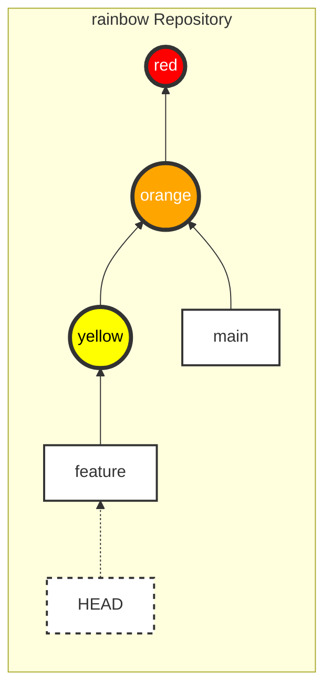
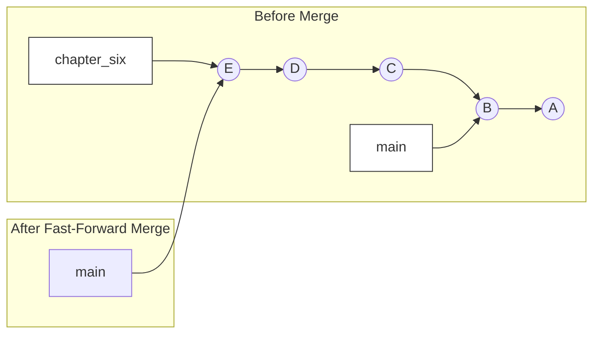
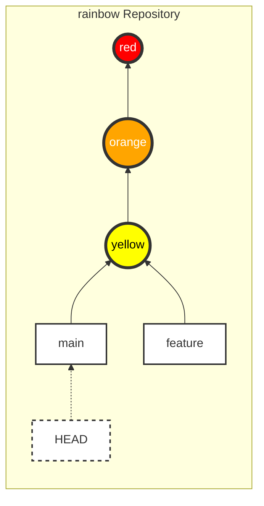
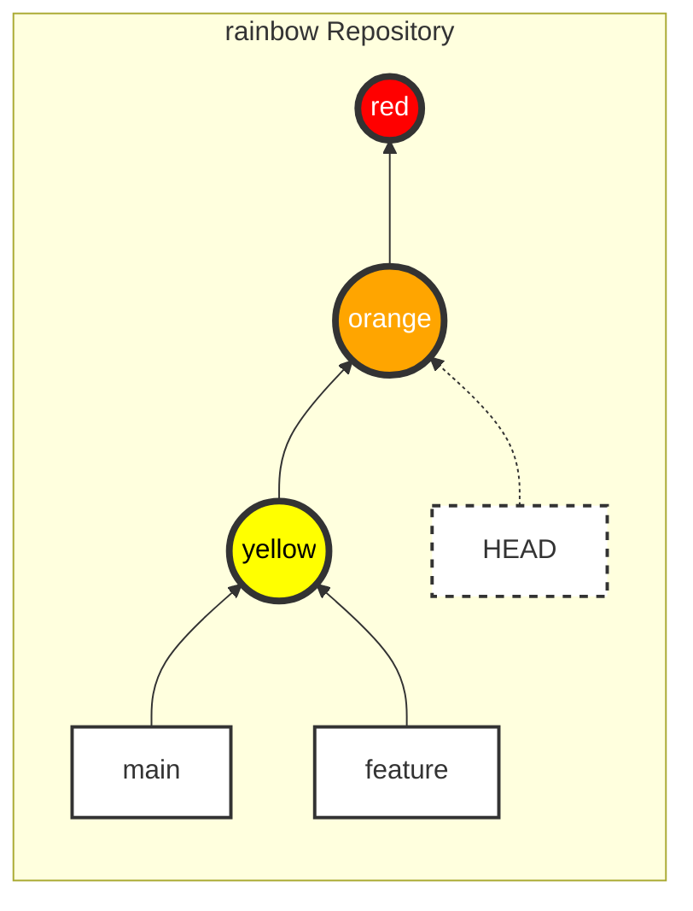

|                                                                                                                                                                                                                                                                                                                                                                                                                                           |
| :---------------------------------------------------------------------------------------------------------------------------------------------------------------------------------------------------------------------------------------------------------------------------------------------------------------------------------------------------------------------------------------------------------------------------------------- |
| Trong chương trước, bạn đã tìm hiểu về các nhánh (branches), cách chúng cho phép làm việc trên cùng một dự án theo nhiều hướng khác nhau và hỗ trợ cộng tác.                                                                                                                                                                                                                                                                              |
| Trong chương này, bạn sẽ học cách tích hợp các thay đổi từ nhánh này sang nhánh khác. Trong Git, có hai cách để làm điều này: **merging** (hợp nhất) và **rebasing** (tái cấu trúc cơ sở). Chúng ta sẽ tìm hiểu rebasing ở [Chương 11](/vi/blog/git-11-rebasing); còn bây giờ chúng ta sẽ tập trung vào merging. Chương này sẽ giới thiệu hai loại merge (fast-forward và three-way), và bạn sẽ thực hành loại đầu tiên: fast-forward merge. |
| Bạn cũng sẽ tìm hiểu cách Git bảo vệ bạn khỏi việc mất các thay đổi chưa commit, cách việc chuyển đổi nhánh ảnh hưởng đến nội dung của working directory, và cách check out (kiểm tra) trực tiếp các commit.                                                                                                                                                                                                                              |

## Trạng Thái Của Local Repository

Đầu chương này, repository `rainbow` của bạn nên có 3 commit và 2 nhánh (`main` và `feature`). Bạn đang đứng ở nhánh `feature`.

### Trạng thái hiện tại



_Hình 5-1: Repository `rainbow` ở đầu Chương 5_

## Giới Thiệu Về Merging

Ở Chương 4, chúng ta đã tạo nhánh `feature` để phát triển độc lập. Nhưng làm sao để gộp những phát triển đó trở lại nhánh `main`?

**Merging** là cách Git tích hợp các thay đổi từ nhánh này vào nhánh khác.
Trong bất kỳ thao tác merge nào, luôn có:

1. **Source branch** (nhánh nguồn): Chứa các thay đổi cần gộp.
2. **Target branch** (nhánh đích): Nhánh nhận các thay đổi (nhánh này sẽ bị thay đổi).

### Ví Dụ Minh Họa 5-1

Giả sử tôi viết sách. Mỗi chương tôi tạo một nhánh phụ (ví dụ `chapter_four`) từ nhánh `main`. Sau khi hoàn thiện và được biên tập viên duyệt, tôi sẽ merge nhánh `chapter_four` vào `main`.

## Các Loại Merge

Có hai loại merge chính:

1. **Fast-forward merge**
2. **Three-way merge**

Yếu tố quyết định loại merge nào sẽ xảy ra là **lịch sử phát triển** của hai nhánh có bị phân tách (diverged) hay không.

### Lịch Sử Phát Triển (Development History)

Lịch sử phát triển được xác định bằng cách lần ngược các liên kết cha-con (parent links).

- Nhánh `main` (trỏ vào commit orange): Lịch sử gồm cam, đỏ.
- Nhánh `feature` (trỏ vào commit yellow): Lịch sử gồm vàng, cam, đỏ.

Ta thấy lịch sử của `main` là tập con của `feature`. Khi đó, chúng ta nói lịch sử **chưa bị phân tách**.

### Fast-Forward Merge

Xảy ra khi lịch sử của source branch nối tiếp trực tiếp từ target branch. Git chỉ đơn giản là di chuyển con trỏ của target branch "tiến về phía trước" (fast-forward) đến commit mới nhất của source branch.

### Ví Dụ Minh Họa 5-2: Fast-forward

Dự án Book có nhánh `main` (commit A, B). Tôi tạo nhánh `chapter_six` từ `main`, thêm commit C, D, E.
Lúc này, từ `chapter_six` đi ngược về có thể gặp `main`.
Khi merge `chapter_six` vào `main`, Git chỉ cần đẩy con trỏ `main` lên commit E.



_Hình 5-2: Mô phỏng Fast-forward merge_

### Three-Way Merge

Xảy ra khi lịch sử hai nhánh đã **phân tách** (diverged). Tức là mỗi nhánh đều có những commit riêng mà nhánh kia không có, và không thể đi từ nhánh này sang nhánh kia chỉ bằng cách tiến lên phía trước.

Khi đó, Git sẽ tạo một **Merge Commit** đặc biệt để kết hợp hai lịch sử lại. Merge commit này có 2 commit cha.

### Ví Dụ Minh Họa 5-3: Three-way

Nhánh `main` có commit F, G.
Tôi tạo nhánh `chapter_eight` từ G, thêm H, I, J.
Đồng thời, trên `main` tôi lại thêm commit K, L.
Lúc này hai nhánh đã rẽ theo hai hướng khác nhau từ G.

Khi merge `chapter_eight` vào `main`, Git thực hiện **Three-way merge** (gộp 3 phía: đầu nhánh `main`, đầu nhánh `chapter_eight`, và commit tổ tiên chung G). Kết quả tạo ra commit M mới.

Chúng ta sẽ tìm hiểu sâu hơn về Three-way merge ở [Chương 9](./chapter-9-three-way-merges.md). Chương này chúng ta tập trung thực hành Fast-forward merge.

## Thực Hiện Fast-Forward Merge

Trong dự án `rainbow`, chúng ta sẽ merge nhánh `feature` (source) vào nhánh `main` (target).
Vì `feature` phát triển tiếp từ `main`, đây là fast-forward merge.

Quy trình 2 bước để merge:

1. **Switch** sang nhánh target (nhánh bạn muốn gộp vào).
2. Sử dụng lệnh `git merge <tên_nhánh_source>`.

> **[ Ghi nhớ lệnh ]**
>
> **git merge <branch_name>**
>
> Hợp nhất các thay đổi từ nhánh chỉ định vào nhánh hiện tại.

### Bước 1: Chuyển sang nhánh Target (`main`)

Trước hết, chúng ta cần chuyển về nhánh `main`. Nhưng trước khi làm điều đó, hãy xem Git bảo vệ bạn như thế nào.

#### Git bảo vệ bạn khỏi mất các thay đổi chưa commit

Khi bạn chuyển nhánh, nội dung Working Directory sẽ thay đổi theo. Nếu bạn đang có file đang sửa dở (uncommitted changes), Git sẽ ngăn bạn chuyển nhánh nếu việc chuyển đổi đó có nguy cơ ghi đè mất công sức của bạn.

### Thực Hành 5-1: Git an toàn

1. Kiểm tra trạng thái:

```bash
rainbow $ git status
On branch feature
nothing to commit, working tree clean
```

1. Sửa file `rainbowcolors.txt`, thêm dòng 4: "Green is the fourth color of the rainbow." nhưng **KHÔNG** commit.
2. Thử chuyển sang `main`:

```bash
rainbow $ git switch main
error: Your local changes to the following files would be overwritten by checkout:
    rainbowcolors.txt
Please commit your changes or stash them before you switch branches.
Aborting
```

**Những điều cần chú ý:**

- Git chặn lại và báo lỗi.
- Nếu Git cho phép, nội dung file `rainbowcolors.txt` (có dòng Green) sẽ bị thay thế bởi phiên bản cũ ở `main` (chỉ có Red, Orange), và bạn sẽ mất dòng Green vừa viết.

### Thực Hành 5-2: Hủy bỏ thay đổi để tiếp tục

Để tiếp tục bài học (giả sử chúng ta chưa muốn thêm màu Green), hãy xóa dòng vừa thêm và lưu file lại để Working Directory sạch sẽ.

```bash
rainbow $ git status
On branch feature
nothing to commit, working tree clean
```

#### Chuyển nhánh thay đổi Working Directory

Khi chuyển nhánh, 3 điều xảy ra (nhắc lại Chương 4):

1. HEAD di chuyển.
2. Staging Area cập nhật.
3. **Working Directory cập nhật**.

### Thực Hành 5-3

1. Mở file `rainbowcolors.txt` (đang có 3 dòng: Red, Orange, Yellow).
2. Chuyển sang `main`:

```bash
rainbow $ git switch main
Switched to branch 'main'
```

1. Quan sát file `rainbowcolors.txt`: Dòng "Yellow..." đã biến mất! File trở về trạng thái chỉ có Red và Orange.
2. Kiểm tra log:

```bash
rainbow $ git log
commit 7acb333... (HEAD -> main)
    orange
...
```

Chỉ còn thấy commit "orange". Commit "yellow" không mất đi, nó chỉ đang nằm ở nhánh `feature`.

### Xem tất cả commit (git log --all)

Lệnh `git log` mặc định chỉ hiện lịch sử của nhánh hiện tại. Để xem toàn bộ:

```bash
rainbow $ git log --all
```

### Thực Hành 5-4

```bash
rainbow $ git log --all
commit fc8139c... (feature)
    yellow
commit 7acb333... (HEAD -> main)
    orange
...
```

Bạn sẽ thấy đủ cả commit "yellow".

### Bước 2: Thực hiện Merge

Giờ bạn đang ở `main` (target), hãy merge `feature` (source) vào.

### Thực Hành 5-5

```bash
rainbow $ git merge feature
Updating 7acb333..fc8139c
Fast-forward
 rainbowcolors.txt | 3 ++-
 1 file changed, 2 insertions(+), 1 deletion(-)
```

Kiểm tra lại `rainbowcolors.txt`, dòng Yellow đã xuất hiện trở lại!

Kiểm tra log:

```bash
rainbow $ git log
commit fc8139c... (HEAD -> main, feature)
    yellow
...
```

**Những điều cần chú ý:**

- `Updating 7acb333..fc8139c`: Git cập nhật từ commit hash cũ sang mới.
- `Fast-forward`: Git thông báo đây là fast-forward merge.
- `HEAD -> main, feature`: Bây giờ `main` cũng đã trỏ vào commit "yellow" ngang hàng với `feature`.



_Hình 5-3: Sau khi merge, `main` đã đuổi kịp `feature`_

> **[ Lưu ý ]**
>
> Merge xong nhánh `feature` vẫn còn đó, không bị xóa.

## Checking Out Commits (Kiểm tra Commit)

`git checkout` (hoặc `git switch --detach`) cho phép bạn xem lại quá khứ của dự án tại một commit bất kỳ, không nhất thiết phải là đầu nhánh.

Nếu bạn muốn xem dự án ở trạng thái commit "orange", bạn có thể check out trực tiếp mã hash của nó.

Khi check out một commit (thay vì một branch):

1. HEAD trỏ trực tiếp vào Commit đó.
2. Trạng thái này gọi là **Detached HEAD** (HEAD bị tách rời).

### Thực Hành 5-6: Detached HEAD

1. Lấy mã hash của commit orange (ví dụ `7acb333`).
2. Check out:

```bash
rainbow $ git checkout 7acb333
Note: switching to '7acb333'.

You are in 'detached HEAD' state. You can look around, make experimental changes...
HEAD is now at 7acb333 orange
```

1. Kiểm tra log:

```bash
rainbow $ git log --all
commit fc8139c... (main, feature)
    yellow
commit 7acb333... (HEAD)
    orange
```

**Những điều cần chú ý:**

- HEAD đang trỏ trực tiếp vào commit orange, không gắn với nhánh nào.
- File `rainbowcolors.txt` quay về trạng thái chỉ có Red và Orange.



_Hình 5-4: Detached HEAD state tại commit orange_

Để thoát khỏi trạng thái này, đơn giản là switch lại về một nhánh có sẵn (ví dụ `main`).

### Thực Hành 5-7

```bash
rainbow $ git switch main
Previous HEAD position was 7acb333 orange
Switched to branch 'main'
```

## Tạo và Switch nhánh trong một lệnh

Mẹo nhỏ: Thay vì `git branch new_branch` rồi `git switch new_branch`, bạn có thể làm gộp:

> **[ Ghi nhớ lệnh ]**
>
> **git switch -c <new_branch_name>**
>
> Tạo nhánh mới và chuyển sang nhánh đó ngay lập tức (`-c` = create).
>
> **git checkout -b <new_branch_name>**
>
> (Tương tự, dùng cho phiên bản cũ).

## Tổng Kết

Trong chương này, bạn đã thực hiện **Fast-forward merge** đầu tiên, hợp nhất nhánh `feature` vào `main`.
Bạn cũng đã học về cơ chế an toàn của Git (ngăn mất dữ liệu chưa commit) và trạng thái **Detached HEAD**.

Đây là kết thúc của Phần 1 - Làm việc với Local Repository.
Trong [Chương 6](/vi/blog/git-06-hosting-auth), chúng ta sẽ bắt đầu Phần 2: Làm việc với Remote Repository (Hosting Services).
