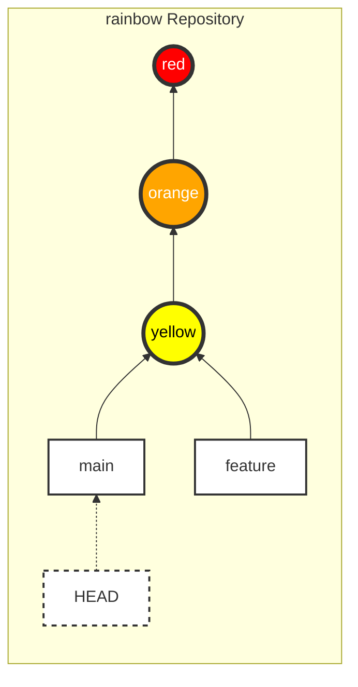
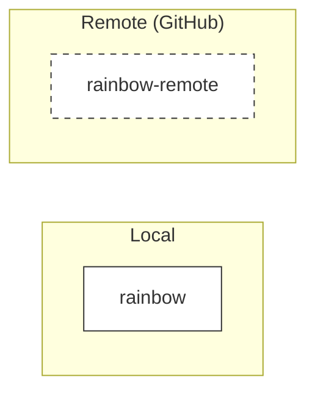
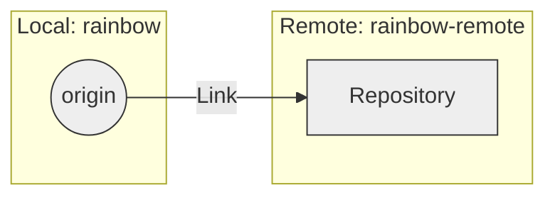
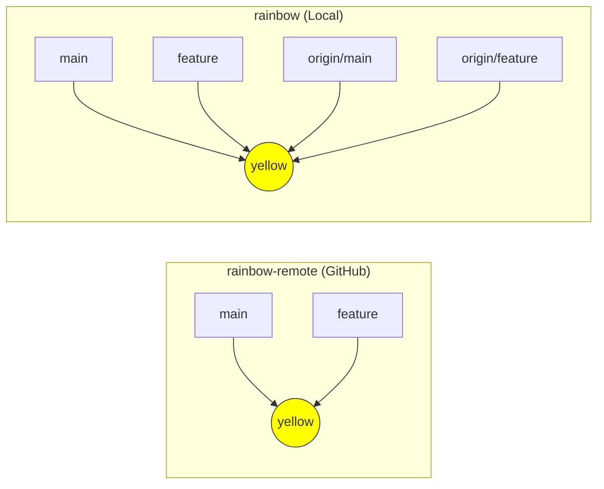

|                                                                                                                                                                 |
| :-------------------------------------------------------------------------------------------------------------------------------------------------------------- |
| In the previous chapter, we chose a hosting service and set up authentication (SSH/HTTPS) to connect securely.                                                  |
| In this chapter, we will learn how to use a Remote Repository. You will practice creating a remote repository for the `rainbow` project and pushing data to it. |

## Current Status of the Local Repository

At the beginning of this chapter, your `rainbow` repository should have 3 commits and 2 branches (`main` and `feature`). You are on the `main` branch.



_Figure 7-1: Status of the `rainbow` repository at the beginning of Chapter 7_

## Two Approaches to a Git Project

There are two ways to start a Git project:

1. **From Local to Remote**: You initialize the project on your machine (`git init`), then create a remote repository and push the data (`git push`).
   - _Example_: You have a personal project on your machine and decide to put it on GitHub for backup.
2. **From Remote to Local**: You copy (**clone**) an existing remote repository to your machine to work on.
   - _Example_: You join an open-source project or an existing company project.

In this chapter, we will follow the first approach: **From Local to Remote**.

## Why Need a Remote Repository?

1. **Backup**: Avoid data loss when your computer fails.
2. **Multi-device**: Work on multiple computers (e.g., home computer and work computer).
3. **Collaboration**: Allow many people to work on the same project together.

## Creating a Remote Repository

First, we need to create a "home" for the project on GitHub.

> **[ Follow Along 7-1 ]**
>
> 1. Log in to GitHub (or the hosting service of your choice).
> 2. Find the **New Repository** button (usually a `+` sign in the top right corner).
> 3. Fill in the information:
>    - **Repository name**: `rainbow-remote` (To distinguish it from the local repo `rainbow`, although in practice they usually have the same name).
>    - **Privacy**: Choose **Private** (recommended for this exercise).
>    - **Initialize this repository with**: **DO NOT** select anything (Do not add a README, .gitignore, or License). We want a completely empty repository.
> 4. Click **Create repository**.

After creating it, GitHub will take you to an instruction page. Find the **SSH URL** of this repository. It looks like: `git@github.com:username/rainbow-remote.git`.



_Figure 7-2: The newly created remote repository `rainbow-remote` (currently empty)_

## Adding a Remote Connection

For the local repository to know where to push data, we need to add a "connection" (remote). Each connection will have a **shortname** to replace the long URL. The most common default name is `origin`.

> **[ Command Reminder ]**
>
> **git remote add <shortname> <url>**
>
> Adds a remote repository with a short name `<shortname>` at the address `<url>`.

### Checking Existing Remotes

- `git remote`: Lists the names of the remotes.
- `git remote -v`: Lists the names and detailed URLs.

> **[ Follow Along 7-2 ]**
>
> 1. Open the terminal in the `rainbow` directory.
> 2. Check the remotes (nothing yet):
>
>    ```bash
>    rainbow $ git remote
>    ```
>
> 3. Add the `origin` remote (replace the URL with your SSH URL):
>
>    ```bash
>    rainbow $ git remote add origin git@github.com:username/rainbow-remote.git
>    ```
>
> 4. Check again:
>
>    ```bash
>    rainbow $ git remote -v
>    origin  git@github.com:username/rainbow-remote.git (fetch)
>    origin  git@github.com:username/rainbow-remote.git (push)
>    ```



_Figure 7-3: Connection `origin` established and pointing to `rainbow-remote`_

## Concept: Remote Branches & Remote-Tracking Branches

When working with remotes, you will encounter two new concepts:

1. **Remote Branch**: A branch located on the server (e.g., the `main` branch on GitHub).
2. **Remote-Tracking Branch**: A "shadow" of the remote branch located in your local repository. It helps Git know where the remote state was the last time it communicated.
   - Naming convention: `<remote>/<branch>` (e.g., `origin/main`).

## Pushing

The `git push` command is used to push commits from the current branch to the remote repository.

> **[ Command Reminder ]**
>
> **git push <remote> <branch>**
>
> Pushes the `<branch>` branch to the `<remote>` remote.

### View all branches (including remote-tracking)

Use the `git branch --all` (or `-a`) command to see both local and remote-tracking branches.

> **[ Follow Along 7-3: Pushing the main branch ]**
>
> 1. Push the `main` branch to `origin`:
>
>    ```bash
>    rainbow $ git push -u origin main
>    ```
>
>    _(Note: `-u` helps establish an upstream relationship; next time you only need to type `git push`. The original book uses `git push origin main` but `-u` is a good habit for the first time)._
>
>    _Sample Output:_
>
>    ```text
>    Enumerating objects: 9, done.
>    ...
>    To github.com:username/rainbow-remote.git
>    * [new branch]      main -> main
>    ```
>
> 2. Check the branches:
>
>    ```bash
>    rainbow $ git branch --all
>      feature
>    * main
>      remotes/origin/main
>    ```
>
>    You will see `remotes/origin/main` appear.

At this point, the `main` branch and your 3 commits are already on GitHub.

> **[ Follow Along 7-4: Pushing the feature branch ]**
>
> The `feature` branch has not been pushed yet. Let's do that.
>
> 1. Switch to the `feature` branch (if necessary, but you can push from anywhere):
>
>    ```bash
>    rainbow $ git push origin feature
>    ...
>    * [new branch]      feature -> feature
>    ```
>
> 2. Check again:
>
>    ```bash
>    rainbow $ git branch --all
>    * feature
>      main
>      remotes/origin/feature
>      remotes/origin/main
>    ```



_Figure 7-4: Fully synchronized state between Local and Remote_

## Summary

You have completed bringing your local project to "the cloud"!

- Created an empty remote repository.
- Connected via `git remote add`.
- Pushed code using `git push`.
- Understood `origin` and `remotes/origin/*` branches.

In [Chapter 8](/en/blog/git-08-cloning), we will play the role of "a friend" to **clone** this project to another machine and start collaborating.
