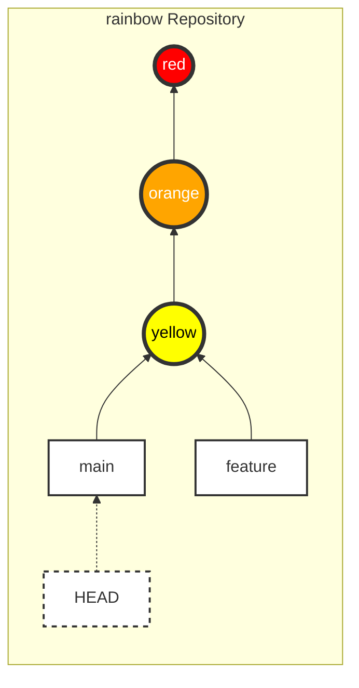
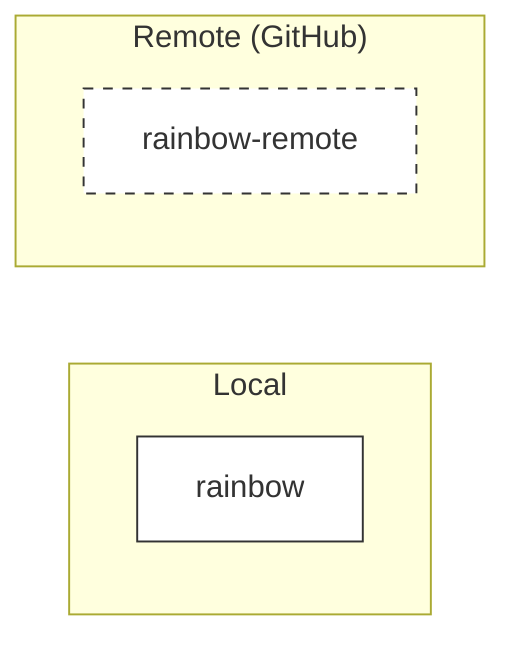
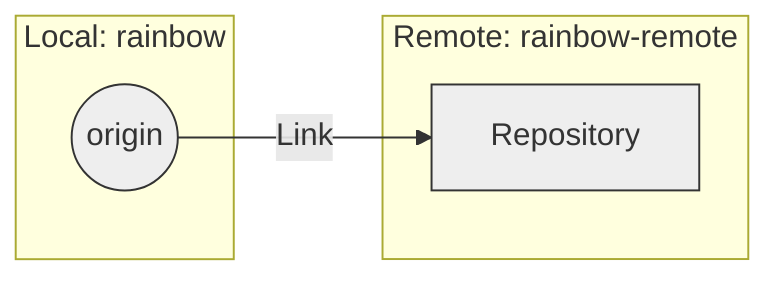
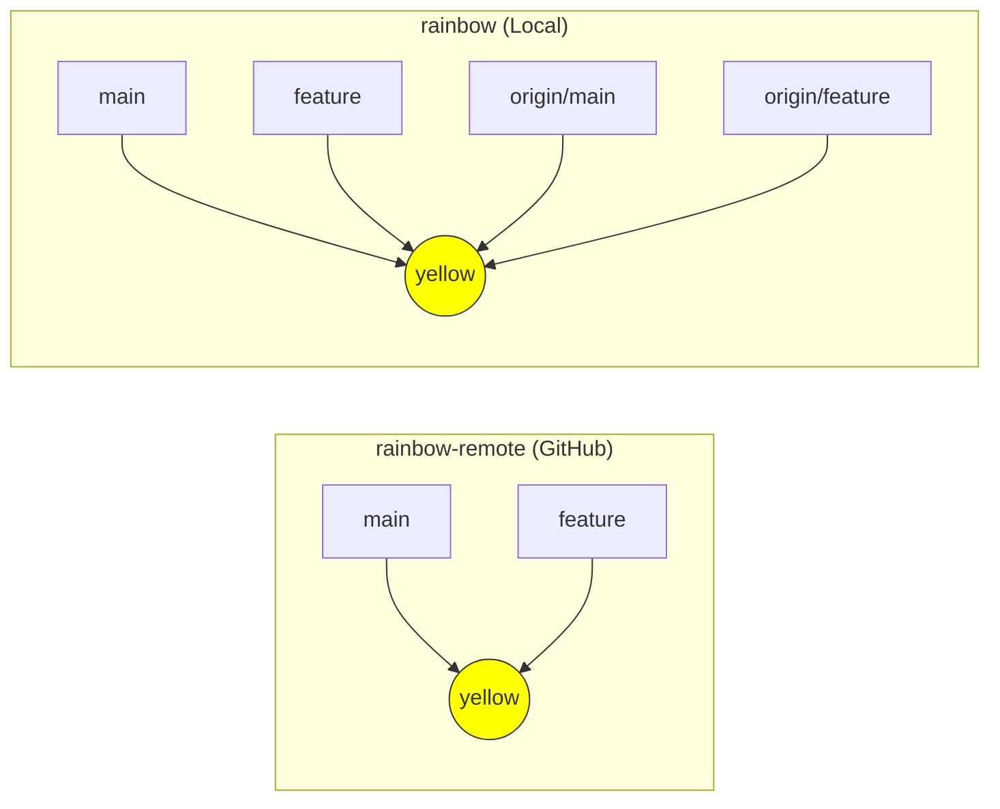

|                                                                                                                                                                 |
| :-------------------------------------------------------------------------------------------------------------------------------------------------------------- |
| Trong chương trước, chúng ta đã chọn dịch vụ hosting và thiết lập xác thực (SSH/HTTPS) để kết nối an toàn.                                                      |
| Ở chương này, chúng ta sẽ tìm hiểu cách sử dụng Remote Repository. Bạn sẽ thực hành tạo một remote repository cho dự án `rainbow` và đẩy dữ liệu (push) lên đó. |

## Trạng Thái Hiện Tại Của Local Repository

Đầu chương này, repository `rainbow` của bạn nên có 3 commit và 2 nhánh (`main` và `feature`). Bạn đang ở nhánh `main`.



_Hình 7-1: Trạng thái repository `rainbow` đầu Chương 7_

## Hai Hướng Tiếp Cận Dự Án Git

Có hai cách để bắt đầu một dự án Git:

1. **Từ Local lên Remote**: Bạn khởi tạo dự án trên máy (`git init`), sau đó tạo remote repository và đẩy dữ liệu lên (`git push`).
   - _Ví dụ_: Bạn có một dự án cá nhân trên máy và quyết định đưa nó lên GitHub để sao lưu.
2. **Từ Remote về Local**: Bạn sao chép (`clone`) một remote repository có sẵn về máy để làm việc.
   - _Ví dụ_: Bạn tham gia vào một dự án mã nguồn mở hoặc một dự án của công ty đã tồn tại.

Trong chương này, chúng ta sẽ đi theo hướng thứ nhất: **Từ Local lên Remote**.

## Tại Sao Cần Remote Repository?

1. **Sao lưu (Backup)**: Tránh mất dữ liệu khi máy tính hỏng.
2. **Đa thiết bị**: Làm việc trên nhiều máy tính (ví dụ: máy ở nhà và máy công ty).
3. **Cộng tác (Collaboration)**: Cho phép nhiều người cùng làm việc trên một dự án.

## Tạo Remote Repository

Trước tiên, chúng ta cần tạo một "ngôi nhà" cho dự án trên GitHub.

> **[ Thực Hành 7-1 ]**
>
> 1. Đăng nhập vào GitHub (hoặc dịch vụ hosting bạn chọn).
> 2. Tìm nút **New Repository** (thường là dấu `+` ở góc trên bên phải).
> 3. Điền thông tin:
>    - **Repository name**: `rainbow-remote` (Để phân biệt với local repo `rainbow`, dù thực tế thường đặt trùng tên).
>    - **Privacy**: Chọn **Private** (khuyên dùng cho bài tập này).
>    - **Initialize this repository with**: **KHÔNG** chọn gì cả (Không thêm README, .gitignore hay License). Chúng ta muốn một repository rỗng hoàn toàn.
> 4. Nhấn **Create repository**.

Sau khi tạo xong, GitHub sẽ đưa bạn đến một trang hướng dẫn. Hãy tìm **SSH URL** của repository này. Nó có dạng: `git@github.com:username/rainbow-remote.git`.



_Hình 7-2: Remote repository `rainbow-remote` mới tạo (đang rỗng)_

## Thêm Kết Nối (Remote Connection)

Để local repository biết phải đẩy dữ liệu đi đâu, chúng ta cần thêm một "kết nối" (remote).
Mỗi kết nối sẽ có một **shortname** (tên ngắn gọn) để thay thế cho URL dài dòng. Tên mặc định phổ biến nhất là `origin`.

> **[ Ghi nhớ lệnh ]**
>
> **git remote add <shortname> <url>**
>
> Thêm một remote repository với tên ngắn gọn là `<shortname>` tại địa chỉ `<url>`.

### Kiểm tra các remote hiện có

- `git remote`: Liệt kê tên các remote.
- `git remote -v`: Liệt kê tên và URL chi tiết.

> **[ Thực Hành 7-2 ]**
>
> 1. Mở terminal tại thư mục `rainbow`.
> 2. Kiểm tra remote (chưa có gì):
>
>    ```bash
>    rainbow $ git remote
>    ```
>
> 3. Thêm remote `origin` (thay thế URL bằng SSH URL của bạn):
>
>    ```bash
>    rainbow $ git remote add origin git@github.com:username/rainbow-remote.git
>    ```
>
> 4. Kiểm tra lại:
>
>    ```bash
>    rainbow $ git remote -v
>    origin  git@github.com:username/rainbow-remote.git (fetch)
>    origin  git@github.com:username/rainbow-remote.git (push)
>    ```



_Hình 7-3: Đã thiết lập kết nối `origin` trỏ tới `rainbow-remote`_

## Khái Niệm: Remote Branches & Remote-Tracking Branches

Khi làm việc với remote, bạn sẽ gặp hai khái niệm mới:

1. **Remote Branch**: Nhánh nằm trên server (ví dụ nhánh `main` trên GitHub).
2. **Remote-Tracking Branch**: "Cái bóng" của nhánh remote nằm trong local repository của bạn. Nó giúp Git biết trạng thái của remote lần cuối cùng liên lạc là ở đâu.
   - Quy tắc đặt tên: `<remote>/<branch>` (ví dụ: `origin/main`).

## Pushing (Đẩy Dữ Liệu)

Lệnh `git push` dùng để đẩy các commit từ nhánh hiện tại lên remote repository.

> **[ Ghi nhớ lệnh ]**
>
> **git push <remote> <branch>**
>
> Đẩy nhánh `<branch>` lên remote `<remote>`.

### Xem tất cả các nhánh (bao gồm remote-tracking)

Sử dụng lệnh `git branch --all` (hoặc `-a`) để xem cả nhánh local và nhánh remote-tracking.

> **[ Thực Hành 7-3: Push nhánh main ]**
>
> 1. Đẩy nhánh `main` lên `origin`:
>
>    ```bash
>    rainbow $ git push -u origin main
>    ```
>
>    _(Lưu ý: `-u` giúp thiết lập mối quan hệ upstream, lần sau chỉ cần gõ `git push` là đủ. Sách gốc dùng `git push origin main` nhưng `-u` là thói quen tốt cho lần đầu)._
>
>    _Output mẫu:_
>
>    ```text
>    Enumerating objects: 9, done.
>    ...
>    To github.com:username/rainbow-remote.git
>    * [new branch]      main -> main
>    ```
>
> 2. Kiểm tra các nhánh:
>
>    ```bash
>    rainbow $ git branch --all
>      feature
>    * main
>      remotes/origin/main
>    ```
>
>    Bạn thấy xuất hiện `remotes/origin/main`.

Lúc này, trên GitHub đã có nhánh `main` và 3 commit của bạn.

> **[ Thực Hành 7-4: Push nhánh feature ]**
>
> Nhánh `feature` chưa được đẩy lên. Hãy làm điều đó.
>
> 1. Chuyển sang nhánh `feature` (nếu cần, nhưng bạn có thể push từ bất cứ đâu):
>
>    ```bash
>    rainbow $ git push origin feature
>    ...
>    * [new branch]      feature -> feature
>    ```
>
> 2. Kiểm tra lại:
>
>    ```bash
>    rainbow $ git branch --all
>    * feature
>      main
>      remotes/origin/feature
>      remotes/origin/main
>    ```



_Hình 7-4: Trạng thái đồng bộ hoàn toàn giữa Local và Remote_

## Tổng Kết

Bạn đã hoàn thành việc đưa dự án local lên "mây"!

- Tạo remote repository rỗng.
- Kết nối bằng `git remote add`.
- Đẩy code bằng `git push`.
- Hiểu về `origin` và các nhánh `remotes/origin/*`.

Trong [Chương 8](/blog/git-08-cloning), chúng ta sẽ đóng vai "người bạn" để `clone` dự án này về máy khác và bắt đầu cộng tác.
