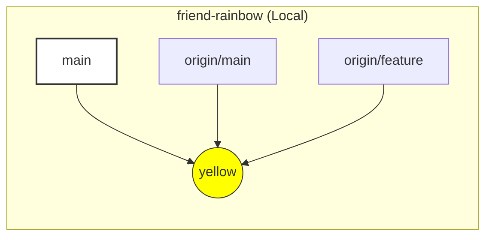

|                                                                                                                                                                                                                                                                                                                                        |
| :------------------------------------------------------------------------------------------------------------------------------------------------------------------------------------------------------------------------------------------------------------------------------------------------------------------------------------- |
| In the previous chapter, you created and pushed code to a remote repository.                                                                                                                                                                                                                                                         |
| In this chapter, we will simulate team collaboration by playing the role of a colleague. You will learn how to copy (**cloning**) a remote repository to your machine, as well as how to get new data (**fetching**) when there are changes from others. |

## Collaboration Simulation

To learn how to work in a team without needing two computers, we will create another copy of the `rainbow` project right on your machine.

- **Repository 1 (`rainbow`)**: Plays the role of YOUR computer.
- **Repository 2 (`friend-rainbow`)**: Plays the role of a COLLEAGUE'S computer.

We will switch back and forth between these two directories to simulate two people working on a shared project.

### Cloning a Remote Repository

"Cloning" is the act of copying a remote repository to a local machine. The `git clone` command will:

1. Download all data (commit history, branches) to the machine.
2. Automatically create a new directory containing the project.
3. Automatically set up the `origin` connection pointing back to the remote repository.

> **[ Follow Along 8-1: Playing the Colleague ]**
>
> Open a new terminal window (or a new tab), navigate out of the current `rainbow` directory (e.g., to the Desktop or parent directory), and perform the following command:
>
> 1. Get the SSH URL of the `rainbow-remote` repository from GitHub (just like in the previous chapter).
> 2. Run the clone command with the new directory name `friend-rainbow`:
>
>    ```bash
>    # Navigate to the parent directory
>    cd ..
>
>    # Clone into the friend-rainbow directory
>    git clone git@github.com:username/rainbow-remote.git friend-rainbow
>    ```
>
>    _(Replace `username` with your GitHub username)_
>
> 3. Go into the new directory:
>
>    ```bash
>    cd friend-rainbow
>    ```

At this point, you are in the role of "The Friend." Let's check what `clone` has done for us.

### Checking Status After Cloning

> **[ Follow Along 8-2 ]**
>
> 1. Check remotes:
>
>    ```bash
>    friend-rainbow $ git remote -v
>    origin  git@github.com:username/rainbow-remote.git (fetch)
>    origin  git@github.com:username/rainbow-remote.git (push)
>    ```
>
>    _Observation_: Git automatically sets the remote name to `origin`.
>
> 2. Check branches:
>
>    ```bash
>    friend-rainbow $ git branch --all
>    * main
>      remotes/origin/HEAD -> origin/main
>      remotes/origin/feature
>      remotes/origin/main
>    ```

**What happened?**

- You have a `main` branch (active).
- You **DO NOT** have a `feature` branch locally.
- However, you have all the **remote-tracking branches** (`origin/main`, `origin/feature`).



_Figure 8-1: Status of the `friend-rainbow` repository after cloning. Only the main branch is created locally by default._

### Working with Branches from Remote

If "The Friend" wants to work on the `feature` branch, they need to check it out. Since Git sees that `remotes/origin/feature` already exists, it will automatically create a corresponding local `feature` branch and link them.

> **[ Follow Along 8-3 ]**
>
> ```bash
> friend-rainbow $ git switch feature
> Branch 'feature' set up to track remote branch 'feature' from 'origin'.
> Switched to a new branch 'feature'
> ```

## Deleting Branches

Suppose "The Friend" sees the `feature` branch is old and wants to delete it (both on remote and locally).

### Deleting on Remote

Use the `git push` command with the `--delete` flag (or `-d`).

> **[ Follow Along 8-4 ]**
>
> 1. Switch back to `main` (you cannot delete a branch you are currently on):
>
>    ```bash
>    friend-rainbow $ git switch main
>    ```
>
> 2. Delete the branch on Remote:
>
>    ```bash
>    friend-rainbow $ git push origin --delete feature
>    To github.com:username/rainbow-remote.git
>    - [deleted]         feature
>    ```
>
> 3. Delete the branch Locally (for `friend-rainbow`):
>
>    ```bash
>    friend-rainbow $ git branch -d feature
>    Deleted branch feature.
>    ```

## Bi-directional Synchronization (Fetching & Merging)

Now, let "The Friend" create a new change on `main` and push it up.

> **[ Follow Along 8-5: Friend updates code ]**
>
> 1. Edit the `rainbowcolors.txt` file (in the `friend-rainbow` directory), add the line:
>    `Green is the fourth color of the rainbow.`
> 2. Commit and Push:
>
>    ```bash
>    friend-rainbow $ git add rainbowcolors.txt
>    friend-rainbow $ git commit -m "green"
>    friend-rainbow $ git push
>    ```

At this point, the "green" commit is already on GitHub (`rainbow-remote`). But YOUR original repository (`rainbow`) doesn't know anything about this yet.

### Going Back to YOUR Role (Repository `rainbow`)

Open the terminal for the `rainbow` directory again (or `cd ../rainbow`). If you type `git log`, you still only see the "yellow" commit.

### Fetching

The `git fetch` command is used to update information from the remote to the machine, but it **has not yet** merged into your code. It only updates the **remote-tracking branches**.

> **[ Follow Along 8-6 ]**
>
> 1. In the `rainbow` directory:
>
>    ```bash
>    rainbow $ git fetch
>    remote: Enumerating objects: 5, done...
>    Unpacking objects: 100% ...
>    From github.com:username/rainbow-remote
>       fc8139c..6987cd2  main       -> origin/main
>    ```
>
> 2. Check the log:
>
>    ```bash
>    rainbow $ git log --all --oneline --graph
>    * 6987cd2 (origin/main) green
>    * fc8139c (HEAD -> main, origin/feature, feature) yellow
>    ```

You see that `origin/main` has moved forward to the "green" commit, but `main` (HEAD) is still at "yellow."

### Merging

To actually update your code, you need to merge `origin/main` into your `main`.

> **[ Follow Along 8-7 ]**
>
> ```bash
> rainbow $ git merge origin/main
> Updating fc8139c..6987cd2
> Fast-forward
>  rainbowcolors.txt | 1 +
>  1 file changed, 1 insertion(+)
> ```

Now your `rainbow` is synchronized with `friend-rainbow` and GitHub.

### Prune (Pruning Dead Branches)

Remember that "The Friend" deleted the `feature` branch on the server? But on your machine (`rainbow`), the `git branch -a` command still shows `remotes/origin/feature`. To clean up references to branches that have been deleted on the remote, use `git fetch --prune` (or `-p`).

> **[ Follow Along 8-8 ]**
>
> 1. Prune old remote-tracking branches:
>
>    ```bash
>    rainbow $ git fetch -p
>    From github.com:username/rainbow-remote
>    - [deleted]         (none)     -> origin/feature
>    ```
>
> 2. Delete the local `feature` branch (if you wish):
>
>    ```bash
>    rainbow $ git branch -d feature
>    ```

## Summary

In this chapter, you learned the basic collaboration workflow:

1. **Clone**: Copy the repo to your machine.
2. **Push**: Push the code up.
3. **Fetch**: Download new information.
4. **Merge**: Combine new information into the current code.

In [Chapter 9](/en/blog/git-09-three-way-merge), we will look at a more complex case: when both people edit a file concurrently and cause a divergence.
