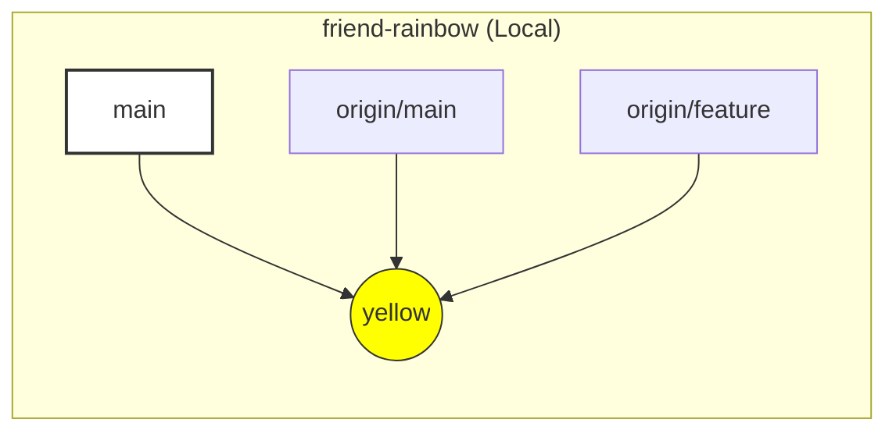

|                                                                                                                                                                                                                                                |
| :--------------------------------------------------------------------------------------------------------------------------------------------------------------------------------------------------------------------------------------------- |
| Trong chương trước, bạn đã tạo và đẩy code lên remote repository.                                                                                                                                                                              |
| Ở chương này, chúng ta sẽ mô phỏng việc cộng tác nhóm bằng cách đóng vai một người bạn đồng nghiệp. Bạn sẽ học cách sao chép (`clone`) một remote repository về máy, cũng như cách lấy dữ liệu mới (`fetch`) về khi có thay đổi từ người khác. |

## Mô Phỏng Hợp Tác (Collaboration Simulation)

Để học cách làm việc nhóm mà không cần hai máy tính, chúng ta sẽ tạo thêm một bản sao nữa của dự án `rainbow` ngay trên máy của bạn.

- **Repository 1 (`rainbow`)**: Đóng vai trò là máy tính của BẠN.
- **Repository 2 (`friend-rainbow`)**: Đóng vai trò là máy tính của ĐỒNG NGHIỆP.

Chúng ta sẽ chuyển đổi qua lại giữa hai thư mục này để mô phỏng việc hai người cùng làm việc trên một dự án chung.

### Cloning (Sao chép) Remote Repository

"Clone" là hành động sao chép một remote repository về máy local. Lệnh `git clone` sẽ:

1. Tải toàn bộ dữ liệu (lịch sử commit, các nhánh) về máy.
2. Tự động tạo một thư mục mới chứa dự án.
3. Tự động thiết lập kết nối `origin` trỏ về remote repository.

> **[ Thực Hành 8-1: Đóng vai Đồng nghiệp ]**
>
> Hãy mở một cửa sổ terminal mới (hoặc tab mới), di chuyển ra khỏi thư mục `rainbow` hiện tại (ví dụ về Desktop hoặc thư mục cha), và thực hiện lệnh sau:
>
> 1. Lấy SSH URL của repository `rainbow-remote` từ GitHub (giống chương trước).
> 2. Chạy lệnh clone với tham số tên thư mục mới là `friend-rainbow`:
>
>    ```bash
>    # Di chuyển ra thư mục cha
>    cd ..
>
>    # Clone về thư mục friend-rainbow
>    git clone git@github.com:username/rainbow-remote.git friend-rainbow
>    ```
>
>    _(Thay `username` bằng tài khoản GitHub của bạn)_
>
> 3. Truy cập vào thư mục mới:
>
>    ```bash
>    cd friend-rainbow
>    ```

Lúc này, bạn đang ở trong vai "Người bạn". Hãy kiểm tra xem `clone` đã làm gì cho chúng ta.

### Kiểm tra trạng thái sau khi Clone

> **[ Thực Hành 8-2 ]**
>
> 1. Kiểm tra remote:
>
>    ```bash
>    friend-rainbow $ git remote -v
>    origin  git@github.com:username/rainbow-remote.git (fetch)
>    origin  git@github.com:username/rainbow-remote.git (push)
>    ```
>
>    _Nhận xét_: Git tự động đặt tên remote là `origin`.
>
> 2. Kiểm tra các nhánh:
>
>    ```bash
>    friend-rainbow $ git branch --all
>    * main
>      remotes/origin/HEAD -> origin/main
>      remotes/origin/feature
>      remotes/origin/main
>    ```

**Điều gì đã xảy ra?**

- Bạn có nhánh `main` (đang active).
- Bạn **KHÔNG** có nhánh `feature` ở local.
- Tuy nhiên, bạn có đầy đủ các **remote-tracking branches** (`origin/main`, `origin/feature`).



_Hình 8-1: Trạng thái repository `friend-rainbow` sau khi clone. Chỉ có nhánh main được tạo local mặc định._

### Làm việc với nhánh từ Remote

Nếu "Người bạn" muốn làm việc trên nhánh `feature`, họ cần checkout nó. Vì Git thấy đã có `remotes/origin/feature`, nó sẽ tự động tạo nhánh local `feature` tương ứng và liên kết chúng.

> **[ Thực Hành 8-3 ]**
>
> ```bash
> friend-rainbow $ git switch feature
> Branch 'feature' set up to track remote branch 'feature' from 'origin'.
> Switched to a new branch 'feature'
> ```

## Dọn Dẹp Nhánh (Deleting Branches)

Giả sử "Người bạn" thấy nhánh `feature` đã cũ và muốn xóa nó đi (cả trên remote và local).

### Xóa trên Remote

Dùng lệnh `git push` với cờ `--delete` (hoặc `-d`).

> **[ Thực Hành 8-4 ]**
>
> 1. Chuyển về `main` (không thể xóa nhánh đang đứng):
>
>    ```bash
>    friend-rainbow $ git switch main
>    ```
>
> 2. Xóa nhánh trên Remote:
>
>    ```bash
>    friend-rainbow $ git push origin --delete feature
>    To github.com:username/rainbow-remote.git
>    - [deleted]         feature
>    ```
>
> 3. Xóa nhánh ở Local (của `friend-rainbow`):
>
>    ```bash
>    friend-rainbow $ git branch -d feature
>    Deleted branch feature.
>    ```

## Đồng Bộ Ngược Lại (Fetching & Merging)

Bây giờ, hãy để "Người bạn" tạo ra một thay đổi mới trên `main` và đẩy lên.

> **[ Thực Hành 8-5: Người bạn update code ]**
>
> 1. Sửa file `rainbowcolors.txt` (trong thư mục `friend-rainbow`), thêm dòng:
>    `Green is the fourth color of the rainbow.`
> 2. Commit và Push:
>
>    ```bash
>    friend-rainbow $ git add rainbowcolors.txt
>    friend-rainbow $ git commit -m "green"
>    friend-rainbow $ git push
>    ```

Lúc này, trên GitHub (`rainbow-remote`) đã có commit "green". Nhưng repository gốc (`rainbow`) của BẠN vẫn chưa biết gì về điều này.

### Quay trở lại vai của BẠN (Repository `rainbow`)

Hãy mở lại terminal của thư mục `rainbow` (hoặc `cd ../rainbow`).
Nếu bạn gõ `git log`, bạn vẫn chỉ thấy commit "yellow".

### Fetch (Tải về)

Lệnh `git fetch` dùng để cập nhật thông tin từ remote về máy, nhưng **chưa** gộp vào code của bạn. Nó chỉ cập nhật các **remote-tracking branches**.

> **[ Thực Hành 8-6 ]**
>
> 1. Tại thư mục `rainbow`:
>
>    ```bash
>    rainbow $ git fetch
>    remote: Enumerating objects: 5, done...
>    Unpacking objects: 100% ...
>    From github.com:username/rainbow-remote
>       fc8139c..6987cd2  main       -> origin/main
>    ```
>
> 2. Kiểm tra log:
>
>    ```bash
>    rainbow $ git log --all --oneline --graph
>    * 6987cd2 (origin/main) green
>    * fc8139c (HEAD -> main, origin/feature, feature) yellow
>    ```

Bạn thấy rằng `origin/main` đã tiến lên commit "green", nhưng `main` (HEAD) vẫn ở "yellow".

### Merge (Hợp nhất)

Để cập nhật code thật sự, bạn cần merge `origin/main` vào `main` của bạn.

> **[ Thực Hành 8-7 ]**
>
> ```bash
> rainbow $ git merge origin/main
> Updating fc8139c..6987cd2
> Fast-forward
>  rainbowcolors.txt | 1 +
>  1 file changed, 1 insertion(+)
> ```

Bây giờ `rainbow` của bạn đã đồng bộ với `friend-rainbow` và GitHub.

### Prune (Cắt tỉa nhánh chết)

Bạn nhớ là "Người bạn" đã xóa nhánh `feature` trên server rồi chứ? Nhưng ở máy bạn (`rainbow`), lệnh `git branch -a` vẫn hiện `remotes/origin/feature`.
Để dọn dẹp các tham chiếu đến nhánh đã bị xóa trên remote, ta dùng `git fetch --prune` (hoặc `-p`).

> **[ Thực Hành 8-8 ]**
>
> 1. Prune các remote-tracking branch cũ:
>
>    ```bash
>    rainbow $ git fetch -p
>    From github.com:username/rainbow-remote
>    - [deleted]         (none)     -> origin/feature
>    ```
>
> 2. Xóa nốt nhánh local `feature` (nếu bạn muốn):
>
>    ```bash
>    rainbow $ git branch -d feature
>    ```

## Tổng Kết

Trong chương này, bạn đã học được quy trình cộng tác cơ bản:

1. **Clone**: Sao chép repo về máy.
2. **Push**: Đẩy code lên.
3. **Fetch**: Tải thông tin mới về.
4. **Merge**: Gộp thông tin mới vào code hiện tại.

Trong [Chương 9](/blog/git-09-three-way-merge), chúng ta sẽ xem xét trường hợp phức tạp hơn: Khi cả hai người cùng sửa một file và gây ra sự phân nhánh (diverge).
