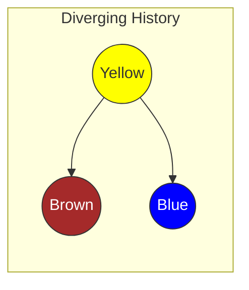
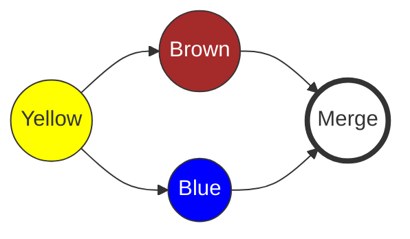

|                                                                                                                                                                                                               |
| :------------------------------------------------------------------------------------------------------------------------------------------------------------------------------------------------------------ |
| In the previous chapter, we performed a **Fast-forward merge** when the commit history was a straight line.                                                                                                   |
| In this chapter, you will face a more realistic situation: **Diverging History**. When you and a colleague change code in parallel, Git needs a smarter mechanism to merge, which is the **Three-Way Merge**. |

## Why need a Three-Way Merge?

In Chapter 5, you briefly learned about the two types of merges:

1. **Fast-forward**: When the target branch is a direct "ancestor" of the source branch. Git only needs to move the pointer forward.
2. **Three-way merge**: When the histories of the two branches have diverged into two different directions. Git needs to create a new **Merge Commit** to link them back together.

We will create a "light conflict" situation (not a code conflict yet, just a history conflict) to see how Three-Way Merge works.

## Creating a Diverging History

You have two repositories: `rainbow` (yours) and `friend-rainbow` (colleague's). Both are synchronized with each other.

### Step 1: You (rainbow) create a change and Push

In the `rainbow` repository, you create a new file and push it to the server.

> **[ Follow Along 9-1: Your Side ]**
>
> 1. In the `rainbow` directory, create a file named `othercolors.txt` with the content:
>    `Brown is not a color in the rainbow.`
> 2. Commit and Push:
>
>    ```bash
>    rainbow $ git add othercolors.txt
>    rainbow $ git commit -m "brown"
>    rainbow $ git push
>    ```

At this point, the "brown" commit is already on the Remote Repository (`origin/main`).

### Step 2: Colleague (friend-rainbow) also works (but hasn't pulled)

Your colleague (at `friend-rainbow`) doesn't know you just pushed the "brown" commit. They continue working on the `rainbowcolors.txt` file.

> **[ Follow Along 9-2: Colleague Side ]**
>
> 1. Open the terminal in the `friend-rainbow` directory.
> 2. Edit the `rainbowcolors.txt` file, adding a line at the end:
>    `Blue is the fifth color of the rainbow.`
> 3. Commit (but **do not** push yet):
>
>    ```bash
>    friend-rainbow $ git add rainbowcolors.txt
>    friend-rainbow $ git commit -m "blue"
>    ```

### Step 3: Colleague attempts to Push (and fails)

This is the moment the issue occurs.

> **[ Follow Along 9-3 ]**
>
> ```bash
> friend-rainbow $ git push
> To github.com:username/rainbow-remote.git
>  ! [rejected]        main -> main (fetch first)
> error: failed to push some refs to ...
> hint: Updates were rejected because the remote contains work that you do
> hint: not have locally. This is usually caused by another repository pushing
> hint: to the same ref. You may want to first integrate the remote changes
> hint: (e.g., 'git pull ...') before pushing again.
> ```

**Why the error?**
The server rejects it because if push were allowed, your "brown" commit history would be overwritten or lost. Git requires the history to be continuous.

Current state:

- Remote: ... -> Yellow -> **Brown**
- Friend-Local: ... -> Yellow -> **Blue**

The two branches have **diverged** from the Yellow commit.



_Figure 9-1: Diverging history. Remote has Brown, Local has Blue._

## Performing a Three-Way Merge

To resolve this, "the friend" needs to follow 2 steps:

1. **Fetch**: Download the "brown" commit to the machine.
2. **Merge**: Integrate the "brown" commit (from `origin/main`) into the `main` branch which currently has the "blue" commit.

> **[ Follow Along 9-4: Fetch and Merge ]**
>
> 1. Fetch the data:
>
>    ```bash
>    friend-rainbow $ git fetch
>    From github.com:username/rainbow-remote
>       ... main       -> origin/main
>    ```
>
> 2. Perform the Merge:
>
>    ```bash
>    friend-rainbow $ git merge origin/main
>    ```

### Merge Commit and Text Editor (Vim/Nano)

When you run the merge command above, Git notices that it cannot fast-forward. It is forced to create a new **Merge Commit** to combine "Brown" and "Blue."
Git will automatically open the default text editor (usually Vim or Nano on Linux) for you to enter a message for this commit. The default message is usually: `Merge remote-tracking branch 'origin/main'`.

- **If it's Nano**: Press `Ctrl+O` then `Enter` to save, then `Ctrl+X` to exit.
- **If it's Vim**:
  1. Press the `Esc` key (to ensure you exit insert mode).
  2. Type `:wq` (Write and Quit).
  3. Press `Enter`.

After saving the message, Git will complete the merge.

> **Result:**
>
> ```text
> Merge made by the 'ort' strategy.
>  othercolors.txt | 1 +
>  1 file changed, 1 insertion(+)
>  create mode 100644 othercolors.txt
> ```

At this point, the commit history of `friend-rainbow` will look like this:



_Figure 9-2: Merge Commit combining two branches._

### Push the result to Remote

Now that your local has the full history (both yours and your colleague's), you can push safely.

> **[ Follow Along 9-5 ]**
>
> ```bash
> friend-rainbow $ git push
> ```

## Git Pull: Fetch + Merge "in an instant"

Instead of typing two commands, `git fetch` and then `git merge`, Git provides the `git pull` command to do both simultaneously.

> **[ Command Reminder ]**
>
> **git pull**
>
> Equivalent to `git fetch` followed by `git merge`.

Now go back to YOUR role (repository `rainbow`). This repository is missing the "blue" commit and the "merge commit" that your colleague just pushed.

> **[ Follow Along 9-6: Using Git Pull ]**
>
> In the `rainbow` directory:
>
> ```bash
> rainbow $ git pull
> Updating ...
> Fast-forward
>  rainbowcolors.txt | 1 +
>  1 file changed, 1 insertion(+)
> ```

_Note: Why was it a Fast-forward this time?_
Because `rainbow` was at the "Brown" commit, and "Brown" is a direct ancestor of the "Merge Commit" (just retrieved from the server). The history is now a straight line from the perspective of `rainbow`.

## Summary

- **Diverging History**: Occurs when both sides change code in parallel from a single starting point.
- **Three-Way Merge**: Git's mechanism to integrate this divergence, creating a **Merge Commit**.
- **Git Pull**: Shortcut command for `Fetch` + `Merge`. Should be used when you want to update the latest code to your machine to continue working.

In [Chapter 10](/en/blog/git-10-merge-conflicts), we will face "the nightmare" of every programmer: **Merge Conflicts**—when both people edit the **same line** in the **same file**.
