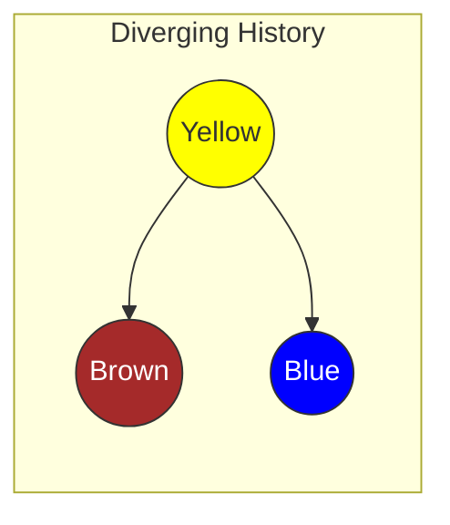
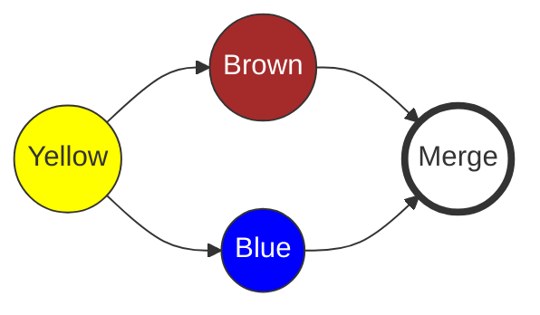

|                                                                                                                                                                                                                                         |
| :-------------------------------------------------------------------------------------------------------------------------------------------------------------------------------------------------------------------------------------- |
| Ở chương trước, chúng ta đã thực hiện **Fast-forward merge** khi lịch sử commit là đường thẳng.                                                                                                                                         |
| Trong chương này, bạn sẽ đối mặt với tình huống thực tế hơn: **Lịch sử phân nhánh (Diverging History)**. Khi bạn và đồng nghiệp cùng thay đổi code song song, Git cần một cơ chế thông minh hơn để hợp nhất, đó là **Three-Way Merge**. |

## Tại sao cần Three-Way Merge?

Trong Chương 5, bạn đã biết sơ qua về hai loại merge:

1. **Fast-forward**: Khi nhánh đích là "tổ tiên" trực tiếp của nhánh nguồn. Git chỉ cần dời con trỏ lên phía trước.
2. **Three-way merge**: Khi lịch sử của hai nhánh đã rẽ sang hai hướng khác nhau. Git cần tạo một **Merge Commit** mới để kết nối chúng lại.

Chúng ta sẽ tạo ra một tình huống "xung đột nhẹ" (chưa phải conflict code, chỉ là conflict lịch sử) để xem Three-Way Merge hoạt động thế nào.

## Tạo Tình Huống Phân Nhánh (Diverging History)

Bạn đang có hai repository: `rainbow` (của bạn) và `friend-rainbow` (của đồng nghiệp). Cả hai đang đồng bộ với nhau.

### Bước 1: Bạn (rainbow) tạo thay đổi và Push

Tại repository `rainbow`, bạn tạo một file mới và đẩy lên server.

> **[ Thực Hành 9-1: Phía Bạn ]**
>
> 1. Tại thư mục `rainbow`, tạo file `othercolors.txt` với nội dung:
>    `Brown is not a color in the rainbow.`
> 2. Commit và Push:
>
>    ```bash
>    rainbow $ git add othercolors.txt
>    rainbow $ git commit -m "brown"
>    rainbow $ git push
>    ```

Lúc này, trên Remote Repository (`origin/main`) đã có commit "brown".

### Bước 2: Đồng nghiệp (friend-rainbow) cũng làm việc (nhưng chưa pull)

Đồng nghiệp của bạn (tại `friend-rainbow`) không biết bạn vừa push commit "brown". Họ vẫn tiếp tục làm việc trên file `rainbowcolors.txt`.

> **[ Thực Hành 9-2: Phía Đồng Nghiệp ]**
>
> 1. Mở terminal tại thư mục `friend-rainbow`.
> 2. Chỉnh sửa file `rainbowcolors.txt`, thêm một dòng vào cuối:
>    `Blue is the fifth color of the rainbow.`
> 3. Commit (nhưng **khoan** push):
>
>    ```bash
>    friend-rainbow $ git add rainbowcolors.txt
>    friend-rainbow $ git commit -m "blue"
>    ```

### Bước 3: Đồng nghiệp cố gắng Push (và thất bại)

Đây là khoảnh khắc sự cố xảy ra.

> **[ Thực Hành 9-3 ]**
>
> ```bash
> friend-rainbow $ git push
> To github.com:username/rainbow-remote.git
>  ! [rejected]        main -> main (fetch first)
> error: failed to push some refs to ...
> hint: Updates were rejected because the remote contains work that you do
> hint: not have locally. This is usually caused by another repository pushing
> hint: to the same ref. You may want to first integrate the remote changes
> hint: (e.g., 'git pull ...') before pushing again.
> ```

**Tại sao lỗi?**
Máy chủ từ chối vì nếu cho phép push, lịch sử commit "brown" của bạn sẽ bị ghi đè hoặc mất dấu. Git yêu cầu lịch sử phải liên tục.

Trạng thái hiện tại:

- Remote: ... -> Yellow -> **Brown**
- Friend-Local: ... -> Yellow -> **Blue**

Hai nhánh đã **phân kỳ (diverged)** từ commit Yellow.



_Hình 9-1: Lịch sử phân nhánh. Remote có Brown, Local có Blue._

## Thực Hiện Three-Way Merge

Để giải quyết, "người bạn" cần làm 2 bước:

1. **Fetch**: Lấy commit "brown" về máy.
2. **Merge**: Hợp nhất commit "brown" (từ `origin/main`) vào nhánh `main` đang có commit "blue".

> **[ Thực Hành 9-4: Fetch và Merge ]**
>
> 1. Lấy dữ liệu về:
>
>    ```bash
>    friend-rainbow $ git fetch
>    From github.com:username/rainbow-remote
>       ... main       -> origin/main
>    ```
>
> 2. Thực hiện Merge:
>
>    ```bash
>    friend-rainbow $ git merge origin/main
>    ```

### Merge Commit và Trình soạn thảo (Vim/Nano)

Khi bạn chạy lệnh merge trên, Git nhận thấy không thể fast-forward. Nó buộc phải tạo ra một **Merge Commit** mới để kết hợp "Brown" và "Blue".
Git sẽ tự động mở trình soạn thảo mặc định (thường là Vim hoặc Nano trên Linux) để bạn nhập tin nhắn cho commit này. Tin nhắn mặc định thường là: `Merge remote-tracking branch 'origin/main'`.

- **Nếu là Nano**: Nhấn `Ctrl+O` sau đó `Enter` để lưu, rồi `Ctrl+X` để thoát.
- **Nếu là Vim**:
  1. Nhấn phím `Esc` (để đảm bảo thoát chế độ nhập liệu).
  2. Gõ `:wq` (Write và Quit).
  3. Nhấn `Enter`.

Sau khi lưu tin nhắn, Git sẽ hoàn tất việc merge.

> **Kết quả:**
>
> ```text
> Merge made by the 'ort' strategy.
>  othercolors.txt | 1 +
>  1 file changed, 1 insertion(+)
>  create mode 100644 othercolors.txt
> ```

Lúc này, lịch sử commit của `friend-rainbow` sẽ trông như sau:



_Hình 9-2: Merge Commit kết hợp hai nhánh lại với nhau._

### Push kết quả lên Remote

Bây giờ local của bạn đã có đầy đủ lịch sử (cả của bạn và của đồng nghiệp), bạn có thể push an toàn.

> **[ Thực Hành 9-5 ]**
>
> ```bash
> friend-rainbow $ git push
> ```

## Git Pull: Fetch + Merge "trong một nốt nhạc"

Thay vì gõ hai lệnh `git fetch` rồi `git merge`, Git cung cấp lệnh `git pull` để làm cả hai việc này cùng lúc.

> **[ Ghi nhớ lệnh ]**
>
> **git pull**
>
> Tương đương với `git fetch` theo sau bởi `git merge`.

Giờ hãy quay lại vai của BẠN (repository `rainbow`). repository này đang thiếu commit "blue" và "merge commit" mà đồng nghiệp vừa push.

> **[ Thực Hành 9-6: Sử dụng Git Pull ]**
>
> Tại thư mục `rainbow`:
>
> ```bash
> rainbow $ git pull
> Updating ...
> Fast-forward
>  rainbowcolors.txt | 1 +
>  1 file changed, 1 insertion(+)
> ```

_Lưu ý: Tại sao lần này lại là Fast-forward?_
Vì `rainbow` đang ở commit "Brown", mà "Brown" là tổ tiên trực tiếp của "Merge Commit" (vừa được lấy về từ server). Lịch sử lúc này là đường thẳng từ góc nhìn của `rainbow`.

## Tổng Kết

- **Diverging History**: Xảy ra khi hai bên cùng thay đổi code song song từ một điểm xuất phát.
- **Three-Way Merge**: Cơ chế của Git để hợp nhất sự phân nhánh này, tạo ra một **Merge Commit**.
- **Git Pull**: Lệnh tắt cho `Fetch` + `Merge`. Nên dùng khi bạn muốn cập nhật code mới nhất về máy để tiếp tục làm việc.

Trong [Chương 10](/vi/blog/git-10-merge-conflicts), chúng ta sẽ đối mặt với "cơn ác mộng" của mọi lập trình viên: **Merge Conflicts** (Xung đột mã nguồn) - khi cả hai cùng sửa **một dòng** trong **cùng một file**.
