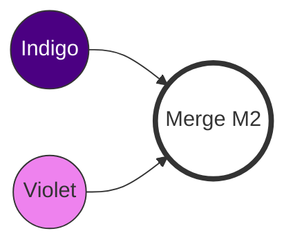

|                                                                                                                                                              |
| :----------------------------------------------------------------------------------------------------------------------------------------------------------- |
| In Chapter 9, we performed a successful **Three-Way Merge** when two people edited two different files.                                                      |
| But what happens if both people edit the **same line** in the **same file**? Git won't know whose code to choose. That is when a **Merge Conflict** appears. |

## What is a Merge Conflict?

A **Merge Conflict** occurs when Git cannot automatically merge changes. This usually happens in two cases:

1. Two branches edit the same line of code (or adjacent lines) in the same file.
2. One branch edits a file while the other branch deletes that file.

When a conflict is encountered, Git will **STOP** the merge process, mark the points of conflict directly within the file, and wait for you—a human—to decide.

## Creating a Conflict Situation (Simulation)

We will continue with the two repositories: `rainbow` (Your Local) and `friend-rainbow` (Colleague's Local).

### Current State

Both are at the latest commit from Chapter 9.
Existing files: `rainbow.txt`, `rainbowcolors.txt`, `othercolors.txt`.

### Step 1: You (rainbow) add the color Indigo

At `rainbow`, you edit the `rainbowcolors.txt` file to add the 6th color.

> **[ Follow Along 10-1: Your Side ]**
>
> 1. In the `rainbow` directory, open the `rainbowcolors.txt` file.
> 2. Add the following line to line 6:
>    `Indigo is the sixth color of the rainbow.`
> 3. Commit and Push:
>
>    ```bash
>    rainbow $ git add rainbowcolors.txt
>    rainbow $ git commit -m "indigo"
>    rainbow $ git push
>    ```

At this point, the Remote (`origin/main`) has the "indigo" commit.

### Step 2: Colleague (friend-rainbow) adds the color Violet (also line 6)

The colleague doesn't know you edited line 6. They also edit line 6 but with different content.

> **[ Follow Along 10-2: Colleague Side ]**
>
> 1. In the `friend-rainbow` directory, open the `rainbowcolors.txt` file.
> 2. Add the following line to line 6 (note: they are also writing to line 6 of the copy they have):
>    `Violet is the seventh color of the rainbow.`
> 3. Commit:
>
>    ```bash
>    friend-rainbow $ git add rainbowcolors.txt
>    friend-rainbow $ git commit -m "violet"
>    ```

### Step 3: Colleague Pulls (AND BOOM! CONFLICT)

The colleague wants to push, but Git reports they must pull first (as in Chapter 9). But this time, when they pull (fetch + merge), a conflict will erupt.

> **[ Follow Along 10-3: Triggering a Conflict ]**
>
> ```bash
> friend-rainbow $ git pull
> remote: Enumerating objects: 5, done.
> ...
> Unpacking objects: 100% (3/3), done.
> From github.com:username/rainbow-remote
>    ...       main       -> origin/main
> Auto-merging rainbowcolors.txt
> CONFLICT (content): Merge conflict in rainbowcolors.txt
> Automatic merge failed; fix conflicts and then commit the result.
> ```

Git clearly states: **Automatic merge failed; fix conflicts and then commit the result.**

Check the status:

```bash
friend-rainbow $ git status
On branch main
You have unmerged paths.
  (fix conflicts and run "git commit")
  (use "git merge --abort" to abort the merge)

Unmerged paths:
  (use "git add <file>..." to mark resolution)
 both modified:   rainbowcolors.txt
```

## Resolving Conflict (Manually)

When you open the `rainbowcolors.txt` file now, you will see that Git has inserted **Conflict Markers** into the file content.

### Structure of Conflict Markers

The file content will look like this:

```text
Red is the first color of the rainbow.
...
Blue is the fifth color of the rainbow.
<<<<<<< HEAD
Violet is the seventh color of the rainbow.
=======
Indigo is the sixth color of the rainbow.
>>>>>>> 9b0a614... (commit hash from remote)
```

- `<<<<<<< HEAD`: Start of your changes (current branch—`main` of `friend-rainbow`).
- `=======`: Separator between the two versions.
- `>>>>>>> hash`: End of the changes from the other branch (the branch being merged in—`origin/main` from your side).

### Step 4: Editing the file (Resolve)

Your task is to:

1. Choose the correct content (or combine both).
2. **Delete** the marker lines (`<<<`, `===`, `>>>`).

In this case, we want to keep both colors, but in the correct order: Indigo (6) first, then Violet (7).

> **[ Follow Along 10-4: Editing the file ]**
>
> 1. Open `rainbowcolors.txt` with `nano` or your favorite editor:
>
>    ```bash
>    nano rainbowcolors.txt
>    ```
>
> 2. Edit the content to:
>
>    ```text
>    Red is the first color of the rainbow.
>    Orange is the second color of the rainbow.
>    Yellow is the third color of the rainbow.
>    Green is the fourth color of the rainbow.
>    Blue is the fifth color of the rainbow.
>    Indigo is the sixth color of the rainbow.
>    Violet is the seventh color of the rainbow.
>    ```
>
>    (Note: All `<<<<<<<`, `=======`, and `>>>>>>>` markers have been removed).
>
> 3. Save the file.

### Step 5: Mark as Resolved (Git Add)

After editing the file, Git still doesn't know you're done. You need to `git add` that file to tell Git: "I have resolved the conflict in this file."

> **[ Follow Along 10-5: Completing the Merge ]**
>
> 1. Add the file:
>
>    ```bash
>    friend-rainbow $ git add rainbowcolors.txt
>    ```
>
> 2. Check status (it will say "All conflicts fixed"):
>
>    ```bash
>    friend-rainbow $ git status
>    All conflicts fixed but you are still merging.
>    ```
>
> 3. Create the Merge Commit:
>
>    ```bash
>    friend-rainbow $ git commit -m "Merge resolved: Indigo and Violet"
>    ```

At this point, the merge process is complete. You have created a new **Merge Commit** (M2).



## Synchronizing

Finally, the colleague (`friend-rainbow`) needs to push the result up, and you (`rainbow`) need to pull it down so everything is synchronized.

> **[ Follow Along 10-6: Push and Pull ]**
>
> 1. At `friend-rainbow`:
>
>    ```bash
>    friend-rainbow $ git push
>    ```
>
> 2. At `rainbow` (yours):
>
>    ```bash
>    rainbow $ git pull
>    ```

Now all 3 locations (`rainbow`, `friend-rainbow`, `remote`) have all 7 colors of the rainbow and the same history.

## Tip: Aborting a Merge

If during the conflict resolution process, you feel overwhelmed and want to "start over" (return to the state before typing `git merge` or `git pull`), use the command:

```bash
git merge --abort
```

This command is extremely useful when you accidentally delete a file or want to see what the original file looked like.

## Summary

- **Conflict** is normal in a collaborative environment. Do not fear it.
- **Conflict Markers** (`<<<`, `===`, `>>>`) help you identify where the differences are.
- Resolution process: **Edit file** -> **Git Add** -> **Git Commit**.

In [Chapter 11](/en/blog/git-11-rebasing), we'll explore **Rebasing**—another way to integrate history, keeping the timeline straight and cleaner, but it also comes with strict rules.
