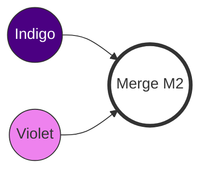

|                                                                                                                                                                   |
| :---------------------------------------------------------------------------------------------------------------------------------------------------------------- |
| Ở Chương 9, chúng ta đã thực hiện **Three-Way Merge** thành công khi hai người sửa hai file khác nhau.                                                            |
| Nhưng chuyện gì xảy ra nếu cả hai cùng sửa **một dòng** trong **cùng một file**? Git sẽ không biết phải chọn code của ai. Đó là lúc **Merge Conflict** xuất hiện. |

## Merge Conflict là gì?

**Merge Conflict** (Xung đột khi hợp nhất) xảy ra khi Git không thể tự động hòa trộn các thay đổi. Điều này thường xảy ra trong hai trường hợp:

1. Hai nhánh cùng sửa đổi một dòng code (hoặc các dòng liền kề) trong cùng một file.
2. Một nhánh sửa file, còn nhánh kia xóa file đó.

Khi gặp conflict, Git sẽ **DỪNG** quá trình merge lại, đánh dấu các điểm xung đột ngay trong file, và chờ bạn - con người - vào quyết định.

## Tạo Tình Huống Xung Đột (Simulation)

Chúng ta sẽ tiếp tục với hai repository `rainbow` (Local của bạn) và `friend-rainbow` (Local của đồng nghiệp).

### Trạng thái hiện tại

Cả hai đều đang ở commit mới nhất từ Chương 9.
Các file hiện có: `rainbow.txt`, `rainbowcolors.txt`, `othercolors.txt`.

### Bước 1: Bạn (rainbow) thêm màu Indigo

Tại `rainbow`, bạn sửa file `rainbowcolors.txt` để thêm màu thứ 6.

> **[ Thực Hành 10-1: Phía Bạn ]**
>
> 1. Tại thư mục `rainbow`, mở file `rainbowcolors.txt`.
> 2. Thêm dòng sau vào dòng 6:
>    `Indigo is the sixth color of the rainbow.`
> 3. Commit và Push:
>
>    ```bash
>    rainbow $ git add rainbowcolors.txt
>    rainbow $ git commit -m "indigo"
>    rainbow $ git push
>    ```

Lúc này, Remote (`origin/main`) đã có commit "indigo".

### Bước 2: Đồng nghiệp (friend-rainbow) thêm màu Violet (cũng dòng 6)

Đồng nghiệp không biết bạn đã sửa dòng 6. Họ cũng sửa dòng 6 nhưng nội dung khác.

> **[ Thực Hành 10-2: Phía Đồng Nghiệp ]**
>
> 1. Tại thư mục `friend-rainbow`, mở file `rainbowcolors.txt`.
> 2. Thêm dòng sau vào dòng 6 (lưu ý: họ cũng viết vào dòng 6 của bản copy họ đang có):
>    `Violet is the seventh color of the rainbow.`
> 3. Commit:
>
>    ```bash
>    friend-rainbow $ git add rainbowcolors.txt
>    friend-rainbow $ git commit -m "violet"
>    ```

### Bước 3: Đồng nghiệp Pull về (VÀ BÙM! CONFLICT)

Đồng nghiệp muốn push, nhưng Git báo phải pull trước (như Chương 9). Nhưng lần này, khi pull (fetch + merge), conflict sẽ nổ ra.

> **[ Thực Hành 10-3: Kích hoạt Conflict ]**
>
> ```bash
> friend-rainbow $ git pull
> remote: Enumerating objects: 5, done.
> ...
> Unpacking objects: 100% (3/3), done.
> From github.com:username/rainbow-remote
>    ...       main       -> origin/main
> Auto-merging rainbowcolors.txt
> CONFLICT (content): Merge conflict in rainbowcolors.txt
> Automatic merge failed; fix conflicts and then commit the result.
> ```

Git báo rõ ràng: **Automatic merge failed; fix conflicts and then commit the result.**

Kiểm tra trạng thái:

```bash
friend-rainbow $ git status
On branch main
You have unmerged paths.
  (fix conflicts and run "git commit")
  (use "git merge --abort" to abort the merge)

Unmerged paths:
  (use "git add <file>..." to mark resolution)
 both modified:   rainbowcolors.txt
```

## Giải Quyết Conflict (Thủ công)

Khi mở file `rainbowcolors.txt` lúc này, bạn sẽ thấy Git đã chèn các **Conflict Markers** (Dấu hiệu xung đột) vào nội dung file.

### Cấu trúc Conflict Markers

Nội dung file sẽ trông như thế này:

```text
Red is the first color of the rainbow.
...
Blue is the fifth color of the rainbow.
<<<<<<< HEAD
Violet is the seventh color of the rainbow.
=======
Indigo is the sixth color of the rainbow.
>>>>>>> 9b0a614... (commit hash từ remote)
```

- `<<<<<<< HEAD`: Bắt đầu phần thay đổi của bạn (nhánh hiện tại - `main` của `friend-rainbow`).
- `=======`: Dấu phân cách giữa hai phiên bản.
- `>>>>>>> hash`: Kết thúc phần thay đổi của nhánh kia (nhánh đang được merge vào - `origin/main` của bạn).

### Bước 4: Chỉnh sửa file (Resolve)

Nhiệm vụ của bạn là:

1. Chọn nội dung đúng (hoặc kết hợp cả hai).
2. **Xóa** các dòng marker (`<<<`, `===`, `>>>`).

Trong trường hợp này, chúng ta muốn giữ cả hai màu, nhưng làm đúng thứ tự: Indigo (6) trước, Violet (7) sau.

> **[ Thực Hành 10-4: Sửa file ]**
>
> 1. Mở `rainbowcolors.txt` bằng `nano` hoặc editor bạn thích:
>
>    ```bash
>    nano rainbowcolors.txt
>    ```
>
> 2. Sửa nội dung thành:
>
>    ```text
>    Red is the first color of the rainbow.
>    Orange is the second color of the rainbow.
>    Yellow is the third color of the rainbow.
>    Green is the fourth color of the rainbow.
>    Blue is the fifth color of the rainbow.
>    Indigo is the sixth color of the rainbow.
>    Violet is the seventh color of the rainbow.
>    ```
>
>    (Lưu ý: Đã xóa hết các dấu `<<<<<<<`, `=======`, `>>>>>>>`).
>
> 3. Lưu file lại.

### Bước 5: Đánh dấu đã giải quyết (Git Add)

Sau khi sửa file xong, Git vẫn chưa biết bạn đã xong chưa. Bạn cần `git add` file đó để báo cho Git: "Tôi đã giải quyết conflict ở file này".

> **[ Thực Hành 10-5: Hoàn tất Merge ]**
>
> 1. Add file:
>
>    ```bash
>    friend-rainbow $ git add rainbowcolors.txt
>    ```
>
> 2. Kiểm tra status (sẽ thấy "All conflicts fixed"):
>
>    ```bash
>    friend-rainbow $ git status
>    All conflicts fixed but you are still merging.
>    ```
>
> 3. Tạo Merge Commit:
>
>    ```bash
>    friend-rainbow $ git commit -m "Merge resolved: Indige and Violet"
>    ```

Lúc này, quá trình merge hoàn tất. Bạn đã tạo ra một **Merge Commit** (M2) mới.



## Đồng bộ hóa (Syncing)

Cuối cùng, người bạn (`friend-rainbow`) cần push kết quả lên, và bạn (`rainbow`) cần pull về để mọi thứ đồng bộ.

> **[ Thực Hành 10-6: Push và Pull ]**
>
> 1. Tại `friend-rainbow`:
>
>    ```bash
>    friend-rainbow $ git push
>    ```
>
> 2. Tại `rainbow` (của bạn):
>
>    ```bash
>    rainbow $ git pull
>    ```

Bây giờ cả 3 nơi (`rainbow`, `friend-rainbow`, `remote`) đều có đủ 7 màu cầu vồng và lịch sử giống nhau.

## Mẹo: Hủy Merge (Aborting a Merge)

Nếu trong quá trình giải quyết conflict, bạn cảm thấy rối tung và muốn "làm lại từ đầu" (quay về trạng thái trước khi gõ `git merge` hay `git pull`), hãy dùng lệnh:

```bash
git merge --abort
```

Lệnh này cực kỳ hữu ích khi bạn lỡ tay xóa nhầm file hoặc muốn xem lại file gốc trông như thế nào.

## Tổng Kết

- **Conflict** là bình thường trong môi trường cộng tác. Đừng sợ nó.
- **Conflict Markers** (`<<<`, `===`, `>>>`) giúp bạn biết sự khác biệt nằm ở đâu.
- Quy trình giải quyết: **Sửa file** -> **Git Add** -> **Git Commit**.

Trong [Chương 11](/blog/git-11-rebasing), chúng ta sẽ khám phá **Rebasing** - một cách khác để hợp nhất lịch sử, giúp timeline thẳng tắp và sạch sẽ hơn, nhưng cũng đi kèm những quy tắc nghiêm ngặt.
