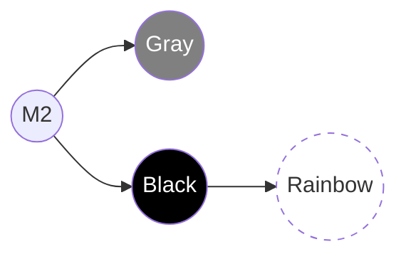
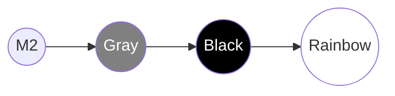

|                                                                                                                                                                                                |
| :--------------------------------------------------------------------------------------------------------------------------------------------------------------------------------------------- |
| In previous chapters, we used `git merge` to integrate code. It's safe, but it creates "Merge Commits" which can make history somewhat messy.                                               |
| **Rebasing** is a powerful Git technique that helps you "rewrite history," turning a parallel development branch into a single straight line. |

## Rebasing vs. Merging

Imagine you are writing a book.

- **Merge**: You write Chapter 5, and a colleague writes Chapter 6. When you combine them, you create a new chapter called "Merging Chapter 5 and 6."
- **Rebase**: You wait for your colleague to finish writing Chapter 6. Then you take what you wrote for Chapter 5 and "paste" it directly after Chapter 6. The history will look as if you only started writing Chapter 5 _after_ Chapter 6 was completed.

### Benefits of Rebasing

- **Linear History**: No more messy branching paths and merge commits. Easier to follow and debug (using `git bisect`).
- **Cleanliness**: Removes unnecessary commits (like "fix typo," "oops") before merging into the main branch.

## Practice Scenario: Rebasing a Local Branch onto Remote

We will continue with the `rainbow` and `friend-rainbow` repositories.

### Current State

- `rainbow` (You): Currently at commit M2.
- `friend-rainbow` (Colleague): Currently at commit M2.

### Step 1: You (rainbow) create a change on Remote

You edit the `othercolors.txt` file and push it to the server.

> **[ Follow Along 11-1 ]**
>
> 1. At `rainbow`, open `othercolors.txt`.
> 2. Add the line: `Gray is not a color in the rainbow.` on line 2.
> 3. Commit and Push:
>
>    ```bash
>    rainbow $ git add othercolors.txt
>    rainbow $ git commit -m "gray"
>    rainbow $ git push
>    ```

Remote `origin/main` is now ahead of `friend-rainbow` by 1 commit.

### Step 2: Colleague (friend-rainbow) works locally (Code "out of sync")

The colleague doesn't know you pushed. They continue working on their machine.

> **[ Follow Along 11-2 ]**
>
> 1. At `friend-rainbow` (don't pull!), open `othercolors.txt`.
> 2. Add the line: `Black is not a color in the rainbow.` on line 2.
> 3. Commit:
>
>    ```bash
>    friend-rainbow $ git add othercolors.txt
>    friend-rainbow $ git commit -m "black"
>    ```
>
> 4. Open `rainbowcolors.txt`, add the final line: `These are the colors of the rainbow.`
> 5. Commit again:
>
>    ```bash
>    friend-rainbow $ git add rainbowcolors.txt
>    friend-rainbow $ git commit -m "rainbow"
>    ```

At this point, the history of yours and the colleague's have diverged.



_Figure 11-1: Gray branch (on Remote) and Black-Rainbow branch (Local) diverged from M2._

### Step 3: Fetch and Rebase

The colleague wants to push, but Git will report an error. They need to update to your latest code ("gray"). Instead of `git merge` (creating a merge commit), they choose `git rebase`.

First, they must fetch the data:

> **[ Follow Along 11-3 ]**
>
> ```bash
> friend-rainbow $ git fetch
> ```

Now, perform Rebase: "Take my 2 commits 'black' and 'rainbow', put them aside temporarily. Update my branch to be equal to `origin/main` (which has 'gray'). Then paste those 2 commits back on top."

> **[ Follow Along 11-4: Starting Rebase ]**
>
> ```bash
> friend-rainbow $ git rebase origin/main
> ```

### Handling Conflicts during Rebase

Since both edited line 2 of `othercolors.txt` ("Gray" and "Black"), a conflict will occur as soon as Git tries to "paste" the first commit ("black") on top of "gray".

Git will stop and report:
`CONFLICT (content): Merge conflict in othercolors.txt`

You must resolve it manually (like in Chapter 10).

> **[ Follow Along 11-5: Resolving Conflict ]**
>
> 1. Open `othercolors.txt`.
> 2. You will see conflict markers. Edit to keep both (Gray first, then Black).
> 3. Save the file.
> 4. Add the file to the Staging Area:
>
>    ```bash
>    friend-rainbow $ git add othercolors.txt
>    ```
>
> 5. **IMPORTANT:** Do not type `git commit`. Instead, type:
>
>    ```bash
>    friend-rainbow $ git rebase --continue
>    ```

If Git asks you to edit the commit message, the editor (Nano/Vim) will appear. You can keep it as is and exit (`Ctrl+O`, `Enter`, `Ctrl+X` for Nano or `:wq` for Vim).

After completing the "black" commit, Git will continue to paste the "rainbow" commit. If there are no errors, the rebase is complete.

### Result after Rebase

The history is now a straight line:
`M2` -> `Gray` -> `Black` -> `Rainbow`.



> **[ Follow Along 11-6: Push the result ]**
>
> ```bash
> friend-rainbow $ git push
> ```
>
> _(Note: Since this is a rebase onto a new commit from remote, we can push normally. However, if you rebase to delete/edit a commit that was already pushed, you would have to use `git push --force`—**be extremely careful!**)_

## The Golden Rule of Rebasing

> **"Never rebase on public branches that others have already pulled."**

Why? When you rebase, you create **new commits** (new hashes), even if the code content is the same as before. If your colleague is working based on an old commit (A), and you delete (A) and replace it with (A'), your colleague will face significant trouble when merging their code back.

**Only use Rebase when:**

1. The branch is one only you are working on (local branch).
2. You haven't pushed that branch to the server yet (or are certain no one else is using it).
3. You want to clean up history before creating a Pull Request.

## Interactive Rebase (`-i`)

Besides merging code, Rebase also allows you to modify history in a "magical" way through interactive mode.

```bash
git rebase -i HEAD~3
```

(Edit the 3 most recent commits).

An editor interface will appear with a list of commits and commands:

- `pick`: Keep the commit as is.
- `reword`: Change the commit message.
- `edit`: Stop to edit the file content within the commit.
- `squash`: Merge this commit into the one above it.
- `drop`: Delete this commit.

This is a great tool for turning a string of commits like "wip," "fix typo," "fix again" into a complete commit like "Implement Feature X."

## Summary

- **Rebase** helps keep history straight and clean.
- Workflow: `git checkout feature` -> `git rebase main`.
- Resolve conflicts one commit at a time -> `git rebase --continue`.
- Always follow the **Golden Rule**: Do not rebase a public branch.

In the next chapter, we will learn about **[Pull Requests](/en/blog/git-12-pull-requests)**—the standard workflow for reviewing and merging code in large projects.
