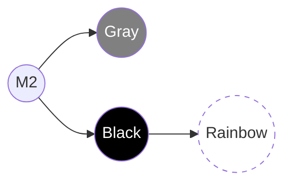
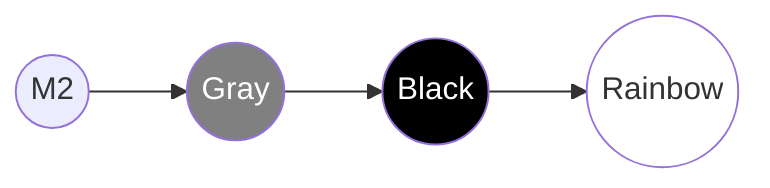

|                                                                                                                                          |
| :--------------------------------------------------------------------------------------------------------------------------------------- |
| Ở các chương trước, ta đã dùng `git merge` để hợp nhất code. Nó an toàn, nhưng tạo ra các "Merge Commit" khiến lịch sử đôi khi rối rắm.  |
| **Rebasing** là một kỹ thuật mạnh mẽ của Git giúp bạn "viết lại lịch sử", biến một nhánh phát triển song song thành một đường thẳng tắp. |

## Rebasing vs. Merging

Hãy tưởng tượng bạn đang viết một cuốn sách.

- **Merge**: Bạn viết chương 5, đồng nghiệp viết chương 6. Khi gộp lại, bạn tạo ra một chương mới gọi là "Gộp chương 5 và 6".
- **Rebase**: Bạn đợi đồng nghiệp viết xong chương 6. Sau đó bạn lấy những gì bạn đã viết cho chương 5, và "dán" nó tiếp nối ngay sau chương 6. Lịch sử sẽ trông như thể bạn chỉ bắt đầu viết chương 5 _sau khi_ chương 6 đã hoàn tất.

### Lợi ích của Rebasing

- **Lịch sử tuyến tính (Linear History)**: Không còn các đường rẽ nhánh và merge commit hỗn độn. Dễ theo dõi và debug (sử dụng `git bisect`).
- **Sạch sẽ**: Loại bỏ các commit thừa thãi (như "fix typo", "oops") trước khi merge vào nhánh chính.

## Kịch bản thực hành: Rebase nhánh Local lên Remote

Chúng ta sẽ tiếp tục với repository `rainbow` và `friend-rainbow`.

### Trạng thái hiện tại

- `rainbow` (Bạn): Đang ở commit M2.
- `friend-rainbow` (Đồng nghiệp): Đang ở commit M2.

### Bước 1: Bạn (rainbow) tạo sự thay đổi trên Remote

Bạn sửa file `othercolors.txt` và đẩy lên server.

> **[ Thực Hành 11-1 ]**
>
> 1. Tại `rainbow`, mở `othercolors.txt`.
> 2. Thêm dòng: `Gray is not a color in the rainbow.` vào dòng 2.
> 3. Commit và Push:
>
>    ```bash
>    rainbow $ git add othercolors.txt
>    rainbow $ git commit -m "gray"
>    rainbow $ git push
>    ```

Remote `origin/main` giờ đã đi trước `friend-rainbow` 1 commit.

### Bước 2: Đồng nghiệp (friend-rainbow) làm việc cục bộ (Code "lệch pha")

Đồng nghiệp không biết thẻ bạn đã push. Họ tiếp tục làm việc trên máy họ.

> **[ Thực Hành 11-2 ]**
>
> 1. Tại `friend-rainbow` (đừng pull nhé!), mở `othercolors.txt`.
> 2. Thêm dòng: `Black is not a color in the rainbow.` vào dòng 2.
> 3. Commit:
>
>    ```bash
>    friend-rainbow $ git add othercolors.txt
>    friend-rainbow $ git commit -m "black"
>    ```
>
> 4. Mở `rainbowcolors.txt`, thêm dòng cuôi: `These are the colors of the rainbow.`
> 5. Commit tiếp:
>
>    ```bash
>    friend-rainbow $ git add rainbowcolors.txt
>    friend-rainbow $ git commit -m "rainbow"
>    ```

Lúc này, lịch sử của bạn và đồng nghiệp đã rẽ nhánh (Diverged).



_Hình 11-1: Nhánh Gray (trên Remote) và nhánh Black-Rainbow (Local) rẽ ra từ M2._

### Bước 3: Fetch và Rebase

Đồng nghiệp muốn push, nhưng Git sẽ báo lỗi. Họ cần cập nhật code mới nhất từ bạn ("gray"). Thay vì `git merge` (tạo merge commit), họ chọn `git rebase`.

Trước hết, phải lấy dữ liệu về (Fetch):

> **[ Thực Hành 11-3 ]**
>
> ```bash
> friend-rainbow $ git fetch
> ```

Bây giờ, thực hiện Rebase: "Lấy 2 commit 'black' và 'rainbow' của tôi, tạm cất đi. Cập nhật nhánh của tôi bằng với `origin/main` (có 'gray'). Sau đó dán lại 2 commit kia lên trên cùng."

> **[ Thực Hành 11-4: Bắt đầu Rebase ]**
>
> ```bash
> friend-rainbow $ git rebase origin/main
> ```

### Xử lý Xung đột khi Rebase

Vì cả hai cùng sửa dòng 2 của `othercolors.txt` ("Gray" và "Black"), xung đột sẽ xảy ra ngay khi Git cố gắng "dán" commit đầu tiên ("black") lên trên "gray".

Git sẽ dừng lại và báo:
`CONFLICT (content): Merge conflict in othercolors.txt`

Bạn phải giải quyết thủ công (giống Chương 10).

> **[ Thực Hành 11-5: Giải quyết Conflict ]**
>
> 1. Mở `othercolors.txt`.
> 2. Bạn sẽ thấy conflict markers. Hãy sửa để giữ cả hai (Gray trước, Black sau).
> 3. Lưu file.
> 4. Add file vào Staging Area:
>
>    ```bash
>    friend-rainbow $ git add othercolors.txt
>    ```
>
> 5. **QUAN TRỌNG:** Không gõ `git commit`. Hãy gõ:
>
>    ```bash
>    friend-rainbow $ git rebase --continue
>    ```

Nếu Git yêu cầu sửa commit message, trình soạn thảo (Nano/Vim) sẽ hiện ra. Bạn có thể giữ nguyên và thoát (`Ctrl+O`, `Enter`, `Ctrl+X` với Nano hoặc `:wq` với Vim).

Sau khi xong commit "black", Git sẽ tiếp tục dán commit "rainbow". Nếu không có lỗi, rebase hoàn tất.

### Kết quả sau Rebase

Lịch sử bây giờ là một đường thẳng:
`M2` -> `Gray` -> `Black` -> `Rainbow`.



> **[ Thực Hành 11-6: Push kết quả ]**
>
> ```bash
> friend-rainbow $ git push
> ```
>
> _(Lưu ý: Vì đây là rebase lên commit mới của remote, ta có thể push bình thường. Tuy nhiên, nếu bạn rebase để xóa/sửa commit đã push trước đó, bạn sẽ phải dùng `git push --force` - **Cực kỳ cẩn thận!**)_

## The Golden Rule of Rebasing (Luật Vàng)

> **"Không bao giờ Rebase trên các nhánh `public` đã được người khác pull về."**

Tại sao?
Khi bạn rebase, bạn tạo ra các **commit mới** (mã hash mới), dù nội dung code có thể giống cũ.
Nếu đồng nghiệp của bạn đang làm việc dựa trên commit cũ (A), mà bạn xóa (A) đi và thay bằng (A'), đồng nghiệp sẽ gặp rắc rối lớn khi merge code của họ trở lại.

**Chỉ dùng Rebase khi:**

1. Nhánh đó chỉ có mình bạn làm việc (local branch).
2. Bạn chưa push nhánh đó lên server (hoặc chắc chắn không ai dùng nó).
3. Bạn muốn dọn dẹp lịch sử trước khi tạo Pull Request.

## Interactive Rebase (`-i`)

Ngoài việc gộp code, Rebase còn cho phép bạn sửa đổi lịch sử một cách "vi diệu" qua chế độ tương tác (`interactive`).

```bash
git rebase -i HEAD~3
```

(Sửa 3 commit gần nhất).

Giao diện ditor sẽ hiện ra danh sách các commit với các lệnh:

- `pick`: Giữ nguyên commit.
- `reword`: Sửa commit message.
- `edit`: Dừng lại để sửa nội dung file trong commit.
- `squash`: Gộp commit này vào commit phía trên nó.
- `drop`: Xóa commit này.

Đây là công cụ tuyệt vời để biến một chuỗi commit "wip", "fix typo", "fix again" thành một commit hoàn chỉnh "Implement Feature X".

## Tổng Kết

- **Rebase** giúp lịch sử thẳng và sạch.
- Quy trình: `git checkout feature` -> `git rebase main`.
- Giải quyết conflict từng commit một -> `git rebase --continue`.
- Luôn tuân thủ **Luật Vàng**: Không rebase nhánh public.

Ở chương tiếp theo, chúng ta sẽ tìm hiểu về **[Pull Requests](/blog/git-12-pull-requests)** - quy trình chuẩn để review và hợp nhất code trong các dự án lớn.
