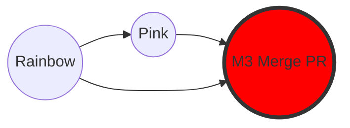

|                                                                                                                                                                                                                         |
| :---------------------------------------------------------------------------------------------------------------------------------------------------------------------------------------------------------------------- |
| We have learned how to merge code (merge/rebase) on the local machine. But in a team environment, having everyone freely merging into the main branch (`main`) is very dangerous.                               |
| **Pull Request (PR)** (or _Merge Request_ on GitLab) is the standard mechanism to propose changes, review code, and test before officially merging into the project. |

## What is a Pull Request?

- **Not a Git feature**: PR is a feature of hosting services (GitHub, GitLab, Bitbucket...).
- **Workflow**:
  1. You push your feature branch (`feature`) to the server.
  2. You create a PR: "I've finished feature X, please review and merge into `main`."
  3. Colleagues review the code, discuss, and request changes.
  4. Once everything is fine, the PR is **Merged**.

> **Note**: Although the name is "Pull Request" (Requesting to pull), its essence is a request to **Merge**.

## Standard Pull Request Process (9 Steps)

1. **Create Branch**: From `main`, create a new branch (e.g., `topic`).
2. **Commit**: Perform changes and commit on the `topic` branch.
3. **Push**: Push the `topic` branch to the Remote Repository.
4. **Create PR**: On the web interface (GitHub/GitLab), open a PR from `topic` into `main`.
5. **Review**: Colleagues examine and comment.
6. **Modify**: If necessary, you continue to commit and push to `topic` (the PR will automatically update).
7. **Approve**: Colleagues approve the PR.
8. **Merge**: Click the Merge button on the web.
9. **Cleanup**: Delete the `topic` branch (both remote and local) and pull the latest `main` to your machine.

## Practice: Simulating the PR Workflow

We will continue with the `rainbow` and `friend-rainbow` repositories.

### Steps 1 & 2: Create Branch and Commit (Local)

You want to add the color "Pink" to the list.

> **[ Follow Along 12-1 ]**
>
> 1. At `rainbow`, create and switch to the `topic` branch:
>
>    ```bash
>    rainbow $ git switch -c topic
>    ```
>
> 2. Open `othercolors.txt`, add the line: `Pink is not a color in the rainbow.` (after the Black line).
> 3. Commit:
>
>    ```bash
>    rainbow $ git add othercolors.txt
>    rainbow $ git commit -m "pink"
>    ```

_Status_: You have the "pink" commit on the `topic` branch, but the remote doesn't know about it yet.

### Step 3: Push and set Upstream (Quick Tip)

Normally, you have to use `git push -u origin topic`. But if you are lazy and just type `git push`, Git will remind you of the necessary command.

> **[ Follow Along 12-2 ]**
>
> ```bash
> rainbow $ git push
> # Git will report an error and suggest a command:
> # fatal: The current branch topic has no upstream branch.
> # To push the current branch and set the remote as upstream, use
> #     git push --set-upstream origin topic
> ```
>
> Copy and run that command:
>
> ```bash
> rainbow $ git push --set-upstream origin topic
> ```

Now the `topic` branch is present on GitHub.

### Step 4: Create Pull Request (Simulated)

Since we don't have a real GitHub interface, imagine:

1. You visit the GitHub page of the repo.
2. GitHub displays a message: "topic had recent pushes less than a minute ago."
3. You click **"Compare & pull request."**
4. Title: "Adding the color pink."
5. Click **"Create pull request."**

### Steps 5 & 6: Review and Discussion

A colleague (or you playing the role) will look at the "Files changed" tab.

- They see the line `+ Pink is not a...`.
- They can comment on that line: "Pink looks nice!"

If changes are needed, you just edit the file locally, commit, and push. The PR on the web will automatically update according to your latest commit.

### Steps 7 & 8: Merge PR

Suppose the PR has been Approved. You click the green **"Merge pull request"** button on GitHub.

**Important Note on Merge Commits:**
On GitHub, the default Merge button will create a **Merge Commit** (Non-fast-forward merge), even if the history is linear. This helps keep a clear audit trail that "this feature was merged at this time."



_Figure 12-1: GitHub creates a Merge Commit (M3) to link the `topic` branch (Pink) into `main` (Rainbow)._

### Step 9: Synchronize and Cleanup

After merging on the server, development on the `topic` branch is considered finished. We need to:

1. Delete the `topic` branch on remote (GitHub usually has a "Delete branch" button after merging).
2. Update `main` locally.
3. Delete the `topic` branch locally.

> **[ Follow Along 12-7: Local Synchronization ]**
>
> 1. Switch back to `main`:
>
>    ```bash
>    rainbow $ git switch main
>    ```
>
> 2. Pull down (with the `-p` flag to automatically prune lost remote references):
>
>    ```bash
>    rainbow $ git pull -p
>    ```
>
>    _Now your `main` will have the "pink" commit and the "Merge pull request..." commit._
>
> 3. Delete the redundant `topic` branch:
>
>    ```bash
>    rainbow $ git branch -d topic
>    ```

## Summary

You have completed the standard workflow of a professional programmer:

1. Code on a separate branch (`feature/topic`).
2. Push to the server and create a PR.
3. Review and fix bugs.
4. Merge via the management interface.
5. Synchronize back to the local machine.

This is the final chapter of core knowledge. Congratulations on mastering Git from the command line to version management thinking! See the Appendix for other advanced commands.
