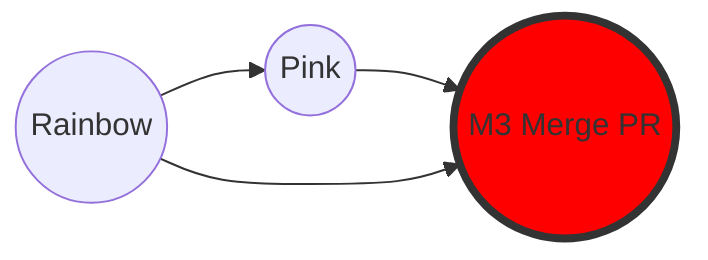

|                                                                                                                                                                            |
| :------------------------------------------------------------------------------------------------------------------------------------------------------------------------- |
| Chúng ta đã học cách hợp nhất code (merge/rebase) trên máy local. Nhưng trong môi trường làm việc nhóm, việc ai cũng tự ý merge vào nhánh chính (`main`) là rất nguy hiểm. |
| **Pull Request (PR)** (hoặc _Merge Request_ trên GitLab) là cơ chế tiêu chuẩn để đề xuất thay đổi, review code và kiểm thử trước khi chính thức hợp nhất vào dự án.        |

## Pull Request là gì?

- **Không phải tính năng của Git**: PR là tính năng của các dịch vụ hosting (GitHub, GitLab, Bitbucket...).
- **Quy trình**:
  1. Bạn push nhánh tính năng (`feature`) của mình lên server.
  2. Bạn tạo một PR: "Tôi đã làm xong tính năng X, xin hãy review và merge vào `main`".
  3. Đồng nghiệp review code, thảo luận, yêu cầu sửa đổi.
  4. Khi mọi thứ ổn, PR được **Merged**.

> **Lưu ý**: Dù tên là "Pull Request" (Yêu cầu kéo về), nhưng bản chất là yêu cầu **Merge** (Hợp nhất).

## Quy trình Pull Request chuẩn (9 Bước)

1. **Tạo nhánh**: Từ `main`, tạo nhánh mới (vd: `topic`).
2. **Commit**: Thực hiện thay đổi và commit trên nhánh `topic`.
3. **Push**: Đẩy nhánh `topic` lên Remote Repository.
4. **Tạo PR**: Trên giao diện web (GitHub/GitLab), mở PR từ `topic` vào `main`.
5. **Review**: Đồng nghiệp xem xét, comment.
6. **Sửa đổi**: Nếu cần, bạn commit và push tiếp vào `topic` (PR sẽ tự cập nhật).
7. **Approve**: Đồng nghiệp chấp thuận (Approve) PR.
8. **Merge**: Nhấn nút Merge trên web.
9. **Cleanup**: Xóa nhánh `topic` (cả remote và local) và pull `main` mới nhất về máy.

## Thực hành: Giả lập quy trình PR

Chúng ta sẽ tiếp tục với repository `rainbow` và `friend-rainbow`.

### Bước 1 & 2: Tạo nhánh và Commit (Local)

Bạn muốn thêm màu "Pink" vào danh sách.

> **[ Thực Hành 12-1 ]**
>
> 1. Tại `rainbow`, tạo và chuyển sang nhánh `topic`:
>
>    ```bash
>    rainbow $ git switch -c topic
>    ```
>
> 2. Mở `othercolors.txt`, thêm dòng: `Pink is not a color in the rainbow.` (sau dòng Black).
> 3. Commit:
>
>    ```bash
>    rainbow $ git add othercolors.txt
>    rainbow $ git commit -m "pink"
>    ```

_Trạng thái_: Bạn có commit "pink" trên nhánh `topic`, nhưng remote chưa biết gì về nó.

### Bước 3: Push và tạo Upstream (Mẹo nhanh)

Bình thường, bạn phải dùng `git push -u origin topic`. Nhưng nếu bạn lười và chỉ gõ `git push`, Git sẽ nhắc bạn câu lệnh cần thiết.

> **[ Thực Hành 12-2 ]**
>
> ```bash
> rainbow $ git push
> # Git sẽ báo lỗi và gợi ý lệnh:
> # fatal: The current branch topic has no upstream branch.
> # To push the current branch and set the remote as upstream, use
> #     git push --set-upstream origin topic
> ```
>
> Hãy copy và chạy lệnh đó:
>
> ```bash
> rainbow $ git push --set-upstream origin topic
> ```

Giờ đây nhánh `topic` đã có mặt trên GitHub.

### Bước 4: Tạo Pull Request (Giả lập)

Vì chúng ta không có giao diện GitHub thật, hãy tưởng tượng:

1. Bạn truy cập trang GitHub của repo.
2. GitHub hiện thông báo: "topic had recent pushes less than a minute ago".
3. Bạn bấm **"Compare & pull request"**.
4. Tiêu đề: "Adding the color pink".
5. Bấm **"Create pull request"**.

### Bước 5 & 6: Review và Thảo luận

Đồng nghiệp (hoặc chính bạn đóng vai) sẽ vào xem tab "Files changed".

- Họ thấy dòng `+ Pink is not a...`.
- Họ có thể comment vào dòng đó: "Màu hồng đẹp đấy!".

Nếu cần sửa, bạn chỉ cần sửa file ở local, commit và push. PR trên web sẽ tự động cập nhật theo commit mới nhất của bạn.

### Bước 7 & 8: Merge PR

Giả sử PR đã được Approve. Bạn bấm nút **"Merge pull request"** màu xanh lá trên GitHub.

**Lưu ý quan trọng về Merge Commit:**
Trên GitHub, nút Merge mặc định sẽ tạo ra một **Merge Commit** (Non-fast-forward merge), ngay cả khi lịch sử là tuyến tính. Điều này giúp lưu lại dấu vết rõ ràng là "tính năng này đã được merge vào lúc này".



_Hình 12-1: GitHub tạo ra Merge Commit (M3) để nối nhánh `topic` (Pink) vào `main` (Rainbow)._

### Bước 9: Đồng bộ và Dọn dẹp

Sau khi merge trên server, việc phát triển nhánh `topic` coi như xong. Ta cần:

1. Xóa nhánh `topic` trên remote (GitHub thường có nút "Delete branch" sau khi merge).
2. Cập nhật `main` ở local.
3. Xóa nhánh `topic` ở local.

> **[ Thực Hành 12-7: Đồng bộ Local ]**
>
> 1. Chuyển về `main`:
>
>    ```bash
>    rainbow $ git switch main
>    ```
>
> 2. Pull về (kèm tham số `-p` để tự động xóa các tham chiếu remote đã mất):
>
>    ```bash
>    rainbow $ git pull -p
>    ```
>
>    _Lúc này `main` của bạn sẽ có commit "pink" và commit "Merge pull request..."._
>
> 3. Xóa nhánh `topic` thừa:
>
>    ```bash
>    rainbow $ git branch -d topic
>    ```

## Tổng Kết

Bạn đã hoàn thành quy trình làm việc chuẩn của một lập trình viên chuyên nghiệp:

1. Code trên nhánh riêng (`feature/topic`).
2. Push lên server và tạo PR.
3. Review, sửa lỗi.
4. Merge thông qua giao diện quản lý.
5. Đồng bộ lại máy local.

Đây là chương cuối cùng về kiến thức cốt lõi. Chúc mừng bạn đã nắm vững Git từ dòng lệnh đến tư duy quản lý phiên bản! Hãy xem thêm phần Phụ lục để biết các lệnh nâng cao khác.
