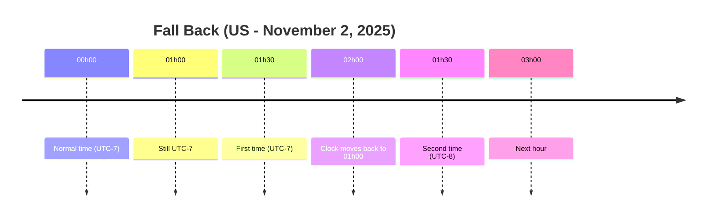
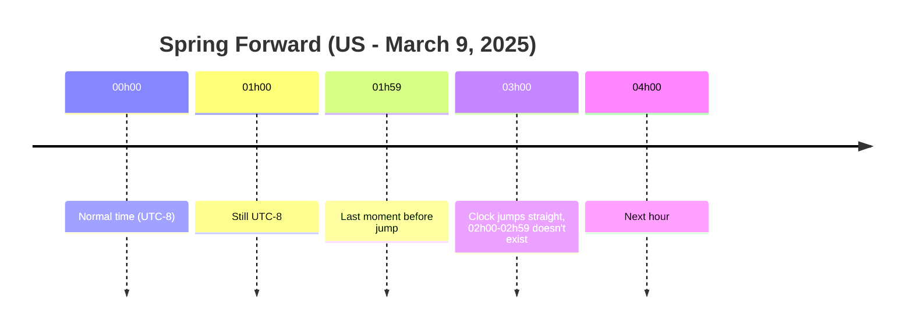

## Introduction: A Developer's Nightmare

If you've ever worked with distributed systems, log servers, cronjobs, or simply written an API that returns time data, you've definitely encountered timezone-related issues at least once. It might seem like a small matter, but just a few hours of discrepancy can cause serious consequences: incorrect reports, jobs running at the wrong time, or birthday congratulation emails sent... a day early. The problem here is that time in computer systems isn't just about "date" and "hour", but is also tied to concepts of time zones, offsets, and even historical political rules of different countries.

## UTC and GMT: Two Confusing Concepts

**UTC (Coordinated Universal Time)** is the global time standard, used in all modern systems. **GMT (Greenwich Mean Time)** is a historical concept, once widely used in maritime and military contexts. Today, most systems consider GMT equivalent to UTC, but technically UTC is more accurate because it accounts for leap seconds. When you see a time string ending with the character `Z`, for example `2025-09-05T10:00:00Z`, it means that moment is represented in UTC (_Zulu time_).

➡️ Golden rule: **store and transmit data in UTC, display by converting to user's timezone**.

## Offset and Timezone: Similar but Different

**Offset** is just the number of hours offset from UTC at a specific moment, for example `+07:00`. Meanwhile, **timezone** is a set of rules describing the history and current state of time in a geographical region, for example `Asia/Ho_Chi_Minh`. Offset can change seasonally due to Daylight Saving Time (DST). That's why you shouldn't just store "UTC+7" but should store the zone ID to handle accurately in all contexts.

## Vietnam and Indochina Time (ICT)

In Vietnam, the situation is easier: we use **Indochina Time (ICT)** year-round, fixed at **UTC+07:00** with no DST applied. The standard zone in the IANA database is `Asia/Ho_Chi_Minh`. However, if you work with international data, you must always be aware of DST and offset changes.

## DST: When Time "Dances"

DST can create ironic situations:

- **Fall back (autumn):** Clock moves back one hour. Result is a time period repeated twice (duplicate hour).
- **Spring forward (spring):** Clock moves forward one hour. There's a time period that completely disappears (non-existent hour).

### Illustrating DST with timeline diagrams

#### **Fall back** case: duplicate hour



#### **Spring forward** case: missing hour



## When Windows Differs from Linux

Windows uses timezone names like `"SE Asia Standard Time"`, while Linux/Unix and most programming libraries use `Asia/Ho_Chi_Minh`. For compatibility, you need to map between these two systems using the `windowsZones.xml` table (CLDR) or use libraries like **TimeZoneConverter** in .NET or **Noda Time**.

## Cronjob and Container: Hidden Traps

Traditional cronjobs run according to server timezone. When DST changes, jobs might run twice or not run at all. Kubernetes solves this issue from version 1.27, allowing you to explicitly declare `spec.timeZone`. Additionally, when deploying in containers (especially Alpine Linux), many images don't install tzdata, leading to logs all in UTC. You need to proactively install tzdata or mount `/etc/localtime`.

## Golden Rules When Working with Time

1. Always **store in UTC format** and include zone ID if needed.
2. **Transmit data via API** using ISO-8601/RFC 3339 standard.
3. **Display according to user's timezone**, use client API to get timezone.
4. **Declare timezone explicitly in Cronjob**, avoid server dependency.
5. **Test DST thoroughly** when application has international users.

## Code Examples

### Java

```java
Instant now = Instant.now();
ZoneId vn = ZoneId.of("Asia/Ho_Chi_Minh");
ZonedDateTime local = now.atZone(vn);
```

### Python

```python
from datetime import datetime
from zoneinfo import ZoneInfo

utc_now = datetime.now(tz=ZoneInfo("UTC"))
vn_time = utc_now.astimezone(ZoneInfo("Asia/Ho_Chi_Minh"))
```

### JavaScript

```js
const tz = Intl.DateTimeFormat().resolvedOptions().timeZone;
console.log(tz); // "Asia/Ho_Chi_Minh"
```

## Conclusion: Turning Fear into Fascination

Timezones are complex because they reflect human history, politics, and culture, not just dry numbers. But if you understand the principles: **UTC for storing and transmitting data, timezone for display, and always test DST**, you'll find everything becomes more manageable. Then, timezone is no longer a "nightmare", but becomes a "fascinating world" for you to explore and conquer.
